# 🏥 US Healthcare & Medical Billing — Master Notes

> [!abstract] What this covers
> Money moves through US healthcare along one chain: **a member gets sick → a provider treats them → a payer foots the bill → coders translate the visit into numbers → billers fight to get paid.** These notes walk that chain end-to-end.

> **Quick nav — Block 1 (Foundations):**
> [[#PHI – Protected Health Information]] · [[#HIPAA]] · [[#The 5 Participants]] · [[#Health Care Plans]] · [[#Medicare vs Medicaid]] · [[#Government Programs]] · [[#Components of Medicare – Parts A B C D]]
>
> **Quick nav — Block 2 (Providers & Plans):**
> [[#DME – Durable Medical Equipment]] · [[#MAPD – Medicare Advantage Prescription Drug Plan]] · [[#Health Care Providers]] · [[#Individual Providers & Contracts]] · [[#Facility Providers]] · [[#Authorization]] · [[#PA Forms – 3 Provider Types]] · [[#Medicare Advantage Plan]] · [[#Payment Modules]] · [[#Coding]]
>
> **Quick nav — Block 3 (Billing & Claims):**
> [[#TFL – Timely Filing Limit]] · [[#TAT – Turn Around Time]] · [[#Appeal]] · [[#NPI – National Provider Identifier]] · [[#TIN – Tax Identification Number]] · [[#Classic Reasons for Denial]] · [[#COB – Coordination of Benefits]] · [[#EOB – Explanation of Benefits]] · [[#Dual Members]] · [[#Patient Responsibility (PR)]] · [[#Quick Recall Cheat Sheet]]

---

## 🔐 PHI — Protected Health Information

> [!important] **PHI = the sensitive details of a member that must stay confidential to secure member privacy.**
> HIPAA exists specifically to protect PHI. Know what counts as PHI — it's a longer list than most people expect.

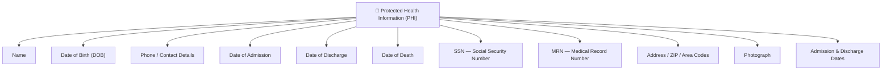

---

## 🛡️ HIPAA

> [!info] **HIPAA — Health Insurance Portability and Accountability Act**
> A **federal privacy law** enacted in **1996** by **DHHS** (Department of Health and Human Services) that forces all members' personally identifiable health information to stay **confidential and private**.

**4 entities must follow HIPAA guidelines.** No exceptions.

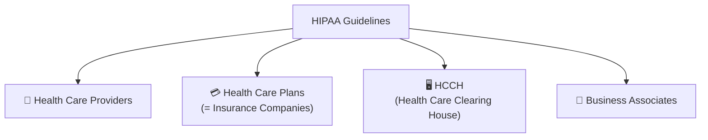

| Entity | Role |
|--------|------|
| **Health Care Providers** | Individuals/orgs giving medical services — keep member details confidential |
| **Health Care Plans** | The insurance policies covering members' medical expenses |
| **HCCH** (Health Care Clearing House) | Orgs that **standardise non-standardised data** used for billing |
| **Business Associates** | Third parties working *on behalf of* plans, providers, and HCCH |

> [!warning] **Common error:** It's **HIPAA**, not HIPPA. One letter difference, instant credibility loss in an interview.

---

## 👥 The 5 Participants

**Healthcare isn't a two-party deal — 5 distinct actors touch every dollar.** Master these before anything else; every later concept hangs off one of these roles.

| # | Participant | Who they are |
|---|-------------|-------------|
| 1 | **Member** | The US policy holder — the patient |
| 2 | **Provider** | Individuals/organizations delivering care (doctors, hospitals) |
| 3 | **Payer** | The insurance company — *the entity that pays the claim* |
| 4 | **Supplier** | Supplies medical equipment/supplies used to treat or prevent illness |
| 5 | **Researcher** | Conducts experiments and studies for human health and wellbeing |

> [!tip] **Mental model:** Member ➜ Provider ➜ **Payer** is the spine. Suppliers and Researchers sit on the edges. Master the spine first.

---

## 💳 Health Care Plans

**Plans split two ways: government-run and government programs** for special populations. Get the Medicare-vs-Medicaid split right and half the domain falls into place.

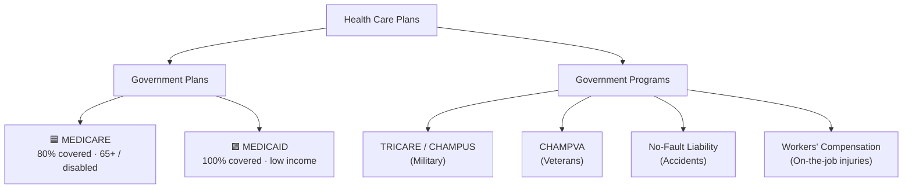

---

## 🟦🟩 Medicare vs Medicaid

**The fastest way to keep them straight: Medicare = age/disability (federal), Medicaid = poverty (state + federal).**

| | 🟦 **MEDICARE** | 🟩 **MEDICAID** |
|--|----------------|----------------|
| **Run by** | Federal government | **Joint** — state-supervised, federally monitored |
| **Covers** | **80%** (20% = patient responsibility) | **100%** |
| **Mnemonic** | "The Rich" / older population | "The Poor" |
| **Age criteria** | **65+**, OR disabled receiving **24 months** of Social Security, OR paid **40 quarters** of federal tax (= 10 yrs US residency) | **No age limit** |
| **Who qualifies** | 65+, disabled, ESRD patients | Poor, disabled, pregnant women, children — anyone **below the federal poverty line** |
| **Payer order** | Primary (usually) | **Last payer** — payer of last resort |
| **Plan type** | Multiple (see Parts A/B/C/D) | **HMO** structure |

> [!note] **2 Medicaid facts that trip people up**
> 1. Medicaid is the **payer of last resort** — it always pays after every other insurer.
> 2. Medicaid also covers **ESRD** (End Stage Renal Disease) patients.

> [!example] **Medicaid = HMO** — this cross-reference matters when studying plan types.

---

## 🌐 Government Programs

**Beyond Medicare/Medicaid, 4 programs cover special groups.**

| Program | Full Name | Who it covers |
|---------|-----------|--------------|
| **TRICARE** *(formerly CHAMPUS)* | Civilian Health And Medical Program of the Uniformed Services | Military personnel — active, deceased, disabled, retirees **and their dependents** |
| **CHAMPVA** | Civilian Health And Medical Program of the **Dept. of Veterans Affairs** | War veterans — active, deceased, disabled, partially disabled during war — **and their dependents** |
| **No-Fault Liability** | Third-Party Insurance | Pays for injuries to a person OR property damage in an accident — **regardless of who caused it** *(optional add-on)* |
| **Workers' Compensation** | — | Covers injuries employees sustain **on work premises or during active work hours** |

---

## 🩺 Components of Medicare — Parts A / B / C / D

**Medicare isn't one thing — it's 4 parts.** Map each part to what it pays for before moving on.

| Part | Nickname | Covers | Example |
|------|----------|--------|---------|
| **Part A** | Original / Traditional Medicare | **Hospital / Inpatient** — stays of **≥24 hours** · premium-free at 65+ | 🔪 Major surgery |
| **Part B** | Original / Traditional Medicare | **Medical / Outpatient** — services **<24 hours** · includes **DME** · optional add-on | 🩹 Minor surgery |
| **Part C** | **Medicare Advantage Plan** | Part A **+** Part B **+** extras: transportation, dental, hearing, vision, gym | 🏢 Private plan |
| **Part D** | PDP — Prescription Drug Plan | Medicines, vaccines · optional add-on | 💊 Drugs |

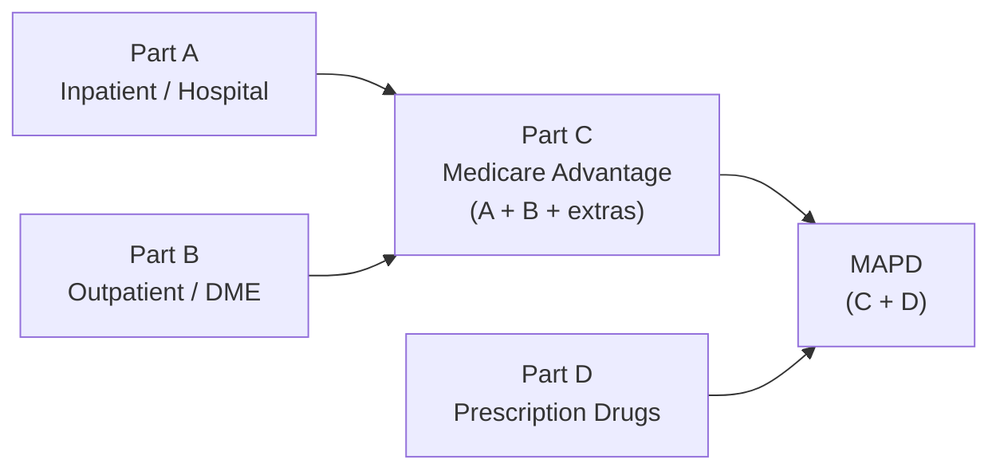

> [!success] **MAPD = Part C + Part D** — bundles everything into one commercial plan built for cost efficiency.

### Major Medicare Payers *(carry the "MCR" tag)*
`Humana` · `Cigna` · `United Health Care (UHC)` · `BCBS` · `Aetna`

---
---

## 🩼 DME — Durable Medical Equipment

> [!info] **DME = Equipment that can be rented or purchased and set up at the member's home for repetitive use.**
> Billed under **Part B**.

| Equipment |
|-----------|
| Wheelchairs |
| Hospital beds |
| Walkers |
| Prosthetics |
| Orthotics |

---

## 🌟 MAPD — Medicare Advantage Prescription Drug Plan

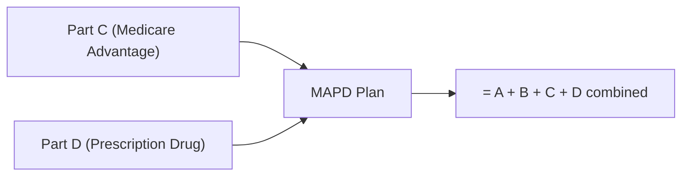

> [!success] **MAPD = Commercial plan that bundles ALL benefits of Part C + Part D together.**
> Built for **cost efficiency**. Administered by private insurers under Medicare contract.

---

## 🏥 Health Care Providers

Two categories. Everything flows from this split.

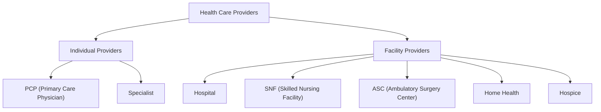

---

## 🧑‍⚕️ Individual Providers & Contracts

**PCP** = Primary gatekeeper → **1st Point of Contact (POC)**

> [!info] **Provider naming zoo** — the same provider wears different hats by function:
> **Requesting · Referring · Ordering · Servicing · Rendering** provider.
> They overlap — context tells you which label applies.

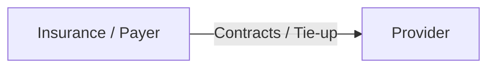

### 📄 Contracts — Network Status

| Code | Meaning | Member cost |
|------|---------|------------|
| **INN** | In-Network → Participating Provider | **Lower** |
| **OON** | Out-of-Network → Non-Participating Provider | **Higher** |

> [!note] **Bank analogy (trainer mnemonic)**
> Participating (INN) ≈ INDUS, ICICI · Non-participating (OON) ≈ SBI. Whatever makes it stick.

### 🔢 Specialist Call Codes

| Who calls | Action | CPT Range |
|-----------|--------|-----------|
| Specialist | Calls insurance | **9921x** codes |
| PCP | Calls insurance for referral | **9920x** codes |

---

## 🏢 Facility Providers

**First**, understand what each facility type actually does — they are *not* interchangeable.

### 1. 🏨 Hospital
Standard inpatient/outpatient acute care facility.

### 2. 🛏️ SNF — Skilled Nursing Facility

> [!info] **SNF = Recovery Center**
> Provides post-surgical recovery care **plus** ADL (Activities of Daily Living) services.
> ADL services: bathing, cooking, occupational therapies.

### 3. 🔬 ASC — Ambulatory Surgery Center

> [!info] **ASC = Same-Day Surgery Center**
> Handles same-day / short-procedure surgeries. Also called **Short Procedure Unit (SPU)**.
> Example: **Cataract surgery**

### 4. 🏠 Home Health

> [!info] **Home Health = Medical Services at Home**
> Agencies that provide medical services to patients **at their home or place of residence**, following a written plan from the provider.

### 5. 🕊️ Hospice

> [!warning] **Hospice ≠ Hospital**
> Hospice programs enable **terminally ill people** to spend the **final stages of their lives at home** or in a home-like setting.

---

## 🔑 Authorization

> [!tip] **One-liner definition**
> **Authorization** = a *designated permission* that a **provider requests** from a health care plan, in order to service any medical procedure to the member.

**The very first authorization** a member ever gets → called a **Referral**.

$$\text{Referral} = \text{Primary Authorization}$$

### 📬 4 Ways to Initiate an Authorization

| # | Method | Notes |
|---|--------|-------|
| 1 | **Calls** | Most common channel |
| 2 | **Portals** | Online payer portals |
| 3 | **P.A. Forms** | Prior Authorization Forms |
| 4 | **E-Fax** | Electronic fax submission |

### 🔁 Authorization Flow

**This is how a specialist visit actually works** — end to end.

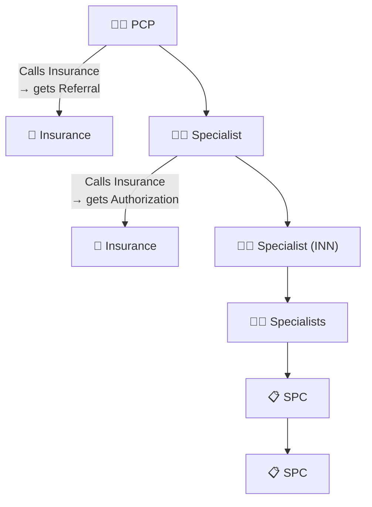

> [!summary] **Authorization chain = PCP Referral → Specialist Auth → INN Specialist → SPC**

---

## 📝 PA Forms — 3 Provider Types

**Section A:** The requesting side (who submits the PA form)

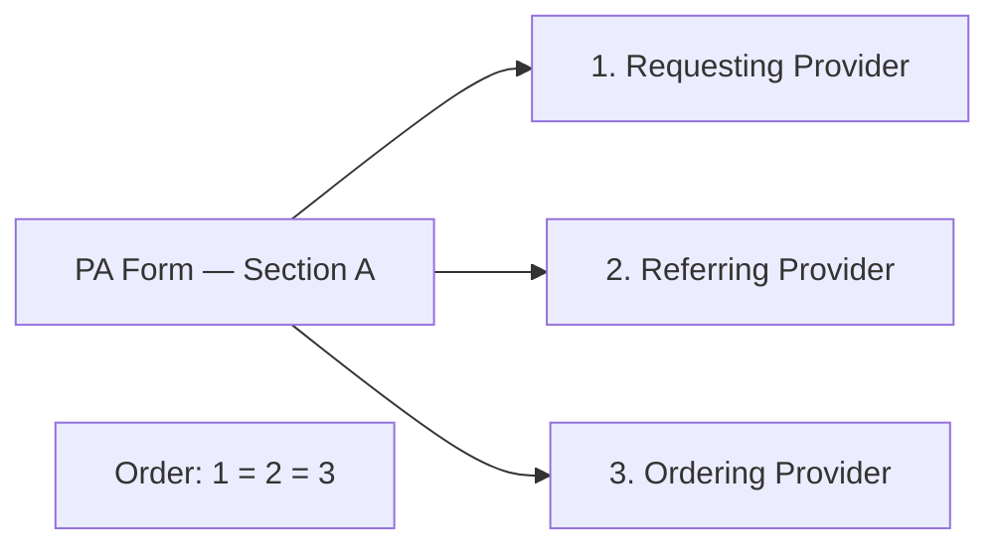

**Section B:** The treating side

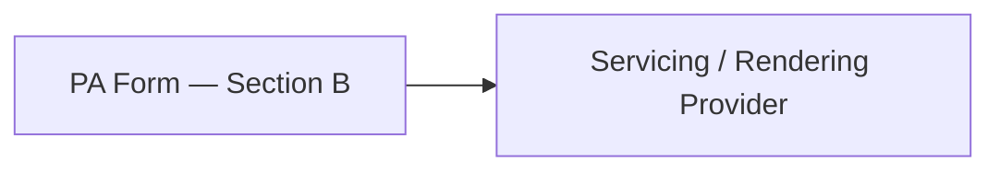

**Flow:** `A → B`

---

## 🏛️ Medicare Advantage Plan

> [!note] **Medicare Advantage = Managed Care Plan**
> It operates under **2 hard rules** — no exceptions:

1. **Authorization / Referral is ALWAYS required.**
2. **Member must ALWAYS visit an INN (In-Network) provider.**

### 📋 Types of Plans

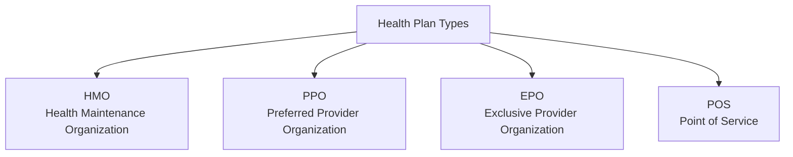

### 📊 Plan Types Comparison

| Plan | PCP Required? | OON Coverage? | Cost-Share | Notes |
|------|:---:|:---:|-----------|-------|
| **HMO** | ✅ | ❌ | **Lower** (60/40 copay) | Locked in — cheap |
| **PPO** | ❌ | ✅ Both INN & OON | Higher OON / Lower INN | Flexible — you pay for freedom |
| **EPO** | ❌ | ❌ | INN = Lower, OON = Higher | No OON, no referral needed |
| **POS** | ✅ | ✅ with PCP Referral | Same as HMO | HMO + limited OON escape hatch |

> [!tip] **HMO = cheap but locked in. PPO = flexible but you pay for the freedom.**

**Key exceptions — exam favourites:**
- ⛔ **EPO** will NOT cover OON specialists — period.
- 🔁 **POS** requires a PCP + referral to access OON.
- ✅ **PPO & EPO** → verbal referrals are allowed.

---

## 💰 Payment Modules

**Provider ↔ Payer — 2 opposing philosophies on how money flows.**

| Module | Income type | How it works | Incentive |
|--------|-------------|-------------|----------|
| **Capitation** | 🔒 Fixed / PMPM | Provider gets **fixed $ per enrolled member per month** — visit count irrelevant | Rewards **keeping people healthy** |
| **Fee for Services (FFS)** | 📈 Per service | Every service billed **separately** in unbundled format | Rewards **volume** |

> [!tip] **Why the incentive structure matters**
> Capitation → fewer visits = same pay → provider profits from prevention.
> FFS → more procedures = more pay → provider profits from volume.
> This is the single most politically contentious design choice in US healthcare.

---

## 🗂️ Coding

**5 coding tools.** Every claim uses at least 2 of these. The system answers 3 questions:

> [!abstract] **The coding logic**
> - **What disease?** → **ICD**
> - **What treatment?** → **CPT**
> - **What equipment / where / extra info?** → **HCPCS · Modifiers · POS**

| # | Code System | Full Name | Covers | Format |
|---|------------|-----------|--------|--------|
| 1 | **CPT** | Current Procedural Terminology | Medical procedures, services, treatments | **5-digit numeric** |
| 2 | **ICD** | International Classification of Diseases | Diseases, symptoms, conditions | **Alphanumeric** |
| 3 | **HCPCS** *(Hikpik)* | Healthcare Common Procedure Coding System | DME & misc. product supplies | **5 alphanumeric** |
| 4 | **Modifiers** | — | Adds extra clarity to CPT (L1) or HCPCS (L2) codes | **2 alphanumeric** |
| 5 | **POS** | Place of Service | Where the service was rendered | **2 numeric** |

### CPT vs ICD — Side by Side

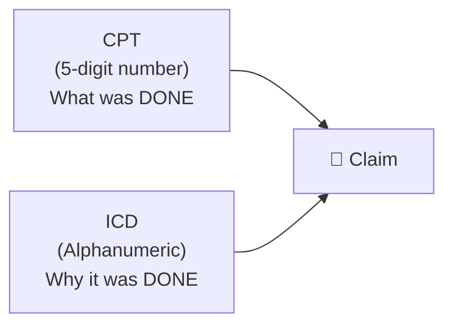

**CPT E/M code ranges:**

| Code | Visit Type |
|------|-----------|
| `99202` | 1st time visit (new patient) |
| `99203` | Specialist visit |
| `99204` | Doctor visit |
| `99205` | Referral / **Exceptional** |
| `99212` | Follow-up |
| `99213` | Follow-up |
| `99214` | Follow-up |
| `99215` | Time-slot follow-up |

**Other CPT examples:** `10040` → Acne surgery · `66984` → Cataract surgery

**ICD examples:** `R51` → Headache · `E11.22` → Diabetes mellitus with Chronic Kidney Disease

### 🔢 HCPCS & Hikpik

> [!tip] **HCPCS (pronounced "Hikpik")** = used specifically for **DME & miscellaneous product supplies**.
> Format: `[Letter][4 digits]`

| Code | Description |
|------|-------------|
| `A0021` | Ambulance |
| `E0265` | Hospital bed |
| `A5500` | Diabetic shoes |
| `LTA500` | Left diabetic shoes |

### 🔧 Modifiers

> [!note] **Modifiers add extra clarity** to a CPT or HCPCS code. **2 alpha-or-numerical characters.**

| Modifier | Meaning | Attaches to |
|----------|---------|------------|
| `RT` | Right side | CPT (L1) or HCPCS (L2) |
| `LT` | Left side | CPT (L1) or HCPCS (L2) |
| `50` | Both sides | CPT (L1) or HCPCS (L2) |

### 📍 POS — Place of Service

> [!info] **POS = denotes the PLACE where services are rendered. Uses 2-digit numerical values.**

| Setting | POS Code |
|---------|---------|
| ASC (Ambulatory Surgery Center) | **24** |
| Home | **12** |

---
---

## ⏱️ TFL — Timely Filing Limit

> [!tip] **TFL = the deadline window within which a provider must submit a claim to the health care plan.**
> The timeframe is **decided by the health care plan** — not the provider, not the government.

**Why it matters:** miss the TFL → instant denial. No exceptions. → Denial Reason #1 (see [[#Classic Reasons for Denial]]).

---

## 🔄 TAT — Turn Around Time *(Resolution)*

> [!info] **TAT = the time interval within which the adjudication engine decides whether to PAY or DENY a claim.**
> TAT also applies to **authorization requests** — not just claims.

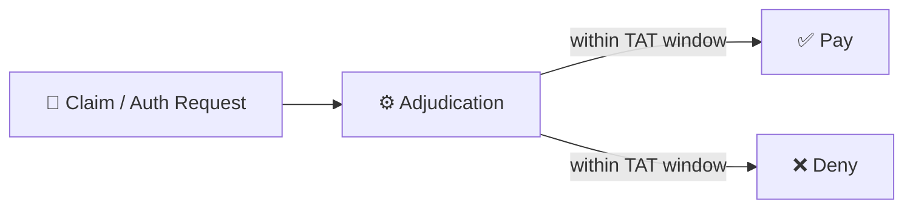

> [!warning] **Key term: Adjudication**
> The automated/manual process the payer uses to evaluate and decide on a claim or authorization.

---

## ⚖️ Appeal

> [!abstract] **Appeal = a formal reconsideration request submitted by a provider OR a member to a health care plan, asking them to reverse a denied claim or authorization.**

**Who can file:** Provider **or** Member — both have the right.
**Trigger:** A denial — of a claim or of an authorization.

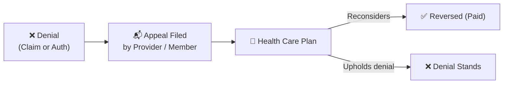

---

## 🪪 NPI — National Provider Identifier

> [!info] **NPI = a 10-digit unique identification number assigned to a specific provider.**
> Every provider gets **their own** NPI — unique, not shared.

| Field | Value |
|-------|-------|
| Digit count | **10 digits** |
| Scope | Unique per provider |
| Purpose | Identifies **individual** providers |

---

## 🧾 TIN — Tax Identification Number

> [!info] **TIN = a 9-digit common identification number shared by multiple providers** under the same tax entity (e.g. a hospital group or practice).

| Field | Value |
|-------|-------|
| Digit count | **9 digits** |
| Scope | **Shared** across multiple providers |
| Purpose | Tax / billing entity identification |

### NPI vs TIN — Side by Side

| | NPI | TIN |
|--|-----|-----|
| Digits | **10** | **9** |
| Unique? | ✅ Per provider | ❌ Shared |
| Identifies | Individual provider | Tax/billing entity |

> [!example] **US Calendar Year:** `01/01/20XX → 12/31/20XX`

---

## 🚫 Classic Reasons for Denial

**3 denials that show up over and over.** Memorise these cold.

| # | Denial Reason | Root Cause |
|---|---------------|-----------|
| 1 | **Untimely Filing Limit** | Claim submitted after TFL window closed |
| 2 | **Member does not have active insurance for the DOS** | No coverage on the Date of Service |
| 3 | **Provider never generated an authorization** | Service rendered without prior auth |

> [!danger] **DOS = Date of Service** — the date the medical service was actually rendered. Payers validate coverage against DOS, not the billing date.

---

## 🔀 COB — Coordination of Benefits

> [!abstract] **COB = the process of determining which payer pays first (primary), second (secondary), or third (tertiary) when a member has multiple insurance plans.**

**Why it exists:** Some members carry 2+ plans. COB decides who takes financial responsibility in what order — so nobody double-pays and the provider gets reimbursed correctly.

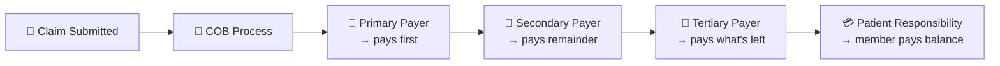

> [!example] **Classic COB scenario:** Medicare (primary) + Medicaid (secondary). Medicare pays first, Medicaid mops up the remainder. Member owes ≈ $0. → This member is a **[[#Dual Members|Dual Member]]**.

---

## 📋 EOB — Explanation of Benefits

> [!info] **EOB = a summary document of a processed claim, sent by the insurance to BOTH the provider and the member.**

**EOB is NOT a bill.** It is a *statement of what happened* after adjudication.

| EOB Field | What it shows |
|-----------|--------------|
| Service rendered | What procedure was billed |
| Amount billed | What the provider charged |
| Amount allowed | What the plan contractually allows |
| Amount paid | What insurance actually paid |
| Patient responsibility | What the member owes |
| Denial reason (if any) | Why part/all was not paid |

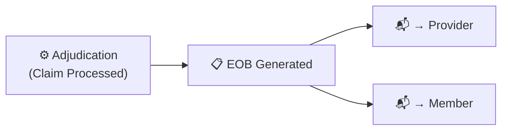

---

## 👥 Dual Members

> [!success] **Dual Member = a member who qualifies for BOTH government health care plans simultaneously** — i.e. both **Medicare AND Medicaid**.

**Who qualifies:** Elderly or disabled individuals who are both:
- Age 65+ or disabled → **Medicare** eligible
- Low income → **Medicaid** eligible

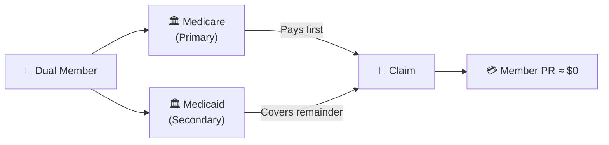

> [!tip] Dual members often end up with **near-zero out-of-pocket cost** because Medicaid covers what Medicare doesn't.

---

## 💸 Patient Responsibility (PR)

**PR = the portion of the bill the member pays — roughly ~20% of the total.** It splits into 3 types, with an overall ceiling called OOP.

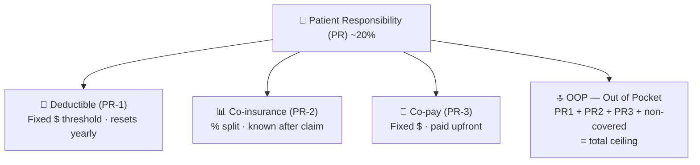

### 🏦 Deductible (PR-1)

> [!abstract] **Deductible = a fixed $ minimum amount the member must fully pay out-of-pocket before the insurance kicks in.**

- Resets **every calendar year** (Jan 1 → Dec 31)
- After the deductible clears → insurance starts sharing cost
- *"Fill this bucket first, then we help"*

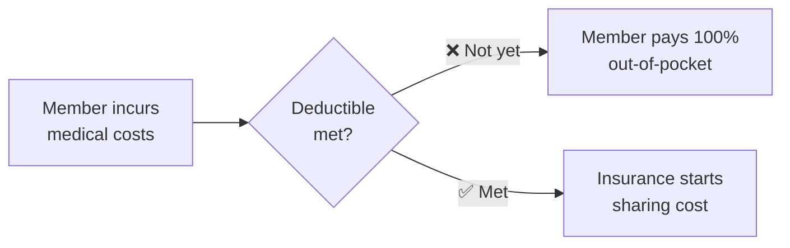

### 💊 Co-pay (PR-3)

> [!info] **Co-pay = a fixed $ amount the member pays upfront to the provider at time of service.**

- **Fixed** — does not change with the cost of the service
- Paid **at the time of service** (before or after — but upfront)
- Independent of whether the deductible has been met

**Example:** Every specialist visit = $30 co-pay, regardless of what was done.

### 📊 Co-insurance (PR-2)

> [!info] **Co-insurance = the cost-share % split between the insurance and the member.**

- Member learns the actual dollar amount **only after the claim processes**
- Format: `Insurance % / Member %` → e.g. `80/20`

**Example:** Claim = $1,000 · Co-insurance = 80/20 → Insurance pays **$800**, Member pays **$200**

> [!warning] **Co-insurance vs Co-pay — don't mix these up**
> Co-pay = **fixed $** · known upfront · independent of claim cost
> Co-insurance = **% of cost** · known only after claim processes

### 🔝 OOP — Out of Pocket

> [!important] **OOP = the total ceiling on member spending per year.**

$$\text{OOP} = \text{PR-1 (Deductible)} + \text{PR-2 (Co-insurance)} + \text{PR-3 (Co-pay)} + \text{non-covered charges}$$

Once OOP is hit, the insurance covers **100%** of the rest for that calendar year.

### PR Summary Table

| PR Type | Code | Format | When known | Resets |
|---------|------|--------|-----------|--------|
| Deductible | PR-1 | Fixed $ annual threshold | At plan enrollment | Annually |
| Co-insurance | PR-2 | % split (e.g. 80/20) | After claim processes | Per claim |
| Co-pay | PR-3 | Fixed $ per visit | At time of service | Per visit |
| **Out of Pocket** | **OOP** | **Sum of all PRs + non-covered** | **After hitting ceiling** | **Annually** |

---

## 🧠 Quick Recall Cheat Sheet

> [!tip] **If you remember nothing else from this entire document:**

| Topic | Key facts |
|-------|-----------|
| **Medicare** | 65+ / federal / covers 80% |
| **Medicaid** | Poor / state+federal / 100% / **last payer** / HMO structure |
| **Part A** | Hospital / inpatient (≥24 hrs) |
| **Part B** | Outpatient + DME (<24 hrs) |
| **Part C** | = A + B + extras (Medicare Advantage) |
| **Part D** | Drugs (optional) |
| **MAPD** | = C + D |
| **HMO** | Referral + INN only + cheap |
| **PPO** | No referral + OON allowed + pricey |
| **EPO** | No referral + INN only + no OON ever |
| **POS** | Referral + INN + limited OON with referral |
| **CPT** | Treatment · 5 numeric |
| **ICD** | Disease · alphanumeric |
| **HCPCS** | Equipment/DME · 5 alphanumeric |
| **POS** | Where · 2 numeric |
| **Modifiers** | Clarity · 2 alphanumeric |
| **TFL** | Deadline to file a claim |
| **TAT** | Time for payer to decide |
| **NPI** | 10-digit · unique per provider |
| **TIN** | 9-digit · shared across entity |
| **PR-1** | Deductible — fixed $ threshold |
| **PR-2** | Co-insurance — % split |
| **PR-3** | Co-pay — fixed $ upfront |
| **OOP** | All PRs + non-covered = ceiling |
| **3 denials** | Late filing · no active insurance · no authorization |
| **PHI** | Name, DOB, SSN, MRN, address, photos, dates |
| **HIPAA** | 1996 · DHHS · 4 entities must comply |
| **COB** | Who pays first/second/third |
| **EOB** | Processed claim summary → sent to provider + member |
| **Dual Member** | Medicare + Medicaid simultaneously |

---

*Tags: #RCM #Healthcare #HIPAA #PHI #Medicare #Medicaid #Authorization #Coding #TFL #TAT #Appeal #NPI #TIN #Denial #PatientResponsibility #COB #EOB #DualMembers #MedicalBilling #Obsidian*
