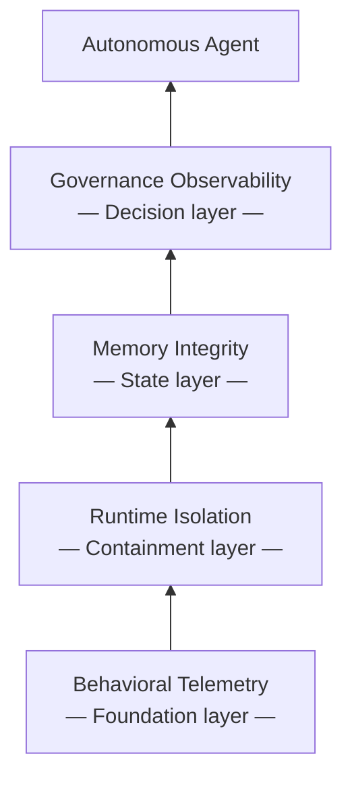
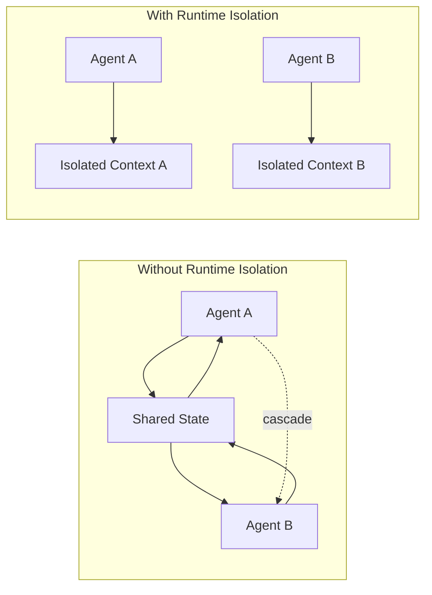

> Every serious autonomous deployment ends up building the same four runtime primitives. The only variable is whether you build them by foresight or by incident.

# The Four Capabilities Every Autonomous AI Deployment Rebuilds

> Every serious autonomous deployment ends up building the same four runtime primitives. The only variable is whether you build them by foresight or by incident.

## You do not decide whether to build runtime infrastructure. Production decides when.

Most teams ship their first autonomous agent and ask the wrong question.

They ask: *Does this agent work?*

It ran. Output arrived. The demo looked clean. The team shipped it. Then production started: real concurrency, real load, real state accumulating across real time. The agent drifted. A parallel instance corrupted shared state. Memory returned stale context without flagging it. A decision escalated through the wrong path, and nobody could reconstruct why.

None of this was a model problem.

The model was constant. The stack was not.

That is the convergence pattern. Four different teams. Four different architectures. Four different model providers. Same four gaps, every time. Platform teams running autonomous agents in production do not choose whether to build runtime infrastructure. They choose the order of the incidents that force them to.

The four **runtime primitives** every deployment rebuilds:

- **Behavioral Telemetry**: observability of what the model does, not whether it runs
- **Runtime Isolation**: execution boundaries that contain failure and prevent state contamination
- **Memory Integrity**: correctness of retrieval and state, not just storage availability
- **Governance Observability**: visibility into policy, escalation, and autonomous decision sequences

> "You will build all four. The only question is whether by foresight or by incident."

Here is the map.

*The four-primitive stack. Behavioral Telemetry at the foundation. Governance Observability at the top. Each layer depends on the one below it; remove one and everything above operates blind.*

The layers are not independent. Governance depends on reliable memory; pull the memory layer and every governance decision runs on corrupted context. Memory retrieval depends on isolated execution contexts, and isolation itself depends on behavioral signals to know when to act. Strip any layer and the one above it operates blind.

Teams that build these **runtime primitives** by foresight wire them bottom-up, before production pressure forces the conversation. Teams that build them by incident wire them top-down: Governance Observability first, when a bad decision surfaces publicly. Memory Integrity second. Runtime Isolation third, after a cascade crash. Behavioral Telemetry last, usually months in, when someone asks how long this has been happening. Nobody knows the answer.

Same four **runtime primitives**. Same stack. Different entry point.

**Operational Entropy** is the accumulated disorder that builds when none of these boundaries exist. It is the bill that arrives in all four incidents at once.

---

## Behavioral Telemetry tells you whether the output makes sense. Monitoring only tells you whether it arrived.

Traditional monitoring tells you two things: whether the process is running, and whether it returned a response. **Behavioral Telemetry** tells you something different: whether what it returned makes sense.

These are not the same question.

Standard infrastructure monitoring is built for deterministic systems. A web server either responds or it doesn't. A database query either executes or it errors. The signal is binary.

Autonomous agents are not deterministic. Different rules. The process runs, the response arrives, both facts register as green, and the output can still be wrong in ways that compound silently for weeks before anything surfaces.

**Behavioral Telemetry** monitors the content and pattern of model behavior, not the infrastructure beneath it. It answers questions your existing observability stack cannot ask: Did the output distribution shift from last week? Are tool calls succeeding syntactically but failing semantically? Are there retrieval patterns that consistently precede failures?

Without **Behavioral Telemetry**, drift is invisible until it is catastrophic.

| Signal | Traditional Monitoring | Behavioral Telemetry | What Breaks Without Telemetry |
|---|---|---|---|
| Process uptime | ✓ Tracks liveness | ✓ Tracks agent availability | Nothing — both layers see it |
| Response latency | ✓ P50/P99 timing | ✓ P50/P99 + deviation from behavioral baseline | Latency anomalies tied to drift go undetected |
| Output format | ✗ Cannot parse LLM output | ✓ Schema validation on every response | Malformed outputs register as successful responses |
| Behavioral drift | ✗ Not observable | ✓ Distribution comparison vs baseline | Gradual quality decline is invisible until the magnitude forces a manual audit |
| Tool-call validity | ✗ Sees only HTTP success/fail | ✓ Validates semantic correctness of tool invocations | Syntactically valid but semantically wrong calls accumulate undetected |
| Retrieval quality | ✗ Not accessible to infrastructure layer | ✓ Context relevance and freshness scoring | Stale or irrelevant retrieval produces silent quality decay |

The gap is not instrumentation depth. It is instrumentation target. Traditional monitoring watches infrastructure. **Behavioral Telemetry** watches behavior. You need both. Only one tells you whether the agent is actually working.

**Behavioral Telemetry** is one of the first **runtime primitives** teams rebuild after a silent degradation incident. The pattern is consistent: agent runs for weeks, infrastructure metrics stay green, a manual review reveals output quality has declined measurably from baseline. Nobody knows when it started. The degradation was already in the logs. Nobody had checked.

Infrastructure stability does not imply behavioral stability. That distinction is what **Behavioral Telemetry** makes visible.

---

## Runtime Isolation contains one failure. Without it, Operational Entropy compounds every failure into many.

Long-running autonomous processes contaminate each other without execution boundaries. This is **Operational Entropy**: the gradual accumulation of disorder that builds when concurrent processes share unguarded state.

It is not dramatic. Incremental.

Two agents share a context window. One agent's state bleeds into another's retrieval path. A memory write corrupts the read path of a concurrent session; a failed task's retry requeues an action that already completed. Each event is minor on its own. Together, they make the system unpredictable in ways that are difficult to reproduce and harder to trace.

The contamination usually starts with the second agent you run concurrently. Not the tenth.

**Runtime Isolation** draws hard execution boundaries between concurrent autonomous processes. Each process runs in a contained context. Failures stay contained. Retries don't re-execute side effects they've already triggered, and one process's state can't contaminate another's retrieval path.

Four boundary types every serious deployment implements:

- **Session isolation**: each agent invocation maintains its own context with no shared in-flight state
- **Memory isolation**: read/write boundaries prevent cross-session contamination of retrieval stores
- **Tool-call isolation**: idempotency and deduplication prevent retry-induced duplication of side effects
- **Failure isolation**: a crash or timeout in one process does not propagate to concurrent processes

*Left: Operational Entropy compounds — contamination spreads across processes, and one cascade reaches everything sharing state. Right: Runtime Isolation contains each process's fault domain independently.*

**Operational Entropy** is a scale property. One autonomous agent running alone may never surface a contamination problem. The problem emerges at concurrency, which is exactly the operational pattern of any deployment that has moved past a single-agent prototype. **Operational Entropy** does not reset. It compounds. Every day without **Runtime Isolation** is a day of accumulating disorder in shared state, mostly invisible, surfacing intermittently as failures that cannot be attributed to a root cause.

**Runtime Isolation** is the most expensive **runtime primitive** to retrofit. The boundary work requires touching every interface where agent processes share state. Done preventively, it is an architectural constraint you define once. Done reactively, it is surgery on a live system while contamination continues.

The incident that forces this conversation is consistent: a cascade failure where one process's fault propagated to others, caused downstream corruption, and required reconstructing the contamination path after the fact. Teams that experience it once do not delay **Runtime Isolation** on their next deployment.

---

## Memory Integrity catches corruption before the agent surfaces the symptom

Memory does not fail loudly.

It fails gradually. So gradually the system appears healthy long after corruption begins. Uptime is green. Latency is stable. Outputs arrive promptly. What changes is what those outputs are based on: retrieval that returns stale context, state that reflects a prior session, embeddings that no longer match the documents they index.

**Memory Integrity** is not about storage availability. Storage is a solved problem. **Memory Integrity** is about retrieval correctness: whether what the agent receives when it reaches into memory accurately represents what is there, and whether what is there accurately represents current ground truth.

The corruption modes are distinct. Each produces different symptoms, requires different detection:

| Corruption Mode | Symptom | Root Cause | What Memory Integrity Checks |
|---|---|---|---|
| Staleness | Agent acts on outdated information | Memory updated; retrieval cache not invalidated | Timestamp validation on retrieved context vs source |
| Session bleed | Agent references prior conversation context | Incorrect session scoping or boundary failure | Session boundary enforcement and cross-session audit |
| Embedding drift | Retrieval returns semantically mismatched results | Model or data updated without re-indexing | Retrieval quality scoring vs current ground truth |
| Write corruption | Agent reads state written incorrectly by a concurrent process | Race condition or missing write atomicity | Write integrity verification before read path serves result |
| Context saturation | Agent operates on truncated context without knowing it | Context window silently exceeded | Context length monitoring and overflow signaling |

None of these look like system failures. They look like model failures.

That misattribution is the core problem. Teams routinely spend weeks debugging what turns out to be a stale retrieval index. The model wasn't wrong. The retrieval was. The symptom reads as model unreliability; the actual cause is infrastructure. Without **Memory Integrity**, the diagnosis runs backward: rule out everything else, suspect memory last.

**Memory Integrity** closes the attribution gap. It instruments the memory layer directly: what was retrieved, from what state of the underlying store, at what timestamp, and whether the retrieved context matched current ground truth at the moment of retrieval.

The gap between when **Memory Integrity** problems begin and when users see symptoms is consistently longer than teams expect. Weeks, not days. The **runtime primitives** that catch these problems early instrument retrieval quality continuously. Not the ones that wait for output quality to decline before asking what changed.

**Memory Integrity** does not prevent corruption from occurring. It ensures you know when it has.

---

## Governance Observability makes autonomous decisions reconstructable after the fact

Autonomous systems make decisions. Most of those decisions are invisible.

An agent escalates a task. Another executes an action with irreversible side effects. A third approves a downstream step without human review. The decisions happen inside the execution loop: logged somewhere, probably, but not structured, not queryable, and not tied to the policy that was supposed to govern them.

**Governance Observability** is the capability that makes autonomous decision-making operationally accountable: the ability to reconstruct what decision was made, against what policy, by what agent, at what point in the execution sequence, and to determine whether that decision was one the agent was authorized to make unilaterally.

Three structures most deployments lack:

- **Decision audit trails**: structured logs of what the agent *decided*, not just what it *did*. The action is the output; the decision is the reasoning and authorization path that produced it. Both need to be captured, separately, and linked.
- **Policy linkage**: each decision tied to the governance rule that authorized it. When policy changes, the linkage reveals which past decisions were made under a rule that no longer applies.
- **Escalation observability**: visibility into why a decision was escalated versus autonomously executed. Escalation patterns reveal where the agent's actual confidence boundaries are, not where they were assumed to be during design.

Without **Governance Observability**, autonomous systems are opaque. The agent acts. Nobody can reconstruct why.

> "The question that matures with every serious autonomous deployment is not 'Does this agent work?' It is 'Which runtime primitives exist underneath it?' Governance Observability answers that question for the most consequential primitive: the decision itself."

Teams that build **Governance Observability** by incident build it because something failed they couldn't explain. The investigation reveals no audit trail exists. Teams that build it by foresight wire it in before the first consequential decision, so the trail exists from day one regardless of what happens next.

**Governance Observability** is the fourth **runtime primitive** in the stack, and typically the last one teams discover they need. The failure that surfaces it is not a technical failure. It is organizational: someone asks "what did the agent decide, and why?" Nobody can answer.

That question will be asked. It is only a matter of when.

---

## The stack you will build either way

Four **runtime primitives**. One convergence. Every autonomous deployment reaches them.

Which entry point are you building from?

| Primitive | What It Prevents | Built by Incident | Built by Foresight |
|---|---|---|---|
| **Behavioral Telemetry** | Silent drift, invisible quality decay, misattributed degradation | Added after a manual audit reveals a large quality decline from an unknown baseline. Drift start date cannot be determined. | Instrumented before first production run. Baseline established day one. Drift visible in week one, not month three. |
| **Runtime Isolation** | State contamination, cascade failures, retry-induced duplication | Retrofitted after a cascade crash exposes shared-state contamination. Boundary work runs while contamination continues. | Defined as architectural constraint before first concurrent agent. Boundaries exist before they are needed. |
| **Memory Integrity** | Stale context, session bleed, embedding drift, context saturation | Added after misattributed model failures turn out to be retrieval infrastructure problems. Weeks of wrong outputs pass before the memory layer is instrumented. | Retrieval quality monitored continuously. Corruption modes detected before users see symptoms. Attribution is immediate. |
| **Governance Observability** | Unrecoverable decision sequences, policy violations, escalation opacity | Built after an accountability failure requires reconstructing a decision that was never logged. Often triggered by an external audit or stakeholder question with no available answer. | Decision audit trails exist from day one. Escalation patterns visible before a high-stakes failure forces the question. |

The **runtime primitives** are not exotic infrastructure.

They are the gap between a system that behaves and a system you can manage.

**Behavioral Telemetry** makes behavior visible. **Runtime Isolation** keeps failures from spreading. **Memory Integrity** and **Governance Observability** handle the rest: context stays honest, decisions stay accountable. Together, they define what it means to run autonomous agents in production, not just to demo them.

The question is not whether your deployment needs all four. It is whether you build them before or after the incidents that prove it.
