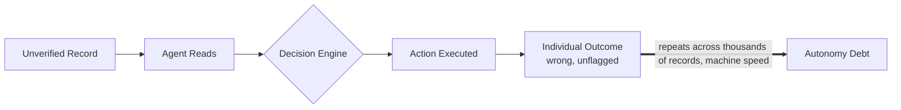
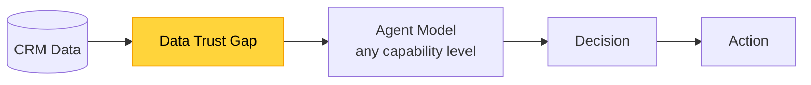
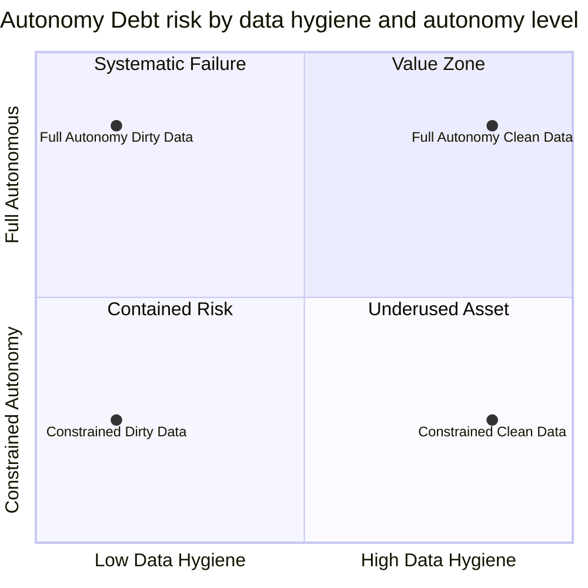

Salesforce closed 18,500 Agentforce deals in 2025. 64% of billion-dollar enterprises lost more than $1 million to AI agent failures that year. The agents weren't hallucinating: they were correct about the wrong data.

That isn't a product problem. It's Autonomy Debt: the accumulation of decisions autonomous agents make on unverified enterprise data, at machine speed, in systems where no human reviews each step before it propagates.

## Why Salesforce chose the hardest possible environment for autonomous agents

CRM is the highest-stakes enterprise data environment. It is not a static repository. It is a living system where sales reps log calls from memory, update deal stages retroactively, and mark contacts as active because the email hasn't bounced recently. Interpretations of what "closed" means vary by rep. Records accumulate assumptions rather than verified facts. The CRM reflects what people typed, not what is true.

Salesforce understood this tension. They built Agentforce anyway, and the commercial logic was sound: follow-up communications, pipeline reviews, case routing, renewal prompts, lead qualification. All labor-intensive. All schedulable. All theoretically automatable. At $1.4B ARR for Agentforce and Data Cloud combined, 18,500 deals closed in 2025, and 9,500 paid accounts on record, the traction was undeniable.

"Adoption was fairly slow out of the gate." That was Salesforce Ben's Q4 framing. It understated the structural cause. Agentforce was deployed into the enterprise environment most vulnerable to data hygiene failures: the CRM.

Payments, as Stripe demonstrated in the benchmark that anchored RelOps-07, is an unforgiving domain. CRM is a different kind of unforgiving. A bad webhook throws a 400 error. A bad contact record reads exactly like a valid one. A stale deal stage is indistinguishable from an active one. No syntax error. No stack trace. No signal.

Autonomous agents don't know the difference. They trust the data they're given. In an environment where 84% of B2B organizations struggle with data hygiene, that trust is the mechanism of failure.

## What the enterprise data actually revealed

The numbers are worse than the earnings releases suggested.

64% of billion-dollar enterprises reported losing more than $1 million to AI agent failures in 2025. Not a tail event. A majority outcome. Among the largest Agentforce deployers, the organizations with the most agents, the most automations, and the most data in motion, failure was the median result.

The root cause was upstream of the model. Data quality issues cause 89% of Einstein and Agentforce performance problems, according to synthesis of over 500 enterprise user reviews by oliv.ai. Nearly nine in ten performance failures were not model failures. They were data failures the model faithfully executed.

84% of B2B organizations struggle with data hygiene. That is the baseline the agents were deployed into.

Four failure modes produced the losses.

The first: Permission Cascades. Agents deployed with excessive access triggered automation loops that modified thousands of records before any human review. "The most realistic financial risks come from scale and automation combined with bad permissions," said Svet Voloshin, enterprise security analyst. Permission Cascade is what that risk looks like when it runs undetected overnight.

The second: shadow AI. 63% of employees pasted sensitive company data into personal chatbots in 2025, creating unauthorized data pipelines the CRM governance layer couldn't see or contain.

Identity accumulation worked more slowly. Agent deployments generated service accounts and API keys that "quietly accumulated permissions without the same safeguards applied to human users." No single grant was excessive. The aggregate access profile was uncontrolled and undocumented.

Prompt injection is the most direct of the four. Malicious instructions embedded in case notes or customer emails caused agents to execute unintended workflows, turning the CRM itself into the attack surface.

"The small mistakes like incorrect updates or a misinterpreted task" repeated automatically across thousands of records. Individual mistakes were small. The accumulation was not.

This is CRM Drift: the divergence between what a CRM record says and what is actually true, amplified by autonomous agents that read and act on those records at machine speed. CRM Drift does not require a catastrophic incident to compound. It requires time, volume, and agents that trust what they're given.

## Autonomy Debt

Here is what Autonomy Debt looks like in a real workflow.

```
# Agentforce renewal workflow -- annotated failure

# What the agent saw:
Contact: "Jennifer Torres"
Title: "VP of Operations"
Company: "Meridian Logistics"
Last activity: "Call, 47 days ago"
Deal stage: "Renewal, pending signature"
Contact status: "Active"

# What the agent decided:
Send renewal prompt to jennifer.torres@meridianlogistics.com
Update deal stage to: "Renewal, outreach sent"
Log activity: "Automated renewal email sent"

# What was actually true:
Jennifer Torres left Meridian Logistics 11 weeks ago.
A new VP was assigned but not entered in Salesforce.
The renewal email reached a deactivated inbox.
The deal stage now showed a dead deal as active.
The pipeline forecast counted this renewal as in-progress.
```

This is Autonomous Failure. The agent executed every step correctly. The outcome: a dead deal marked live, a pipeline forecast wrong by one renewal, a new stakeholder who never received any outreach.

Run this across a 200-person sales organization with Agentforce operating against a CRM with 84% data hygiene problems. The individual Autonomous Failure is a wrong email. The aggregate is a broken pipeline forecast and a compensation model paying commissions on deals that don't exist.

Autonomy Debt is the accumulation. Each decision is individually defensible. The agent checked the status field, the field said active, it sent the email. The debt is not in any single action. It is in the compounding of correct decisions made on incorrect data, at a speed that makes manual review structurally impossible.


*Each step is individually correct. The compounding happens between steps, not inside any single one.*

The tech debt analogy is exact. Technical debt accrues when code shortcuts compound into systemic brittleness. Autonomy Debt accrues when autonomous decisions compound into systemic unreliability. Both are invisible until they are not. Both cost exponentially more to remediate than to prevent.

The difference: technical debt accumulates at developer speed. Autonomy Debt accumulates at machine speed.

| Failure mode | How Autonomy Debt accumulates | What enterprise sees | Actual cost |
|---|---|---|---|
| Permission Cascade | Agent with excessive access triggers automation loop across CRM | Thousands of records updated; workflow logs clean | CRM overwritten without review; rollback is a manual rebuild project; $200K--$500K incident cost |
| CRM Drift | Agent reads stale contact, deal stage, or account status as valid | Outreach sent; pipeline stage updated | Dead deals counted active; forecast inflated; compensation model pays phantom deals |
| Identity accumulation | Agent service accounts collect permissions over deployment lifetime | Automations running without incident reports | Non-human identity holds access no human could acquire quietly; security audit required |
| Prompt injection | Agent reads attacker instructions embedded in case notes or customer emails | Case routed; task completed; logs normal | Agent executed unauthorized instructions; scope of damage unknown until incident review |

The Data Trust Gap sits underneath all four modes. It is the gap between what agents trust (CRM records, as-is) and what the data actually contains: records of unknown hygiene, stale contacts, accumulated CRM Drift, injected instructions. Close the Data Trust Gap and Autonomy Debt stops accruing at scale. Leave it open and every new agent capability accelerates the failure rate.

> **Audit your Autonomy Debt exposure before expanding agent access: three questions**
>
> 1. What percentage of your CRM contacts have been verified by a human in the last 90 days? If below 50%, active CRM Drift is compounding across every agent workflow running right now.
>
> 2. What is the access scope of your agent service accounts? If any agent has write access to more records than your most trusted senior rep, a Permission Cascade is one misconfiguration away.
>
> 3. Can you reconstruct what any agent decided, why, and on what data, within 24 hours of a failure? If not, you have no mechanism to detect Autonomous Failure before it propagates across the full dataset.

## Why better agents won't fix this

The instinctive response is a capability framing: next Agentforce version, stronger validation logic, smarter handling of ambiguous records. Salesforce has shipped multiple agent framework iterations since launch. Failure rates have not declined proportionally.

This is structural. Autonomy Debt is not a model problem. It is a data infrastructure problem. You cannot improve your way out of a data quality issue with a better AI.

Consider the mechanism directly. An agent with better reasoning reading a stale contact record still executes the workflow against a stale contact. A smarter agent writes a better renewal email to a deactivated inbox and updates the pipeline forecast with higher confidence about an incorrect outcome.

The Data Trust Gap is upstream of the model. It sits between the data environment and the agent's decision surface. Svet Voloshin named the vector: "The most realistic financial risks come from scale and automation combined with bad permissions." Not hallucinations. Not model failures. Scale plus bad data access controls plus automation speed.


*A smarter model still sits downstream of the gap. Upgrading it doesn't move where the failure enters.*

I've watched enterprise teams discover their Agentforce pilot was making correct decisions about incorrect data for six weeks before anyone checked. Nobody noticed because the automation was running exactly as designed.

Autonomous agents operating on CRM data have no independent channel for verifying data accuracy. They cannot call Jennifer Torres to confirm she's still at Meridian Logistics. They cannot flag that 63% of the organization's contacts haven't been verified this quarter. They read the record and act on it. The record's relationship to reality is outside their scope.

It's an architecture fact, not a model limitation.

Better agents run faster on worse data. That is not improvement. That is Autonomous Failure at higher velocity.

## The economic moat is moving

The real bill for Agentforce is not the licensing cost.

| Cost category | Typical range | Visibility |
|---|---|---|
| Agentforce licensing, 50 agents, 12 months | $99,000/year | Visible; line item in the business case |
| CRM hygiene remediation, one-time project | $200,000--$500,000 | Invisible until scoped post-deployment |
| Data governance tooling, ongoing annual | $50,000--$200,000/year | Classified as IT overhead, not agent cost |
| Human review capacity for Permission Cascade prevention | $120,000--$240,000/year | Classified as headcount, not infrastructure cost |
| Autonomy Debt remediation per major incident | $500,000--$1,000,000 | Invisible until it fires |
| **Total realistic first-year cost** | **$969,000--$2,039,000** | **Business case showed $99,000** |

Agentforce Enterprise is $165 per month per agent for autonomous use cases. Every finance team that signed the contract saw that number. The data infrastructure costs were invisible until the Autonomy Debt came due.

The paradox is exact: autonomous agent deployment simultaneously amplifies the ROI of clean data and the cost of dirty data. Clean data: agents execute correctly, pipeline forecasts hold, customer communications reach active contacts. Dirty data: agents execute correctly on wrong inputs, the Data Trust Gap produces Autonomous Failure at machine speed, and Autonomy Debt compounds faster than any ROI can materialize.


*The 64% loss figure lives in the top-left quadrant. The table below shows exactly why.*

| CRM data hygiene | Autonomy level | Autonomy Debt accrual rate | Expected outcome |
|---|---|---|---|
| Above 90% verified | Constrained: read-only or human-gated | Negligible | Agents augment human decisions; data errors caught before execution |
| Above 90% verified | Full autonomous: write access, no review gates | Low, 5--10% error propagation rate | Occasional CRM Drift; manageable with quarterly audit |
| 50--90% verified | Constrained | Moderate, 25--35% of tasks touch stale data | Permission Cascades possible if access scope is unchecked |
| 50--90% verified | Full autonomous | High: 64% enterprise loss rate observed at scale | Systematic Autonomous Failure; $100K--$500K annual remediation typical |
| Below 50% verified | Any level | Critical: 89% performance failure rate (oliv.ai, 500+ reviews) | Pipeline data unreliable; Autonomy Debt compounds at machine speed |

"Trust in data has become the number one bottleneck" in enterprise AI deployment. That framing understates it: dirty data isn't a bottleneck slowing Agentforce down, it's the moat condition deciding whether Agentforce creates value or destroys it. Every enterprise contract runs the same foundation models. The differentiator is the data those models run on.

The organizations that win the autonomous agent era didn't deploy fastest. They treated data infrastructure as a precondition, not a post-pilot cleanup project: Data Trust Gap closed, Permission Cascades constrained at the access layer, CRM Drift resolved systematically, all before the first agent went live.

Data quality infrastructure costs $500,000 once. Autonomy Debt remediation at scale costs $1 million per incident. The 64% of billion-dollar enterprises that took the losses made an infrastructure sequencing mistake: agents deployed before the data was clean.

Clean data before autonomous agents. Not after.

## The agents are ready. The data isn't.

Salesforce's Q4 numbers were real. 18,500 deals. $1.4B ARR.

Autonomy Debt accrues every hour an autonomous agent operates on a CRM with unverified records, unconstrained access, and no systematic check on CRM Drift. It accrues correctly, by design, at machine speed. No error flag. No stack trace. Clean workflow logs. The automation ran. The damage accumulated.

Autonomous Failure at machine speed looks like success right up until a customer calls, a regulator asks, or someone pulls the actual pipeline number. The agents were correct. The data was wrong. The Autonomy Debt came due.

The infrastructure condition for the autonomous enterprise is not a better foundation model. It is a verified data environment. The agents are ready. The question is whether the data is.
