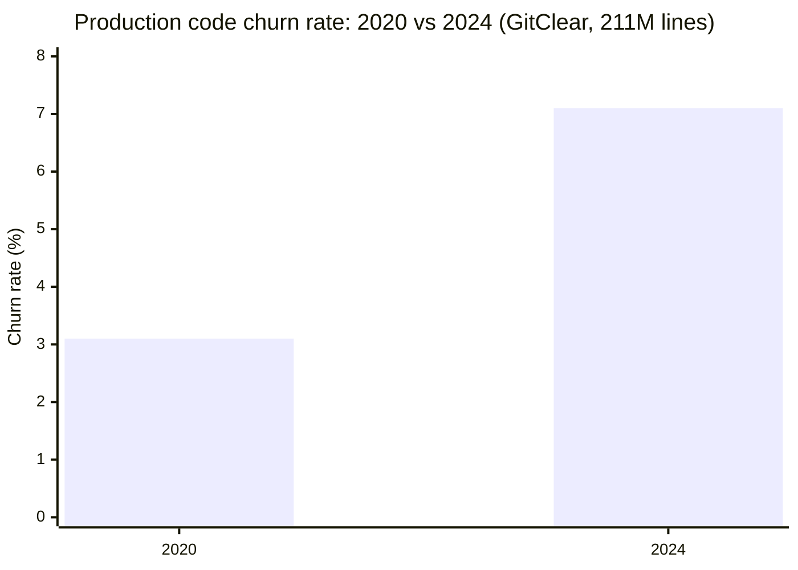
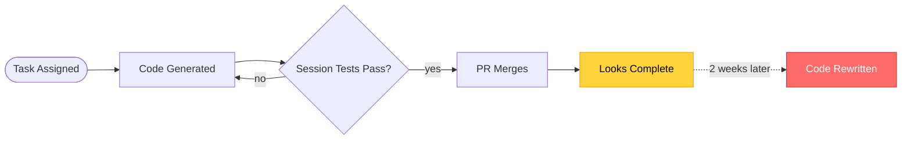

GitHub's enterprise Copilot data showed PR merge rates up 15%. GitClear analyzed 211 million lines of production code changes. Code churn rate increased 129%.

This isn't a model problem. It's Completion Theater: what happens when Completion Velocity runs upward while the codebase runs the other way. All the session metrics look right. The code still gets rewritten.

## What GitHub's study actually measured

The GitHub × Accenture study is the most cited evidence in any DevEx budget conversation. The methodology is solid. 202 developers, all with five or more years of engineering experience, completing the same task: build a working restaurant API from scratch, passing 10 predefined unit tests. Half had Copilot. Half didn't.

The results were clean. Copilot users merged 15% more pull requests per week. They submitted 8.69% more PRs per developer. Reviewers approved their code 5% more often, without being told which submissions came from Copilot users. On the unit tests that defined completion for the task, Copilot users passed 53.2% more of them. Every metric moved in the same direction.

This is Session Productivity measured properly. A controlled setting. A single task. A clear success criterion. The numbers aren't manufactured and the methodology isn't gaming anything. Within its context, the study shows what it claims: developers using Copilot complete coding tasks faster, with higher quality signals across session-level metrics.

The context is the word to notice. One task. One session. One API. 202 developers selected for experience. I've watched that context disappear by the second slide of a DevEx deck.

Session Productivity is a real and measurable thing. The GitHub study measures it well. The question isn't whether those numbers are accurate. It's whether they measure what actually matters to a production codebase over time.

| What was measured | GitHub controlled study | GitClear production analysis |
|---|---|---|
| Sample | 202 developers, controlled trial | 211 million lines across 4 years |
| Task | Single API build with 10 unit tests | Real production codebases in production |
| Primary metrics | PR merge rate, unit test pass rate | Code churn rate, code clone frequency |
| Finding | Session quality up across all metrics | Churn up 129%, clones up 4× |
| What it can't see | What happens to the code after merge | What any individual session looks like |

## What GitClear's 211 million lines found

GitClear didn't run a controlled trial. They measured 211 million lines of real production code changes across four years: 2020 through 2024. No controlled conditions. No assigned tasks. Just codebases running in production, changing the way production codebases actually change.

Churn rate is at the center of their analysis. A definition for context: churn is the percentage of code that gets rewritten or deleted within two weeks of being committed. In 2020, the churn rate across GitClear's codebase sample was 3.1%. Code was being committed and holding.

By 2024, the churn rate had reached 7.1%. That's a 129% increase over the period. In the same window, code clone frequency (the rate at which duplicate code blocks appear in production) increased fourfold.



Two caveats that matter. GitClear's analysis is correlational, not causal: it can't isolate AI tool adoption as the single driver. And churn isn't inherently bad: sometimes code gets rewritten because requirements changed, not because the original was wrong. I've never seen a vendor slide quote that second caveat while pitching the first year's numbers.

But 129% over four years isn't noise. The GitClear team first published a version of this analysis in 2023 with the headline "downward pressure on code quality." The 2025 report, analyzing a larger dataset, confirmed the trend had accelerated.

The trajectory of the GitClear Codebase Health data runs exactly inverse to the trajectory of the GitHub Session Productivity data. Both are measuring the same tool in use. They're measuring different things about it. That divergence is what Completion Theater names.

## Completion Theater

Completion Theater is the condition where all the session-level signals look right and the codebase doesn't match them. Pull requests merge. Unit tests pass. Completion Velocity rises on the dashboard. The code still gets rewritten two weeks later.

The theater isn't the AI's fault. It isn't the developer's fault. It's a measurement architecture problem. When the success criterion for an AI coding tool is "does it increase Session Productivity?" you will get tools optimized to increase Session Productivity. That's what they do. What happens to the codebase after the session ends is a different measurement question. The session metrics don't ask it.



```
// What the session metrics showed (GitHub × Accenture, 202 developers)

PR merge rate:        +15%
Unit test pass rate:  +53.2%
Code approval rate:   +5%
PRs per developer:    +8.7%

Status: COMPLETE. All session metrics improved.


// What the codebase showed (GitClear, 211M lines, 2020–2024)

Code churn rate:      3.1% → 7.1%  (+129%)
Code clone frequency: +4× year-over-year

Status: DEGRADING. Correctness Durability declining.


// The gap

Session metrics measure: did the task complete this session?
Codebase metrics measure: does the completed work hold over time?
These are not the same question.
```

Completion Theater exists because these two questions have been treated as equivalent. A developer who merges a PR that passes its unit tests has, by session-level criteria, done quality work. If that PR gets substantially rewritten 10 days later because it broke something outside the scope of the session's tests, the session metric doesn't record that outcome. The churn rate does.

This is why Correctness Durability is a distinct concept from session quality. Session quality is point-in-time: did it work when it was committed? Correctness Durability is longitudinal: does it still work, and at what rewrite cost, a month later? A codebase with rising Session Productivity and declining Correctness Durability has a name: technical debt accumulating faster than it's being paid down.

| Metric type | Examples | What it measures | What it hides | Use it for |
|---|---|---|---|---|
| Session Productivity | PR merge rate, test pass rate, lines per session, code approval rate | Task completion within the coding session | What happens after merge | Developer experience reporting, session-level tool ROI |
| Codebase Health | Churn rate, clone frequency, long-term defect density, code reuse rate | What the codebase accumulates over time | How any individual session performed | Codebase quality assessment, long-term DevEx ROI |

Session Productivity metrics are not wrong. They measure real things. The Completion Theater problem is using them as proxies for Codebase Health, and then making budget and tooling decisions based on that substitution.

## Why better models won't fix this

The natural response is: "The model needs to be better. Write code that stays written."

This response mistakes the problem's category. Completion Theater is not a model capability problem. It's a measurement optimization problem. When models are evaluated on session-level signals (did the code compile, did the tests pass, did the PR merge), they learn to optimize for session-level signals. A better model will get better at passing session-level signals. That's what optimization does.

Churn rate doesn't measure session performance. It measures what the session left behind. A model can generate code that passes every unit test in a controlled setting and still produce code that requires rewriting once it runs inside a real codebase, against real integration tests, over real time. Completeness-of-session-tests and codebase-fittingness measure different things. Improving one doesn't improve the other.

I've seen engineering directors present DevEx ROI in board slides using merge rate as the headline quality indicator. The slides look right. Completion Velocity goes up and to the right. The code churn trajectory is not in the slide. Churn rate is not what the tool vendor's dashboard shows, and not what the DevEx budget conversation has been organized around.

The gap between Completion Velocity on the slide and Correctness Durability in the codebase is the Completion Theater gap. A smarter model widens it faster if the optimization target stays the same. You get better at completing sessions. The codebase keeps degrading.

The fix is not a better model. It's adding Codebase Health signals to the evaluation loop alongside Session Productivity signals. Two separate measurement questions require two separate measurement instruments.

## The economic moat is moving

For three years, the DevEx investment story has been: AI tools increase developer output. Measure output. Report output. Renew at a higher seat count.

The output numbers are real. Copilot increases Completion Velocity. The GitHub × Accenture data is the clearest evidence. At $19 per seat per month, a 1,000-developer organization spends $228,000 per year on that Completion Velocity gain. A 5,000-developer organization spends $1.14 million. A 20,000-developer organization spends $4.56 million annually.

| Fleet size | Annual cost | ROI case built on Session Productivity | ROI case built on Correctness Durability |
|---|---|---|---|
| 1,000 devs | $228K/yr | "PR merge rate +15%. Developers shipping faster." | "Has churn rate moved? Is the code holding after merge?" |
| 5,000 devs | $1.14M/yr | "8.7% more PRs per developer. Velocity gain across org." | "At 5,000 devs, a churn rate increase represents thousands of rewrite hours." |
| 20,000 devs | $4.56M/yr | "Enterprise-scale velocity improvement. Clear ROI." | "Unknown Codebase Health trajectory. What's the rewrite cost at this scale?" |

The ROI conversation happening now is the first column. The ROI question that determines long-term value is the second column. These are different conversations, built on different measurements, reaching different conclusions.

Where the economic moat is moving: from "which tool increases session output?" to "which teams have instrumented both Session Productivity and Codebase Health?" The first question, every team is answering. The second question, almost no team is asking. That gap is where competitive advantage is accumulating. Quietly. The way churn rate accumulates quietly, until you look at four years of production data and see where it went.

> **Which metric is your DevEx ROI argument based on?**
>
> Three questions for your team:
> 1. What is your codebase churn rate today? Do you have this number?
> 2. Has it changed since AI tooling adoption began?
> 3. If a board member asked whether AI coding tools are improving your code quality, what metric would you cite?
>
> If the answer to question 3 is a session metric (merge rate, test pass rate, lines committed), you're making a Correctness Durability argument with Session Productivity data. That's the Completion Theater gap in your reporting stack.

## What the next DevEx argument looks like

Session Productivity and Codebase Health are not competing measurements. They're complementary. Session Productivity tells you how fast the work is getting done. Codebase Health tells you whether it's staying done. Both are necessary. The problem is when one gets used as a proxy for the other in contexts where they diverge.

The practical step isn't complicated. Instrument churn rate before AI tooling adoption and measure it monthly afterward. Every team I've seen try to reconstruct this baseline six months in has regretted not starting from day one. Track code clone frequency. Run those numbers against the Session Productivity metrics the vendor dashboard provides. If they move together, the tool is delivering on both dimensions. If they diverge, you're looking at Completion Theater. Name it, measure it, act on it before it becomes four years of technical debt.

The organizations that will move fastest over the next three years are the ones that add Correctness Durability to the evaluation loop now, while the tooling category is still establishing its ROI narrative. Once Completion Velocity is the settled metric for all DevEx conversations, changing the metric is a political problem, not just a measurement problem.

The companies that built verification infrastructure around AI agents, the ones that built systems to prove correctness rather than assume it after completion, didn't do it because someone told them to. They did it because they were measuring the right thing. The same pattern is playing out in developer tooling. The session metrics will keep looking good. The teams that also track what the codebase is telling them will know something the session metrics don't.

More completions. Same codebase. The gap has been named.
