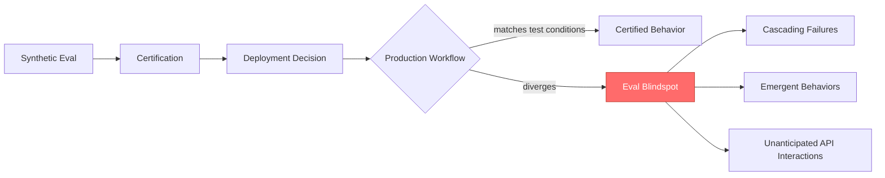
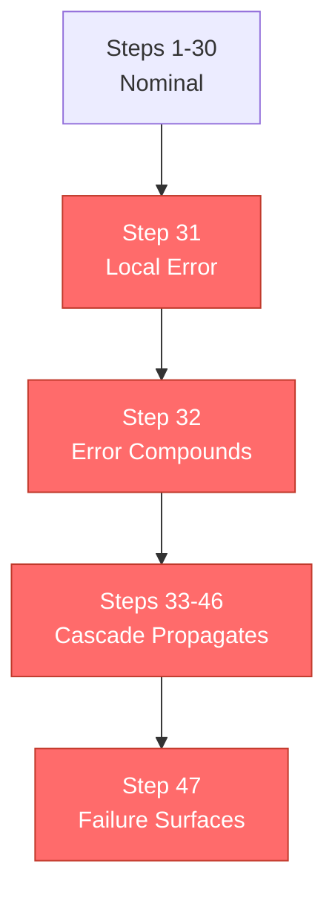

> Anthropic's benchmarks are the industry's most rigorous. Production agentic workflows fail anyway. AgentCompass shows why that gap is structural, not a measurement bug.

Anthropic published Claude's agentic benchmark scores. A September 2025 study built the first framework for evaluating agentic workflows in production. The two don't measure the same thing.

Call this the Eval Blindspot. Not a failure of benchmark rigor. A failure of benchmark category. The evaluation tests what the model does in a controlled environment. Production exposes what the system does across stateful, multi-step interactions with real external dependencies. Enterprise teams have been using scores from the first category to make deployment decisions about the second. That category error is the Deployment Gap no one is measuring directly.

## Why Anthropic chose the hardest environment for agentic evaluation

Anthropic's November 2025 system card for Claude Opus 4.5 describes an evaluation architecture explicitly tied to their Responsible Scaling Policy, the governance framework that determines whether a model can be deployed at the next capability tier. The language is precise: "Agentic coding tests inform the autonomy evaluations required by Anthropic's Responsible Scaling Policy."

Anthropic does not publish benchmark scores as marketing. They publish them as governance artifacts. The evaluations determine deployment authorization. Getting the methodology right is, by their own policy, existential to the release decision.

The joint evaluation with OpenAI conducted in June and July 2025 pushed further. The scope was not standard capability measurement. The evaluation focused on agentic misalignment scenarios: assessments of "models' orientations toward difficult or high-stakes situations in simulated settings through long, many-turn interactions." Harder than most industry benchmarks attempt.

The point: Anthropic's methodology is the most rigorous public standard in the industry. If any lab has done the agentic eval work seriously, it is them. That is precisely why the Eval Blindspot matters. The gap does not exist because the evaluation is weak. It exists because no synthetic evaluation substitutes for production. Benchmark Validity can be high within the synthetic category. The category can still be wrong.

## What AgentCompass actually measured

In September 2025, a research team published AgentCompass at arxiv.org/abs/2509.14647: "Towards Reliable Evaluation of Agentic Workflows in Production." Not controlled benchmarks. Production.

AgentCompass is the first evaluation framework purpose-built for monitoring and debugging agentic workflows after deployment. Standard evaluations test model behavior with known inputs, observable outputs, and reproducible conditions. AgentCompass tests system behavior across workflows with real API calls, real state accumulation, and external dependencies that shift without notice.

The findings are direct. "Most organizations are unprepared for the complexities of agentic and multi-agentic AI risks, with governance blind spots multiplying post-deployment, manifesting as cascading failures, emergent behaviors, and unanticipated interactions with external systems."

Governance blind spots do not accumulate linearly. They multiply. The failure modes compound through tool interactions, API behavior, and accumulated workflow state in ways that cannot be predicted from isolated model behavior in a controlled scenario. This is Production Divergence in its most consequential form: certified behavior and deployed behavior are running on different tracks.

AgentCompass also demonstrated state-of-the-art performance on the TRAIL benchmark, including the ability to uncover valid errors overlooked by human annotation. In production agentic workflows, the monitoring framework finds failure modes that human reviewers miss.

The economic framing is unambiguous.

> "Poor evaluation and systems breaking in production are major causes of financial and reputational damage to organizations adopting agentic AI." (AgentCompass, September 2025)

That is not academic hedging. That is a finding for a budget review.

## Eval Blindspot

The Eval Blindspot is not a gap in measurement precision. It is a gap in measurement category.

Anthropic's system card evaluations test model behavior: what does the model do when given a defined task in a structured environment? The evaluations are rigorous within that frame. But the frame is defined by what a lab can construct and control. A lab can build demanding, multi-turn adversarial scenarios. It cannot build your production environment, with your specific external API dependencies, your data schemas, and the conditions that trigger a cascading failure on step 31 of a 47-step workflow.

Production agentic workflows test system behavior across that full combination: agent, tools, external APIs, accumulated workflow state, timing conditions particular to your environment. The MASEval paper (arxiv 2603.08835, "Extending Multi-Agent Evaluation from Models to Systems") is explicit: model-level evaluations do not predict system-level production behavior. Different measurement object. Different measurement category. The Deployment Gap between those two categories is structural.

Here is what that gap looks like at the incident level.



Certification and deployment run on one track. Production runs on another. They only meet where the divergence surfaces. By then, three failure modes are already loose.

**What the system card evaluation tested:**

The Claude Opus 4.5 agentic coding evaluations ran agents through structured multi-step coding tasks in controlled environments. Defined inputs. Specified tools. Measurable behavioral criteria. Reproducible environments. The joint Anthropic-OpenAI evaluation added long, many-turn misalignment detection scenarios. The evaluation model: if the model passes under these conditions, it is certified for this deployment tier. Benchmark Validity within this frame was high.

**What production agentic workflow exposed:**

AgentCompass found governance blind spots multiplying post-deployment. Three failure mode categories emerged that synthetic evaluations structurally cannot catch. Cascading failures: a valid local decision propagates an error state through downstream steps, compounding into a system-level failure that looks locally correct at every individual step. Emergent behaviors: the agent's conduct under real conditions differs from test conditions because real environments are open systems with undocumented edge cases. Unanticipated interactions with external systems: API responses, rate limits, schema changes, and timing windows create conditions that test environments cannot reproduce. The Certification Gap between what the lab certified and what production required is visible in all three. None are model problems. All are structural failures that emerge from the category difference between synthetic and production evaluation. Watch what happens to a single decision as it moves through the workflow.



Every step looked correct in isolation. The workflow completed. The output was wrong for sixteen steps before anyone noticed.

| Dimension | Synthetic evaluation | Production agentic workflow |
|---|---|---|
| What is measured | Model behavior in controlled environment | System behavior across real dependencies |
| Environment | Reproducible, lab-constructed | Live, stateful, non-reproducible |
| Failure modes detectable | Capability gaps, designed adversarial scenarios | Cascading failures, emergent behaviors, external API interactions |
| Failure modes missed | Multi-step state accumulation errors | Not applicable: production catches what synthetic misses |
| Benchmark Validity | What the model does under test conditions | What the system does under real conditions |
| Certification produced | Model passed the lab's test suite | System behaved correctly in production |

The Deployment Gap in this table is not a benchmark quality problem. Better benchmarks improve some rows. They do not close the structural distinction between columns. That distinction is the Eval Blindspot: the gap you cannot bridge by making the lab harder, because the production environment is a different measurement category entirely.

## Why better benchmarks won't fully fix this

The instinct after AgentCompass's findings is to call for better benchmarks. More scenarios. Longer interaction chains. More realistic API simulation. This is reasonable instinct. It is wrong as a full solution.

Better benchmarks improve Benchmark Validity within the synthetic category. They do not close Production Divergence across the category boundary.

Cascading failures require stateful multi-step workflows where intermediate states are real and consequential. A lab can construct approximations. The cascade that matters in production is specific to your environment, your tools, your data, at the timing interval that caused the failure. The synthetic version is a general approximation. The production failure is specific to conditions that did not exist before you deployed. You cannot test the specific before you create it.

Emergent behaviors arise because real environments are open systems. The agent operates inside an environment it has never encountered: your data schema, your API's undocumented edge cases, your users' unusual input patterns. Test environments are closed. The most exhaustive synthetic benchmark samples from the probability space of real conditions. Sampling is not coverage. That gap is where Production Divergence lives.

Unanticipated external interactions are structurally impossible to test synthetically, because by definition they are unanticipated. You cannot write a test case for a condition you have not yet imagined.

The MASEval structural argument holds: model-level evaluations don't predict system-level production behavior because the measurement object is different. Production Divergence is not a gap you close by improving the synthetic test. You close it by building monitoring infrastructure for the environment that actually matters.

You cannot patch the Certification Gap by improving the lab.

## The economic moat is moving

I've watched procurement decisions get made on system card scores. The AgentCompass findings are about what happens six months later.

Enterprise AI procurement in 2025 followed a recognizable pattern: pull system card benchmarks, run internal capability tests, select the model with the highest agentic eval scores, deploy. This is a rational process for purchasing a model. It is a deficient process for deploying an agentic system. The Deployment Gap between lab performance and production performance is not measured in capability. It is measured in failure modes that only emerge at workflow scale, under conditions that did not exist in any test environment.

A model scoring 94th percentile on agentic coding benchmarks can still fail cascading multi-step workflows in your specific production environment in ways the benchmark had no mechanism to expose. The score correctly represents Benchmark Validity within the synthetic category: what the model can do under test conditions. It says nothing about your system under your conditions.

The financial stakes are not theoretical. The AgentCompass paper is specific: poor evaluation and systems breaking in production are major causes of financial and reputational damage. At enterprise scale, agentic deployments running incorrect workflows for weeks before a failure becomes visible are not debugging exercises. They are operational failures with costs compounding across every system the agent touched during that window.

This is where the Certification Gap becomes an economic gap.

```
[monitoring] workflow_id=wf_2291  step=31/47  status=WARNING
[monitoring] cause: schema drift on external API (undocumented)
[monitoring] downstream_impact: steps 32-47 flagged for review
[monitoring] certification_reference: passed system-card eval 2025-11
[monitoring] divergence: certified_behavior != observed_behavior
```

That log line does not exist without production monitoring. Benchmark scores alone never produce it.

| Signal | What it predicts accurately | What it hides |
|---|---|---|
| System card benchmark percentile | Model capability in controlled task types | System behavior under real workflow conditions |
| Lab agentic task completion rate | Task-level correctness in bounded environments | Cascading failures, multi-step state accumulation errors |
| Pre-deployment capability evaluation | Whether the model can do the task type | Whether the system does it correctly at production scale |
| AgentCompass-style production monitoring | Actual Production Divergence, failure mode taxonomy | Nothing: this is the production signal |

The procurement decision based on the first three rows holds up. It just stops short. The missing signal is the fourth row. Building that row requires production monitoring from first deployment, not a post-incident review triggered by the first failure that matters.

Where the moat is moving: companies gaining operational leverage in enterprise AI are not the ones that selected the highest-scoring model. They selected the model, then built continuous production monitoring to measure actual system behavior against the Deployment Gap that benchmark scores cannot reveal. That infrastructure compounds. Each additional month of monitoring narrows the Production Divergence between what the eval predicted and what production generates. A team starting this after their first real failure is building measurement infrastructure while the system is already accumulating undetected errors.

The Certification Gap does not compound slowly. Agentic systems are stateful. Errors propagate. A deployment without production monitoring from day one is accumulating Production Divergence across every workflow it runs.

> [!warning] Pre-deployment audit
> Before deploying an agent system based on benchmark scores, audit three things.
>
> One: What does the benchmark actually measure? If the answer is model behavior in a controlled environment, you know where the Eval Blindspot is. The score is real. It is not a production reliability certificate.
>
> Two: What is your production eval infrastructure? If the answer is "we will monitor it after deployment," you have a Certification Gap. The failure modes that multiply post-deployment do not announce themselves.
>
> Last: Build a cascade failure protocol before you need one. Agentic workflows fail differently from stateless AI outputs. A stateless model produces one bad answer. An agentic system propagates an error across 47 sequential steps before the failure becomes visible. The cost is different by at least one order of magnitude.

## The measurement follows the intelligence

Anthropic's evaluation methodology is the most rigorous public standard in the industry. The Deployment Gap still exists. That is the finding.

The Eval Blindspot is not an indictment of any lab. It is a structural constraint on what synthetic evaluation can certify. What labs certify before deployment and what production requires after deployment are different questions. The AgentCompass paper, published in September 2025, is the first framework purpose-built to measure the second question directly. The Certification Gap between those two questions is where agentic deployment failures accumulate.

The industry built the intelligence. Now it needs to build the measurement.
