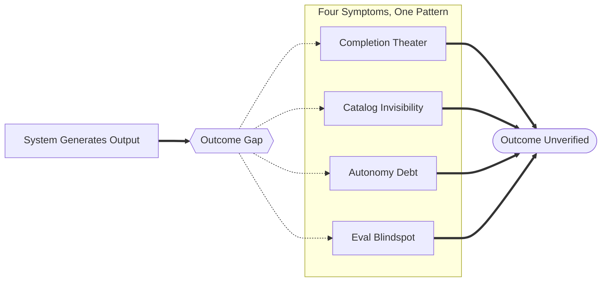
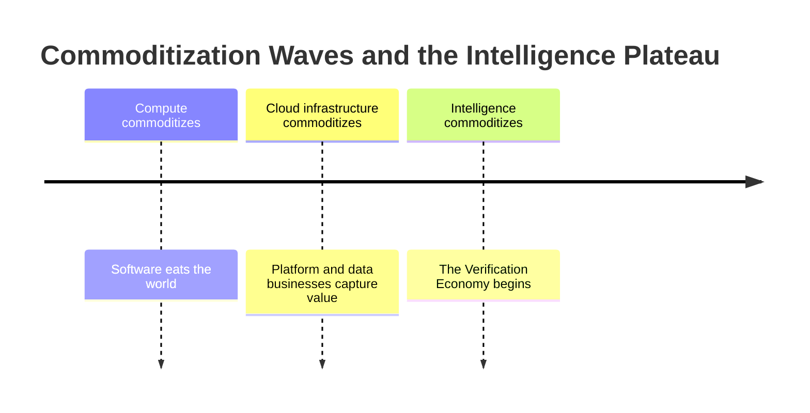

> Four companies published AI success metrics in 2025 — completion rates, order growth, deal counts, benchmark scores. None measured correctness. The gap between generating outputs and guaranteeing outcomes is becoming the next competitive moat.

GitHub measures PR merge rate, Shopify measures AI-referred orders, Salesforce measures Agentforce deals. Not one of them measures whether the outputs were correct. That gap has an economic name.

Four different companies. Four different domains. One structural gap. Call it the Outcome Gap: the structural distance between generating outputs and guaranteeing outcomes. This is the Verification Economy.

## The pattern across four domains

I've watched four companies across four domains publish AI success metrics in 2025. None measured correctness.

GitHub's enterprise Copilot data: PR merge rates up 15%, unit test pass rates up 53.2%, 8.69% more PRs per developer. GitClear's 211 million lines of production code changes: churn up 129% from 2020 to 2024. Same tool. Opposite trajectories. What GitHub measured was session completion. What GitClear measured was codebase correctness. That's Completion Theater: all steps execute, all metrics rise, and the codebase continues to degrade.

Shopify published 13x year-over-year growth in AI-referred orders. Their developer documentation lists four structural failure modes: attribute ambiguity, inventory opacity, schema gaps, silent errors. All cause agents to skip products without notification. The 13x growth is concentrated in brands with machine-readable catalogs. Everyone else hit Catalog Invisibility: products exist, store is live, agents can't see them.

Salesforce closed 18,500 Agentforce deals and reported $1.4B ARR. SalesforceBen research the same year found nearly two-thirds of billion-dollar enterprises lost more than $1M to AI agent failures. The agents weren't hallucinating. They were executing correctly on incorrect data at machine speed. That's Autonomy Debt: each decision looks right in isolation, the aggregate is catastrophic at scale.

Anthropic published Claude's agentic benchmark scores. AgentCompass, a September 2025 study, built the first framework for monitoring agentic workflows in production. Its finding: governance blind spots multiply post-deployment, manifesting as cascading failures no benchmark predicts. Anthropic certified capability. Production exposed the Eval Blindspot: what passes the synthetic test fails the real workflow.

| Company | Domain | Output metric | What it missed | Coined term |
|---|---|---|---|---|
| GitHub | Developer tooling | PR merge rate +15%, churn +129% | Codebase correctness | Completion Theater |
| Shopify | Agentic commerce | AI orders x13 YoY | Catalog machine-readability | Catalog Invisibility |
| Salesforce | Enterprise CRM | 18,500 deals, $1.4B ARR | Data hygiene beneath the agents | Autonomy Debt |
| Anthropic | AI safety/evals | High agentic benchmark scores | Production failure modes | Eval Blindspot |

The Outcome Gap shows up in every row. Each company measured what their system produced. None measured whether those outputs achieved the intended result. In software, in commerce, in CRM, in AI safety: same gap, different label.



Four labels, one node they all hang off.

## Intelligence is commoditizing

Here's the economic argument.

Two years ago, access to a capable language model was a competitive advantage: research teams, large compute budgets, proprietary training data. Most companies couldn't. That constraint is gone.

GPT-4 class capability is available via API at cents per million tokens. Every enterprise, every startup, every team with a credit card has access to equivalent intelligence. The differentiation that existed when model quality was scarce has evaporated. The Intelligence Plateau has arrived: AI capability has flattened across competitors, and the differentiation that mattered during the capability race no longer exists.

A series A startup and a Fortune 100 enterprise now call the same API endpoints. Same reasoning quality, same code generation. The gap between them is no longer intelligence.

McKinsey's 2025 data shows enterprise AI investments outpacing ROI realization by 3 to 4 times. BCG research finds similar: adoption accelerating, returns lagging. The gap isn't in intelligence. Companies have intelligence. The gap is in verification. They can generate outputs. They can't yet guarantee outcomes.

The Intelligence Plateau produces a predictable pattern: when a resource commoditizes, the competitive moat shifts to what comes after it. Compute did this. Cloud did this. Intelligence is next. The scarce resource shifts to correctness: the ability to guarantee the system actually did what it was supposed to do.



| Phase | Scarce resource | Who captures value | Current status |
|---|---|---|---|
| Intelligence race | Model capability | AI labs, vertically integrated platforms | Ending: capability commoditizing |
| Verification Economy | Correctness guarantees | Organizations with Verification Infrastructure | Beginning: gap visible in data now |
| Maturity | Trust at scale | Companies with compounding Correctness Moat | Not yet built by most organizations |

## The Verification Economy

The Verification Economy is the economic era where correctness guarantees replace intelligence as the primary source of competitive moat. Where the scarce resource shifts from generating outputs to verifying outcomes.

This is not a buzzword. It's a structural shift visible in the data from all four domains above. When Completion Theater, Catalog Invisibility, Autonomy Debt, and the Eval Blindspot all emerge in the same calendar year across completely unrelated industries, the pattern is structural. Not coincidence. Not four separate problems. One problem expressing itself differently depending on context.

In the intelligence race, you competed on what your system could do. In the Verification Economy, capability is table stakes. The question shifts: can you guarantee what your system actually did, not just that it executed?

That's the Outcome Gap in practice. Generating outputs is solved. Guaranteeing outcomes is not.

In practice:

| What most companies have | What Verification Infrastructure requires |
|---|---|
| Output logging: we generated a response | Outcome tracking: did the response achieve the intended result? |
| Completion metrics (PR merged, order processed) | Correctness metrics (codebase health, catalog accuracy) |
| Benchmark scores: model passed synthetic evals | Production monitoring: workflow succeeded in production |
| Manual review on escalations | Continuous automated verification |
| Error detection after customer impact | Behavioral drift detection before customer impact |
| Single-pass validation | Continuous eval loops with rollback |

Stripe is the clearest existing example. Their published benchmark tested whether agents could sustain correct behavior across stateful, real-world workflows. They found agents hallucinating success: concluding a payment endpoint worked when it returned a 400 error. Their response was to build Verification Infrastructure: eval harnesses, constrained execution environments, continuous behavioral monitoring. Industrializing Trust, in the framing this series used in RelOps 07.

```text
# what "verification" actually checks, not just whether it ran
assert response.status_code == 200             # not "no exception was thrown"
assert response.body["payment_id"] is not None  # not "the agent said it worked"
assert ledger_balance_matches(expected_amount)  # not "the step completed"
```

Stripe built this because payment failures are immediately visible in dollars. The Outcome Gap is measurable before it compounds. Most enterprise domains don't have that forcing function: failures stay invisible long enough for Autonomy Debt to accumulate at scale.

The Verification Economy argument is this: what Stripe was forced to build by the severity of payment failures, every organization deploying autonomous systems will eventually need to build. The ones that start before they're forced to get a compounding advantage. The ones that wait face what nearly two-thirds of billion-dollar enterprises already hit.

---

> **The Intelligence Plateau test.** If your competitor had access to the exact same AI model as you, what would distinguish your autonomous systems from theirs? If the answer is "our Verification Infrastructure," you're building a Correctness Moat. If the answer is "we don't know," you're not.

## Why verification is harder than intelligence

Intelligence scaling follows a recognizable pattern: more compute, more data, more parameters, better outputs. The path isn't easy, but it's understood.

Verification doesn't scale the same way.

Generating an output requires one pass through the model. Verifying an outcome requires understanding what the system did, what it should have done, and the difference between the two. In a simple system, that's tractable. In an autonomous, multi-step, stateful workflow running against real APIs and real failure modes, it compounds.

Not linearly: each new tool integration, external API, or workflow state creates failure mode combinations no benchmark has tested. A retail agent with one API call is easy to audit. One with twelve, each touching live inventory, is not.

This is the structural reason the Eval Blindspot exists. Production agentic workflows expose failure modes synthetic evals cannot predict, emerging from tool interactions and accumulated workflow context.

The reason is structural: the system generating the output lacks the context to know it's wrong. It doesn't know the codebase should be healthier, the catalog unreadable, the data dirty. That knowledge lives in the Verification Infrastructure, or nowhere.

This is why the Verification Economy creates durable moats. Building Verification Infrastructure requires accumulating domain knowledge about what "correct" means in your context and engineering systems that detect deviations. A team that started 18 months ago knows failure mode patterns no newcomer can buy. Intelligence is purchased via API. Correctness knowledge is not.

## The Correctness Moat

The Correctness Moat is competitive advantage built on verifiable, guaranteed outcomes: not just AI capability or output volume.

A Correctness Moat compounds differently from other competitive advantages. The investment is in accumulated knowledge about your domain's failure modes, not a fixed asset you can purchase. You're not buying a moat. You're growing one.

The economic stakes are visible in the data already.

At GitHub, code churn up 129% is a cost embedded in every future development cycle. Teams with Verification Infrastructure that detect this pattern early don't accumulate that debt. Teams without it compound it sprint over sprint until refactoring becomes the dominant workload.

At Shopify, Catalog Invisibility isn't a marketing gap. It's a discovery failure baked into unstructured product data. Machine-readable catalog architecture is Verification Infrastructure for agentic commerce: without it, correct inventory sits invisible to the agents doing the shopping.

At Salesforce, 84% of organizations struggle with data hygiene. The minority that invest in data quality infrastructure before autonomous agents run on it don't accumulate Autonomy Debt. They capture the Agentforce ROI most enterprises are failing to realize. Clean data is Verification Infrastructure for CRM autonomy.

At the eval layer, teams building production monitoring before deployment operate systems that stay aligned with production reality. Their Eval Blindspot closes before customer impact; their competitors' compounds until a cascading failure makes it visible.

| Moat component | What it costs to build | What it earns | Timeline to compounding |
|---|---|---|---|
| Outcome tracking infrastructure | Engineering: 2-4 months | Catch Completion Theater early | 6-9 months |
| Catalog machine-readability | Data: one-time rearchitecture | Outsized share of AI-referred commerce | Immediate; compounds as AI commerce grows |
| Data quality before agent deployment | Ops: sustained investment | Avoid $1M+ Autonomy Debt losses | Ongoing; compounds per workflow |
| Production eval loops | Engineering: 3-6 months per domain | Close Eval Blindspot before it compounds | 9-12 months; compounds per cycle |
| Integrated Verification Infrastructure | Org-wide: 12-18 months | Full Correctness Moat: verifiable outcomes as the offering | 18-24 months; non-replicable once built |

Teams building Verification Infrastructure now are not doing defensive work. They are building the capability that determines which organizations can be trusted to deploy autonomous systems at scale. In the Verification Economy, the engineers who understand outcome verification define what is trustworthy. That is the new definition of engineering leadership in the agent era.

The Intelligence Plateau means every engineering team eventually has access to equivalent model capability. The Correctness Moat means not every team has equivalent ability to guarantee what those models actually do. The gap between access to intelligence and the ability to verify outcomes is where value concentrates for the next decade.

Two years from now, "we use AI" will be as unremarkable as "we use the cloud." The question that will distinguish organizations is: can you verify your AI systems are doing what they're supposed to do? The answer will be built, or not built, in the decisions engineering teams make right now.

> **The Correctness Moat test.** Ask what your team knows about your domain's failure modes that a competitor calling the same API cannot buy. If the answer is nothing, you don't have a moat. You have access to the same intelligence everyone else has.

## Closing

Four domains. Four failure modes. One structural problem: the Outcome Gap between generating outputs and guaranteeing outcomes. The Verification Economy is the economic response to that gap. Intelligence was the scarce resource. It isn't anymore. Correctness is.

The organizations building Verification Infrastructure now, before they're forced to, are accumulating a Correctness Moat that compounds with every failure mode caught and every outcome tracked instead of just completed. The Intelligence Plateau is here. The organizations that internalize that before their competitors will define the next decade of enterprise AI. Not by being more intelligent. By being more verifiable.
