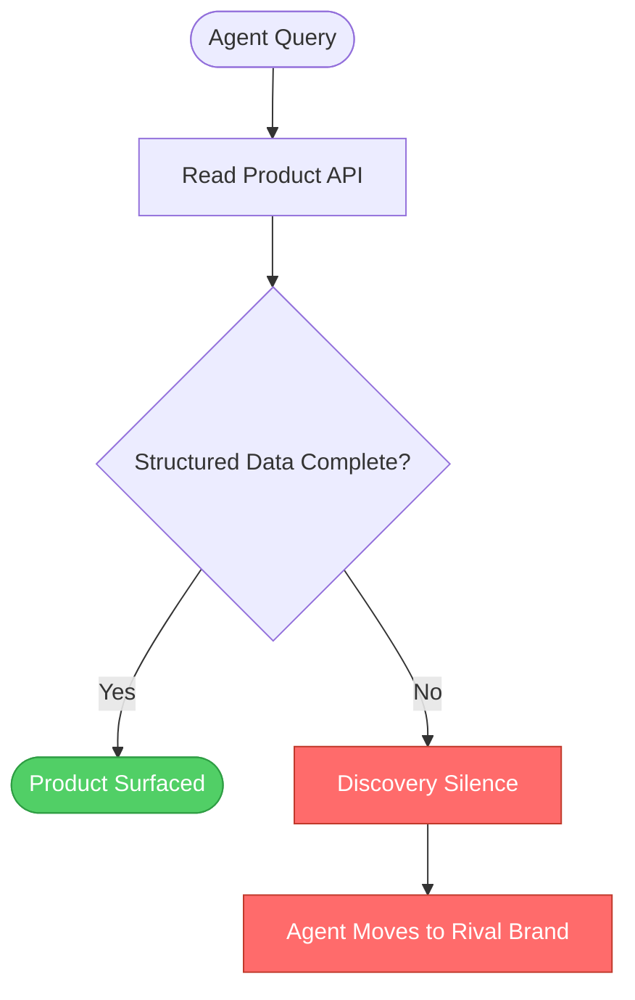

> Shopify's AI-referred orders grew 13x in 2025, but the growth is concentrated in catalogs built for machine readers, not human browsers. Most merchants have Catalog Invisibility and don't know it.

Shopify's AI-driven orders grew 13× year over year. OpenAI launched an in-chat checkout and killed it. Most merchants aren't capturing either number.

The gap has a name: Catalog Invisibility. Products exist. The store is live. Payments work. But the AI agents now routing purchase intent can't surface those products because the underlying data structure is wrong. This is not a Product Readiness problem that better copy fixes. It is a catalog architecture problem. And the merchants who haven't solved it have a Commerce Blindspot directly in the channel with 13× order growth.

## Why Shopify chose the hardest possible environment for agentic commerce

Commerce is unforgiving. A content recommendation getting it wrong loses a click. A commerce agent getting it wrong loses a sale. Shopify operates at the intersection where AI makes purchase decisions in real time, with real money, on behalf of real customers.

Shopify's 2025 data is not a projection. AI-referred orders grew nearly 13× year over year. AI-referred visitors convert at nearly 50% higher rates than organic search. The channel is not hypothetical. It is running, scaling, and distributing revenue unevenly across the merchant base.

The distribution matters more than the headline number. If agentic commerce grows at 13× and AI-referred conversion rates run 50% above organic baselines, the merchants capturing that growth are pulling away from those who aren't. Channels with that kind of differential don't stay open indefinitely. Early organic search created decade-long advantages for companies that understood how it worked before everyone else did. Agentic commerce is following the same pattern, compressed into months.

I've watched merchants assume their Shopify store means they're participating in agentic commerce. It does not. A live Shopify store means you have a catalog. It does not mean that catalog is structured for Agentic Discovery. The difference is where the 13× is hiding.

## What Shopify's own data actually revealed

OpenAI launched Instant Checkout in 2025. In-chat purchase flow, embedded commerce, the ability to complete a transaction without leaving a conversation. The vision was direct. The execution failed.

OpenAI killed it. The stated reason: "it did not offer the level of flexibility" needed. The actual failure was structural. Merchants couldn't get accurate product data into the chat interface. Multi-item carts didn't work. Loyalty integrations broke. These weren't design failures in the checkout flow. They were catalog failures. The agent had no reliable way to know what products a merchant carried, in which variants, at which stock levels, with which shipping parameters.

This is Discovery Silence in agentic commerce: the agent can't answer a product query, moves to a brand whose catalog it can read, and the original merchant never knows the interaction happened. No error message. No lower-ranked result. No signal of any kind.

Shopify published a developer-facing guide on agentic-ready product data. Most merchants will never read it. It documents four failure modes that cause Discovery Silence across Shopify catalogs.

Attribute ambiguity is the most common. Variants aren't properly grouped in the catalog data. An agent asked "Does this come in red?" reads conflicting attributes and either gives a wrong answer or refuses.

Inventory opacity hits differently. Variant-level stock data isn't exposed through the API at the resolution an agent needs. The agent can't confirm availability. Faced with that gap, it refuses to recommend. The sale disappears without a trace.

Schema gaps are more absolute. Missing structured data makes the product invisible to Agentic Discovery from the first pass. The agent never encounters the product at all.

Silent errors are the hardest to catch. The agent skips the product with no notification to the merchant. Discovery Silence at the system level: complete, invisible, undetectable without explicit instrumentation.

| Failure mode | What happens | What merchant sees | Structural fix |
|---|---|---|---|
| Attribute ambiguity | Agent misreads variants, gives wrong answer or no answer | Wrong answer, or no sale | Group variants with complete attribute matrix per variant ID |
| Inventory opacity | Agent refuses to recommend without stock clarity | No sale, no signal | Expose variant-level inventory through API, not aggregate count |
| Schema gaps | Product invisible to Agentic Discovery entirely | Zero exposure, no error | Implement structured data per Shopify product schema spec |
| Silent errors | Agent skips product, no notification to merchant | Nothing. Discovery Silence. | Enable agent feedback loops; audit catalog coverage gaps |

Four failure modes. None surface as errors on the merchant side. Each produces the same outcome: Discovery Silence, and zero share of the 13×.

## Catalog Invisibility

Catalog Invisibility is the state where a merchant's products exist in a live store, transactions are possible, fulfillment is operational, but AI agents cannot surface those products because the product data was structured for human browsers, not machine readers.

This is not a visibility problem in the search engine sense. The distinction matters.

Shopify's enterprise blog stated it directly: "Unlike a low-ranking Google result, there's no page two. The agent simply moves to the brand that's easiest to understand."

In Google, a poorly optimized product lands lower in results. It still appears. A user can find it by scrolling or refining a query. The surface area for recovery exists. In agentic commerce, Catalog Invisibility is binary. The agent either reads your data and recommends your product, or it doesn't. The intermediate states that exist in search have no equivalent here.

Agentic Discovery is the process by which AI agents find products. It looks nothing like human browsing. Merchants who treat it like human browsing have a Commerce Blindspot at the foundation of their agentic strategy.

| | Human browsing | Agentic Discovery |
|---|---|---|
| Discovery method | Visual scan, category navigation, filter menus | Reads structured data: titles, attributes, inventory state, schema |
| What determines visibility | Category placement, imagery, marketing copy | Data completeness, schema conformance, variant grouping |
| Response to missing data | User notices, asks, or moves on | Agent skips silently, no notification issued |
| Ranking alternative | Lower rank, still visible | Binary: readable and surfaced, or not surfaced at all |
| Copy quality impact | High | Minimal if underlying schema is incomplete |
| Inventory signal | User can ask directly | Agent refuses to recommend without explicit variant-level data |

The right question for any commerce operator is not "Is our copy good enough for AI?" It is narrower: can an agent, reading only your product API, answer a specific inventory query?

> **Is your catalog Agentic Discovery-ready?**
> Test: can an agent answer "Is size M in stock for [product]?" from your product API alone?
> If the answer is no, you have Discovery Silence. Your entire catalog carries a Commerce Blindspot for every agent routing purchase intent through agentic channels.

There is no middle state between these two outcomes. Either the agent reads your data and surfaces the product, or it moves to a rival brand and never reports why.



Product Readiness is not about content quality. It is a data architecture question. A beautifully written product description attached to a malformed variant schema produces exactly the same outcome as no description: the agent misreads the product or skips it entirely.

The Universal Commerce Protocol, developed by Shopify and Google, and the Agentic Commerce Protocol, developed by OpenAI and Stripe, both exist because the industry recognized that unstructured product data is incompatible with agentic commerce at scale. Neither protocol changes anything for a merchant whose catalog doesn't meet the underlying data requirements. Product Readiness is the prerequisite. The protocols are the interface layer built on top of it.

| | Google SEO | Agentic commerce |
|---|---|---|
| What determines visibility | Relevance signals, backlinks, page speed, content quality | Product data completeness, schema conformance, variant structure, inventory API |
| Response to poor optimization | Lower rank, still findable | No surfacing, no signal, Discovery Silence |
| Feedback mechanism | Ranking data in Search Console | None by default |
| Recovery path | Improve signals over weeks to months | Fix schema, effect is immediate |
| Copy quality impact | High, compounds over time | Minimal without correct data structure first |

Catalog Invisibility is not an SEO problem with a different name. The failure mechanism is different, the fix is different, and the cost of waiting is different.

## Why better product descriptions won't fix this

The instinct is common. Catalog Invisibility sounds like a content problem. The description isn't specific enough. The images aren't detailed enough.

None of that is the issue.

Shopify's developer documentation states it directly: "AI agents don't browse a store the way a human does. They read structured data, product titles, descriptions, images, pricing, inventory, shipping speeds, and use it to decide what to recommend."

The operative word is "structured." Not good data. Structured data. Data formatted so an agent can parse it and act on a specific query without inference.

An agent asked "Does this hoodie come in navy blue, size large?" reads the variant table. Not the product description. Not the brand story. The variant table. If that table doesn't correctly map navy blue as a color attribute against large as a size attribute, the agent produces a wrong answer or refuses. The Product Readiness gap lives entirely in the data model.

```json
// Attribute ambiguity: agent cannot resolve color or size
{
  "title": "Classic Hoodie - Navy/Blue, Lg",
  "variants": ["Navy-L", "Blue-Large", "L-Navy"]
}

// Structured: agent resolves the query directly
{
  "title": "Classic Hoodie",
  "variants": [
    { "id": "hoodie-navy-l", "color": "Navy Blue", "size": "L", "inventory": 42 }
  ]
}
```

Same product. Same merchant intent. One string is a guess for a human. The other tells the agent exactly what it needs to know.

Content and SEO teams have strong intuitions here. Those intuitions are wrong for this channel. Search optimization is about signal density: how many relevant signals can be packed into copy, metadata, and backlinks. Catalog optimization for Agentic Discovery is about data fidelity: does your catalog accurately reflect what you carry, in a structure an agent can read?

SEO is a marketing function. Data architecture for Product Readiness is an engineering function. The merchants closing their Commerce Blindspot fastest identified this distinction early and routed the work accordingly.

Take any product in your catalog. Can an agent reading only your product API answer: what colors are available, which sizes are in stock, what is the shipping speed today? If the API alone cannot answer those questions for that product, you have Discovery Silence for it. The fix is a data modeling project, not a copywriting project.

## The economic moat is moving

The 13× order growth Shopify reported is not distributed uniformly. If catalog architecture determines Agentic Discovery exposure, then Product Readiness is the filter separating merchants who capture agentic commerce from merchants who get Discovery Silence.

Run the math on the conversion differential. AI-referred visitors convert at 50% higher rates than organic search. A merchant doing 2,000 conversions per month from organic gets 3,000 from the same number of AI-referred visitors. That 1,000-conversion difference is the floor for merchants who solve Product Readiness. For merchants with Catalog Invisibility, the AI channel contributes zero. Not fewer. Zero.

| Catalog state | AI channel access | Conversion rate versus organic | Growth captured |
|---|---|---|---|
| Full Product Readiness, schema complete | Yes, full surface | Plus 50% on AI-referred visitors | Captures the 13× channel |
| Partial Product Readiness, some schema gaps | Partial, inconsistent by product | Plus 10 to 25% | Captures a fraction |
| Catalog Invisibility from attribute ambiguity | No, wrong answers given | Zero from AI channel | Misses the 13× entirely |
| Catalog Invisibility from inventory opacity | No, agent refuses to recommend | Zero from AI channel | Misses the 13× entirely |

The window is closing. Standards are consolidating now. Merchants who solve catalog architecture before those standards lock aren't just capturing present orders. They are building data infrastructure that makes compliance straightforward when access to major AI shopping integrations requires it.

After standards consolidate, Catalog Invisibility becomes structural. Technical debt compounds against a locked spec, not a moving target. Merchants who wait pay twice: engineering work redone, plus the order volume already lost.

The DevEx parallel is instructive. Developer experience tooling created a first-mover moat for companies that invested early in 2019 and 2020. That investment compounded into trust that took five years to build. Merchants who built Product Readiness in 2025, when most of the market hasn't heard of Commerce Blindspot as a category, are positioning the same way.

The economic argument is concrete. Shopify's 13× is historical data, not a forecast. The 50% conversion differential is measured, not modeled. The cost of Discovery Silence is calculable as orders not generated from a real and scaling channel. The window for building catalog infrastructure before standards lock is measured in months.

The moat is moving from catalog discoverability for human browsers to catalog machine-readability for AI agents. The merchants building that infrastructure now are not taking a speculative bet. They are filling a channel that already has orders in it, already measured, already distributing revenue along the lines of Product Readiness.

## The commerce channel you're already missing

The 13× happened. It is in Shopify's published data. OpenAI built, tested, and killed a checkout integration because merchant product data wasn't structured for machine consumption. Shopify published four failure modes causing Discovery Silence in a guide most operators will never read.

Agentic commerce is a real operating channel that grew 13× in a single year. The Commerce Blindspot is not a prediction about what will go wrong eventually. It is where most merchants are right now: store live, products real, catalog invisible to every agent routing purchase intent.

Catalog Invisibility is not the next problem. It is the current problem. Discovery Silence at scale is already happening. The 13× is already distributing unevenly. And a structural gap has already formed between merchants who understood Product Readiness early and merchants who reached for a better product description instead.

The agents are already deciding. Most catalogs are not readable. That is a data architecture problem with a data architecture fix. And the window to solve it before Catalog Invisibility calcifies into a permanent Commerce Blindspot is measured in months, not years.
