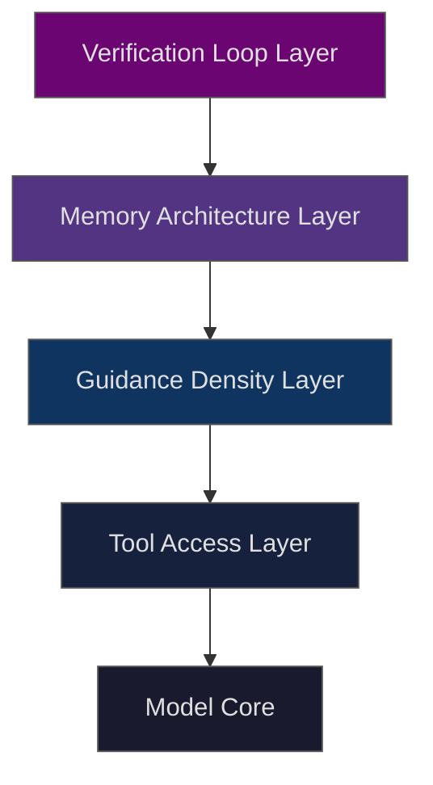

> Why every measurable performance gap in production AI traces to harness architecture — not model selection — and how to diagnose which layer is failing.

You are not in the model business. You are in the harness business.

The measurable gap in production AI — speed, reliability, cost, task completion — traces to harness architecture. Not model selection. Not parameter count. Not the version you upgraded to last quarter.

You are either engineering the harness, or you are renting someone else's ceiling.

This is Harness Engineering. Here is what fails when you misunderstand it.

---

## The category lie

Every AI team I've watched plateau has done the same thing first. They upgraded the model.

Sometimes it helped. Task completion rates stayed flat more often than not. Latency didn't move. Costs climbed. The next upgrade was already being evaluated before the current one settled. This is the category lie in production AI: that capability is a model problem, and that the path forward is a better model.

It's a clean belief. And it is wrong.

The belief survives because it is partially true. Stronger models handle ambiguous instructions better. They recover from partial context more gracefully. Benchmark rankings are real. The problem is that benchmarks measure models in isolation — not models operating inside a harness. In production, the model never runs alone.

What runs is the harness.

The harness is everything the model operates inside: the tools it can call, the instructions it receives, the memory it has access to, the verification loops that check its output, the constraints that bound its scope. Strip any of those layers and performance drops — not because the model changed, but because what the model was operating inside changed. The model had no idea. It was doing exactly what the harness told it to do.

Teams hit a framework ceiling and mistook it for a model ceiling. LangChain, LlamaIndex, and their successors made it fast to get an agent running. They also made it easy to confuse framework adoption with harness engineering. Months of effort went into tuning abstraction layers that couldn't be tuned into what the system needed — because the ceiling was the abstraction itself, not the configuration. When performance plateaued, the reflex was: different model. The actual fix: different harness.

Guidance collapse is what happens when that reflex wins over and over. Teams never build the scaffolding — or strip it to simplify — and the model does not gradually underperform. It stops working. Not a slide. A drop to zero.

That is not a model problem. The model was doing fine until you removed the harness.

---

## The evidence is not subtle

In a controlled ablation study across 480 trials using an HVAC audit task, Sonnet 4.6 running on a fully configured harness averaged 0.966 reward. Near-perfect task completion. Consistent across nearly five hundred runs.

Then we ran harness ablation.

Harness ablation is the systematic removal of one harness layer at a time — tools, guidance, memory, verification — to isolate which layer owns a given performance delta. It is the diagnostic protocol that makes capability claims falsifiable. You do not need to guess which layer is carrying the system. You can measure it.

First, the turn budget was cut from 20 to 10. Reward dropped to 0.943. A trim. The model adapted within constraints.

Tool access was removed next, with guidance unchanged. Reward fell to 0.153. The model was operating on general knowledge instead of task-specific data retrieval. Still functioning. Still making structured attempts — just not executing the actual task.

Then guidance density went to zero. Zero specificity, zero domain rules, zero structured constraints. With tool access already gone, reward dropped to 0.000. Across all conditions. Not partial failure. Complete failure.

This is guidance collapse: the failure mode where removing harness scaffolding drops model output not incrementally, but completely. The model was never the capability source. The harness was. Remove it and you learn that.

**SW1 — Harness Ablation Results (HVAC Audit, ~480 trials, Sonnet 4.6)**

| Condition | Reward | Delta from full harness |
|---|---|---|
| Full harness (baseline) | 0.966 | — |
| Turn budget cut 20→10 | 0.943 | −2.4% |
| No-tool condition | 0.153 | −84.1% |
| No guidance, no tools (L0) | 0.000 | −100% |
| Self-improvement: two-pass restructure | 0.940 | +95% tokens, flat reward |
| Self-improvement: systematic 2-sentence checklist | 0.980 | +11% tokens, +4.4% reward |

The self-improvement rows carry a separate lesson. Adding a two-pass restructure protocol to the harness burned 95 percent more tokens and gained nothing. Adding a two-sentence per-room checklist burned 11 percent more tokens and raised reward from 0.940 to 0.980. The winning change was two sentences.

More guidance is not more guidance density. Density is specificity, not volume. The systematic checklist worked because it gave the agent a structured completion criterion it could verify against. The two-pass restructure added processing overhead without adding clarity.

There is one more data point. That winning checklist, dropped into L0 conditions — the thinnest reference baseline — pushed reward from 0.83 down to 0.53. The strategy transfers across harness configurations. The wording does not. Guidance density is a property of the harness-task pairing, not a prompt template that ports cleanly between systems.

---

## The capability floor

The capability floor is the minimum performance level a harness guarantees regardless of which model runs inside it. It is established by tool access, guidance density, and verification loops — not by model parameters.

Most engineers treat this backwards. They set a performance target, pick the strongest model they can afford, and expect the harness to fill in around it. What they are actually doing is setting a model ceiling and hoping the floor meets it. The failure modes are invisible when it works. They are catastrophic when it stops — and they stop in ways that look like model problems, because the model is the only thing the team was tracking.

Here is what a capability floor shift looks like when it is engineered deliberately.

On TerminalBench 2.0, LangChain DeepAgent jumped from outside the top 30 to the top 5. Same model. No fine-tuning. No prompt engineering changes. The variable: the harness. The benchmarkers changed how the model was operated, not what model was operating. That is a framework ceiling break — the orchestration layer stopped being the constraint — and a capability floor reset. The model had that performance level available the entire time. The harness was not delivering it.

A fintech team ran a financial assistant with 14-second query latency, retrieval accuracy stuck at 60 percent, and a development cycle measured in months. The fix was not a model upgrade. They removed the layered multi-framework architecture entirely — replaced it with plain Python and direct API calls. Response time dropped to 3.2 seconds. Retrieval accuracy rose to 89 percent. The next feature shipped in three weeks. I've seen this pattern more than once: the teams that move fastest are usually the ones who got burned worst by the abstraction first.

Six months of framework wrestling ended when they stopped treating the framework ceiling as a configuration problem. The capability floor had been suppressed by the abstraction the whole time.

**SW2 — Framework vs. Custom Harness: Operational Comparison**

| Metric | Framework (baseline) | Custom harness | Delta |
|---|---|---|---|
| Response latency | 14s | 3.2s | −77% |
| Retrieval accuracy | ~60% | 89% | +48pp |
| Development cycle | 6 months | 3 weeks | −87% |
| Per-task cost reduction | — | −30 to 60% | Prompt caching + model routing |
| Task completion rate | 40–60% | 80–90% | +33 to 50pp |
| Primary failure mode | Framework ceiling | Guidance collapse | Different failure, different fix |

The failure mode column is the one to read. Framework ceiling and guidance collapse require different interventions. Teams that treat them as the same problem — and upgrade the model as the fix for both — spend months on the wrong repair. The framework ceiling means your orchestration layer is the bottleneck. Guidance collapse means your scaffolding is insufficient. You will not solve one by fixing the other.

**SW3 — Build vs. Adopt: 5-Question Harness Decision Rubric**

Run this before proposing a custom harness migration. A "no" on any question maps to a specific engineering intervention. The questions are ordered — if Q1 through Q3 return yes, you have not hit the framework ceiling yet.

| # | Question | If No → Intervention |
|---|---|---|
| 1 | Is latency SLA under 5s? | Audit context volume per turn; check verification loop depth |
| 2 | Is task completion rate above 80%? | Run harness ablation to locate missing layer |
| 3 | Is per-task token cost within budget at scale? (20 engineers × 10 tasks/day = $1,000–$3,000/day) | Implement prompt caching + smart model routing |
| 4 | Do optimizations require removing abstraction rather than tuning it? | Framework ceiling hit — migrate to custom harness |
| 5 | Do failure modes produce guidance collapse rather than incremental degradation? | Rebuild guidance density from L0 baseline upward |

Q4 and Q5 are the migration triggers. Reaching them with yes answers on Q1–Q3 means the harness is functioning within its design — optimizations are still available. Reaching Q4 with a no means the framework ceiling is the bottleneck. Reaching Q5 with a no means the scaffolding itself is absent or collapsed.

**The Harness Stack — Where the Capability Floor Lives**

The model sits at the core. Each outer layer is a harness engineering decision. The capability floor is the aggregate output of all four layers — not the model alone. At L0 you have only the core. That is what 0.000 reward looks like. Add tool access: 0.153. Add guidance density: everything else that gets the system to 0.966. The floor is built layer by layer. It does not appear automatically because you deployed a capable model.

---

## What breaks and how

Not all harness failures look the same. In low-guidance and no-tool conditions — approaching L0 — four distinct failure shapes emerge. These are not quality gradations on a single scale. They are mechanistically different failures with different diagnostic signatures and different harness layer origins. I've looked at enough of these to stop being surprised. The shape tells you exactly where the harness broke.

**Instance substitution.** The model silently replaces the actual task conditions with different ones — a different schedule, a different room configuration, different city inputs. Output looks structurally complete. The data is wrong. This failure shape is invisible to static analysis tools. The financial assistant case produced a tax calculation that was syntactically valid, type-safe, and applying the wrong marginal rate. The LSP passed it. The type checker passed it. The error was semantic: the harness had not provided the constraint that would catch the substitution before output was delivered.

**Generic-domain takeover.** Fluent technical prose appears in output, but it is generic-domain fluency rather than task-specific reasoning. In HVAC audit conditions, an agent in guidance collapse produces a coherent explanation of how HVAC systems function — drawing on general knowledge — without engaging the specific audit requirements. The prose is confident. The task is not being executed. This is the failure shape that reads like success until someone checks the actual output.

**Standard hallucination.** Confident assertions of lookup values with no access to the actual data. Predictable in zero-tool conditions. The model cannot retrieve what it cannot reach. It retrieves what it knows from training, which is not the same as the task-specific data. Guidance density, when present, constrains the model to acknowledge data absence. Without that constraint, it produces outputs anyway.

**Verbosity runaway.** The trace expands toward the token ceiling without converging on findings. The agent keeps processing. It never finishes. In a documented failure, an agent burned $47 in API costs alternating between two conflicting approaches to a single CSS layout bug — neither resolving the conflict, neither the agent recognizing the loop. A verification loop that checked for convergence would have caught this at turn 3. Without it, the agent ran to cost termination.

Each failure shape points to a specific harness layer. Instance substitution and hallucination point to guidance density and tool access deficits. Generic-domain takeover and verbosity runaway point to verification loop absence. When your agent fails, one of these four shapes is what you are looking at. Knowing which one tells you where to rebuild.

**SW4 — Harness Ablation Protocol: 6-Step Diagnostic**

| Step | Action | What It Measures |
|---|---|---|
| 1 | Run baseline reward on target task (minimum 5 instances) | Establishes the floor before ablation begins |
| 2 | Remove verification loops; rerun | Isolates verification layer contribution |
| 3 | Remove tool access; rerun | Isolates tool access contribution |
| 4 | Set guidance density to zero (L0 condition); rerun | Identifies guidance collapse threshold |
| 5 | Restore layers one at a time in reverse order | Maps recovery curve; largest delta identifies load-bearing layer |
| 6 | Record failure shape at each removal | Instance substitution → guidance layer; generic-domain → tool layer; verbosity runaway → verification layer |

Run at least 5 instances per condition. Single-instance evaluation is not ablation. A single-instance run once concluded a reward ceiling was a model capability boundary. A five-instance run proved the ceiling was instance-specific and the prompt could improve. One instance does not give you a floor. It gives you a sample.

The trace anatomy data shows what performance difference looks like in structure — not just score.

**SW5 — Perfect vs. Partial Agent Trace Anatomy**

| Metric | Perfect traces (reward 1.0) | Partial traces (reward 0.9) |
|---|---|---|
| Execution turns | 55.5% | 45.3% |
| Verification turns | 41.9% | 49.0% |
| Deliberation turns | 2.6% | 5.8% |
| Longest uninterrupted exec streak (avg) | 3.8 turns | 2.4 turns |
| Opened with 3 consecutive exec turns | 58% of traces | 28% of traces |
| Contained any deliberation | 25% of traces | 56% of traces |
| First-half verification share | 28% of turns | 41% of turns |

Perfect agents execute more, deliberate less, and front-load execution before verification. Partial agents verify early and deliberate at the start. Both are signals of what the harness gave them. A harness with sufficient guidance density lets the agent proceed confidently without deliberation. A harness without it forces the agent to work out context during execution — burning turns on orientation instead of task completion.

When an agent is deliberating, it is compensating for what the harness did not provide.

**SW6 — Model Performance Under Fixed Harness Conditions (HVAC, ~480 trials)**

| Model | Avg reward | Zero-score rate | Characteristic failure |
|---|---|---|---|
| Sonnet 4.6 | 0.966 | 0% | Most consistent; no zero-score runs across all conditions |
| Haiku 4.5 | 0.963 overall | ~4% | Best quality-per-dollar in class; strong structured output |
| Sonnet 4 | ~0.940 | ~5% | Third; reliable on structured tasks |
| GPT-4.1-mini | 0.341 overall | 64% zero-rate | Format failure: truncation and prose-not-JSON |

GPT-4.1-mini's 64 percent zero-score rate was not reasoning failure. The success traces and failure traces were behaviorally almost indistinguishable — no readable internal signal before collapse. The failure was format compliance: truncated outputs, prose responses where the output contract required JSON. A harness with explicit output validation catches this before the task fails. Without it, the format failure becomes a task failure. The guidance collapse risk is not uniform across models. It has a different shape per model — not higher or lower capability, but a different failure mechanism that the harness must account for.

This table is not a shopping guide. The point is harness-invariant behavior: Sonnet 4.6 and Haiku 4.5 maintained high reward under the same fixed harness. GPT-4.1-mini did not. Same harness. Different output contracts honored. The variable that mattered was not intelligence — it was format compliance under the output specification the harness defined.

---

## The infrastructure tax you are not measuring

Context debt is the accumulated degradation in task-relevant recall caused by context window rotations — the infrastructure tax paid when memory architecture is not explicitly engineered.

After the second context window rotation on complex multi-file refactoring tasks, task-relevant recall drops 15 to 25 percent. Not the model degrading. The model is the same. What degrades is what persists across rotations — what gets compressed, what gets dropped, what the harness decided to retain. When that decision is not made deliberately, the default is to lose context. Teams attribute the recall errors to model limitations quarter after quarter. The actual cause is context debt accumulating silently in the background of every long-running task.

The behavioral data makes this visible. Claude Sonnet 4.5 exhibited premature task wrap-up approaching context limits — strongly enough that compaction was insufficient and context resets were required to complete long tasks. Opus 4.6 eliminated the behavior that Opus 4.5 still exhibited. That was not model capability alone. The harness managing context window pressure changed alongside the model. The capability floor shifted because both variables moved. Teams running Opus 4.6 without updating their memory architecture are still paying the old context debt on a new model. That is the part nobody catches until the billing cycle.

The cost calculation at scale makes context debt a budget line, not an abstraction.

A single complex coding task runs 500,000 to 1,000,000 tokens. At current API pricing, that is $5 to $15 per task. Twenty engineers running 10 tasks per day: $1,000 to $3,000 per day in direct API costs. Prompt caching and smart model routing reduce that 40 to 60 percent — but only if the harness implements them deliberately. Without it, the team is running the default implementation, which is the expensive one. Codex team data suggests prompt caching alone cuts 30 to 40 percent on long-running tasks. That saving does not appear without harness engineering. It does not appear by upgrading the model.

Context debt compounds the cost. A team not engineering memory architecture pays more per task, loses more context per rotation, and then invests in model upgrades that cannot fix a harness problem. The framework ceiling stops further optimization. Context debt makes you pay to stay still.

The harness is not infrastructure around the model. The harness is the product. The model is a component inside it.

---

## You are either engineering it or you are not

This week: run a harness ablation on your worst-performing agent.

Not the most expensive. Not the most complex. The one your team keeps saying needs a better model.

Remove guidance density first. Drop it to zero. Check whether the failure shape changes — or whether you get guidance collapse instead of a slide. Collapse means the model was never the problem. The scaffolding was absent. A slide means you have a layer present but underbuilt, and now you know which one.

The capability floor is already built into your system. You either engineered it deliberately, or you inherited someone else's defaults. Every performance gap traces to a specific layer: tools, guidance, memory, verification. Harness ablation isolates the layer. Context debt accumulates where memory was not designed. Framework ceiling appears where abstraction was not replaced with direct control.

You are either engineering the harness, or you are waiting for a model that fixes a problem models cannot fix.

That model is not coming.
