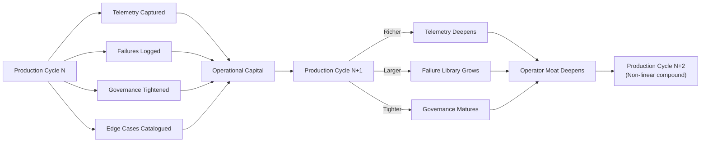
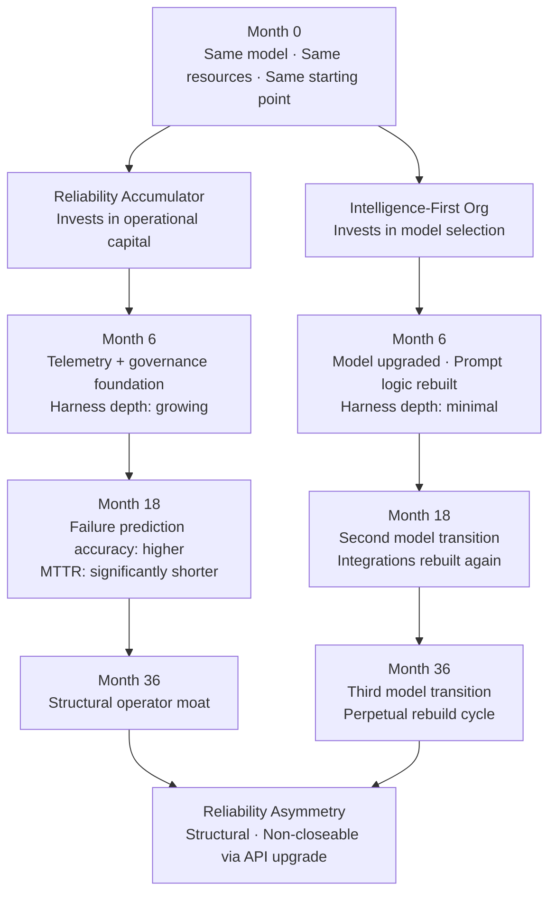

> Model capability equalizes. Operational reliability compounds. Why the infrastructure layer is becoming the only durable moat in enterprise AI.
> The race isn't intelligence. The race is reliability accumulation. Most enterprises haven't switched races yet.

---

Every enterprise AI program I've seen optimizes for the same thing.

Better models. Faster upgrades. Superior benchmarks.

They're optimizing the wrong variable.

Model capability is a public good. It diffuses. Every API subscriber gets the upgrade at the same price on the same morning, and the competitive advantage you built last quarter is gone before lunch. Operational reliability is a private good. It compounds inside your deployment history: inside your telemetry, your failure-pattern libraries, your governance maturity accumulated across production cycles your competitors haven't run.

You're accumulating operational capital through deployment cycles. Or you're renting intelligence from a market that equalizes.

One of these builds a moat. The other builds a dependency.

---

## The Intelligence-First Trap

The intelligence-first trap is seductive because it's not entirely wrong.

Models are genuinely getting better. Reasoning improves. Context windows expand. The benchmarks go up quarterly, and the benchmarks aren't lying. I won't argue otherwise.

What the intelligence-first trap misses is where competitive advantage actually forms.

I've watched procurement teams spend six months evaluating models. Comparison matrices across twenty task categories. Inference benchmarks against internal golden datasets. Rigorous work. By the time they shipped their pilot, three evaluated models had been updated and the team that skipped the six-month evaluation had been compounding production cycles the entire time.

The intelligence-first trap produces this split:

Invested in: model selection, benchmark tracking, capability delta comparisons, vendor switching logic.

Underinvested in: telemetry accumulation, failure-pattern libraries, runtime governance maturity, rollback reliability.

The misallocation feels rational. Models are visibly improving. Infrastructure feels like overhead. What the intelligence-first trap obscures: the economics of advantage in a market where the central technology diffuses across every participant.

---

## Why Intelligence Asymmetry Shrinks

Frontier AI capability is a public good in the enterprise market.

Not because it lacks access controls. But because the diffusion rate is fast enough, and access cost low enough, that model quality equalizes across competitors before any organization can build durable advantage from it.

The timeline: model achieves a breakthrough. Within six months, every enterprise with serious AI spend has access. Within twelve months, open-source variants exist at near-zero marginal cost. Within eighteen months, switching costs dominate over capability gaps.

The competitive window from superior model access is months. Not years.

I've watched this play out. A vendor announcement closed a gap three organizations spent seven months building. Same morning, same API, same pricing tier.

Intelligence asymmetry has a shelf life. Reliability asymmetry has no shelf life. It compounds with every production cycle you've run that your competitor hasn't.

> Model upgrades are available to every subscriber simultaneously. No vendor announcement distributes your deployment history. One of these is a public good. The other is an operator moat.

| What Diffuses (Public Good) | What Compounds (Private Good) |
|---|---|
| Frontier model capability | Deployment telemetry |
| Benchmark performance improvements | Failure-pattern libraries |
| API feature sets and tool support | Governance maturity |
| Context and reasoning improvements | Rollback reliability |
| Pricing decreases | Edge-case handling depth |
| Vendor switching options | Runtime heuristics and operator trust |

The left column is available to every subscriber simultaneously. The right column is locked inside your deployment history. No competitor can buy it, license it, or inherit it.

---

## What Compounds: Deployment-Cycle Compounding

Operational learning does not diffuse. It accumulates inside the organization that earns it through production cycles.

Every production run adds something specific to an inventory of non-transferable knowledge: the failure mode at this token count under this load condition, the governance constraint that only fired after a real audit, the rollback procedure that works because it's been invoked and fixed twice. That specific knowledge cannot be purchased.



Deployment-cycle compounding works because each layer built makes the next layer more valuable. Richer telemetry makes failure prediction more accurate. More accurate failure prediction makes governance more targeted. More targeted governance makes rollbacks safer. Safer rollbacks allow more aggressive production cycles. More cycles deepen the compound.

The compound rate is non-linear. Intelligence asymmetry compounds linearly with model generations, which the vendor controls. Reliability asymmetry compounds with production cycles, which you control.

The specific inventory:

Telemetry signatures are the behavioral fingerprints your model generates under your specific load, at your data distribution. Your competitor's telemetry can't decode your failure modes. Their failures look structurally similar but manifest differently at 3 a.m. under your traffic patterns.

Edge-case libraries grow with cycles, not upgrades. Every failure your production environment surfaces that no benchmark predicted goes into that library. Unrunnable from outside.

Governance maturity is jurisdiction-specific and workflow-specific. A vendor who hasn't operated under your regulatory constraints can't sell it to you. You earn it by running under those constraints, audit after audit.

When something breaks at 2 a.m., rollback reliability is whether you can reverse without cascading corruption. Earned through incidents. Eighteen months of incident response isn't compressible into three.

---

## The Operator Moat

Two enterprises. Same frontier model. Same API tier. Radically different operational histories.

Enterprise A has been in production eighteen months. Their telemetry layer has processed billions of tokens. They've surfaced and fixed dozens of failure modes. Their governance layer survived regulatory scrutiny. Their rollback system has been invoked multiple times and never cascaded.

Enterprise B launched three months ago. Better benchmark scores; they waited for a newer model release. Clean infrastructure. No operational history.

Enterprise A can't reproduce Enterprise B's benchmark comparison. What Enterprise B can't reproduce at all is Enterprise A's production record.

The moat is not the model. The moat is what the model has been through.

> Infrastructure quality compounds faster than benchmark improvements. Every telemetry signal captured, every failure pattern surfaced before it cascaded, every governance constraint tightened against a real production incident adds to a foundation that competitors must rebuild from scratch. There is no shortcut. (RelOps 9)

Harness depth is the measurable form of the operator moat:

- Telemetry coverage percentage: what fraction of model behavior is instrumented
- Failure prediction accuracy: how often you catch failures before users do
- Mean time to recovery: how fast the system heals after incidents
- Governance rule density: how specifically constraints are encoded per workflow class
- Rollback success rate: how reliably state can be reversed without cascading

These metrics compound with production cycles. Don't reset on model upgrade. Don't reset on vendor switch. Organizational assets. The balance sheet of operational capital.

---

## The Divergence in Practice

Reliability asymmetry isn't theoretical. It unfolds predictably across deployment timelines.



| Dimension | Model Advantage | Operator Moat |
|---|---|---|
| Durability | Months, eroded by vendor diffusion | Years, compounding with each cycle |
| Transferability | Immediate via API subscription | None; requires running cycles yourself |
| Compounding mechanism | None; resets with each vendor release | Non-linear; each cycle deepens the next |
| Erosion mechanism | Vendor releases to all subscribers simultaneously | Irreducible without equivalent operational history |
| Investment classification | Operating expense | Capital formation |

The right-hand column describes operational capital. It accumulates. It compounds. The pattern is deployment-cycle compounding at market scale: returns proportional to cycles run, not dollars spent.

The intelligence-first trap treats the right-hand column as if it doesn't exist. Optimizes exclusively for the left. Result: perpetually capable on paper, perpetually fragile in production, cycling model evaluations while operational foundations stay shallow and intelligence asymmetry closes.

---

## The Diagnostic

The intelligence-first trap is diagnosable before you've lost the race.

Eight signals.

```
INTELLIGENCE-FIRST TRAP DIAGNOSTIC
━━━━━━━━━━━━━━━━━━━━━━━━━━━━━━━━━━━━━━━━━━━━━━━━━

Score 1 point for each YES

[ ] Ran a formal model evaluation in the last 6 months
[ ] Capability delta tracking is a regular team activity
[ ] AI roadmap references model upgrade timelines
[ ] Switched primary model providers in the last 12 months
[ ] Benchmark scores justify AI infrastructure investments
[ ] Human review is the primary reliability mechanism
[ ] No formal telemetry coverage target exists
[ ] Cannot report mean time to recovery for AI workflow failures

━━━━━━━━━━━━━━━━━━━━━━━━━━━━━━━━━━━━━━━━━━━━━━━━━
SCORE INTERPRETATION:
  0-2   Reliability accumulator: operational capital forming
  3-5   Mixed: intelligence-first drift present, recoverable
  6-8   Intelligence-first trap: operational capital not accumulating
━━━━━━━━━━━━━━━━━━━━━━━━━━━━━━━━━━━━━━━━━━━━━━━━━
```

The trap doesn't feel like a trap. It feels like rigor.

Evaluating models feels analytical. Tracking capability deltas feels strategic. Real value. The problem: they crowd out the activities that build durable advantage, and organizations don't notice until reliability asymmetry between them and a competitor becomes impossible to close.

> Enterprises don't fall into the intelligence-first trap because they're lazy. They fall in because model improvements are visible and reliability accumulation is invisible, until a competitor's harness depth makes the gap explicit.

Most organizations can describe their model tier in detail. Benchmark results. Planned upgrades.

Different questions: What's your telemetry coverage percentage across production workflows? How many failure modes have you catalogued from production incidents? What's your rollback success rate?

The organizations building operator moats can answer these. The organizations in the intelligence-first trap cannot.

---

## What Reliability Accumulation Looks Like

Reliability accumulation is not "stop upgrading models." That's not the argument.

Operational capital must be treated as capital: explicitly invested in, tracked, and compounded across cycles. Not a byproduct of deployment.

**Before:** Define telemetry targets explicitly. What signatures captured? What failure modes instrumented? Name before the cycle runs, not after.

**During:** Structured failure capture, not error logging. Causal analysis: why did this failure mode occur, under what conditions? Each answer enters the failure-pattern library.

**After:** Update harness depth metrics as financial metrics. Telemetry coverage percentage. Governance rule count. Rollback test coverage. The balance sheet of operational capital.

The organizations executing this well don't run inferior models. They run harness infrastructure through enough production cycles that model transitions become low-risk. Telemetry transfers. Failure libraries transfer. Governance transfers.

The model is the application. The harness is the runtime. You don't rebuild the runtime when you upgrade an application.

Intelligence acquisition is a running cost. Reliability accumulation is capital formation. The distinction matters when a competitor's eighteen months of deployment-cycle compounding becomes structurally unavailable to close.

---

## The Race Already Running

Enterprise AI has a reliability problem. Not an intelligence problem.

Model improvements distribute publicly. Every major model release resets intelligence asymmetry to zero across all subscribers simultaneously.

Harness depth compounds privately. No vendor announcement distributes your deployment history. No model release replicates your failure-pattern library. The eighteen-month production gap doesn't narrow when benchmark scores equalize.

Reliability asymmetry grows faster than intelligence asymmetry shrinks.

I've watched this split play out. One enterprise can pull its MTTR trend for the past twelve months, failure mode by failure mode. Deployment-cycle compounding made legible. Another enterprise in the same market is on its third model evaluation cycle.

The enterprises accumulating operational capital now are building a foundation that model upgrades cannot erode.

> The competitive question in enterprise AI is no longer which model you have. It is how deep your harness has gone and how many production cycles have made it deeper. That question has a compounding answer. And that answer belongs to you alone.

Operator moats are forming now. Quietly. Inside organizations treating deployment cycles as capital formation. By the time the market bifurcates, the gap between accumulators and renters will be structural.

Which side of the reliability asymmetry are you on?
