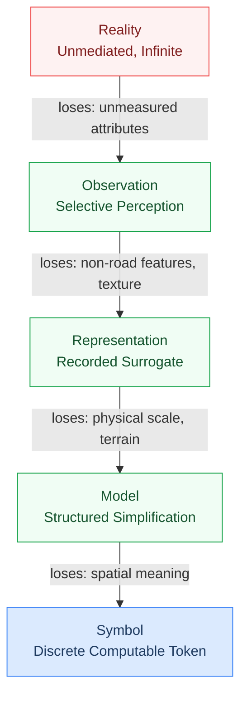
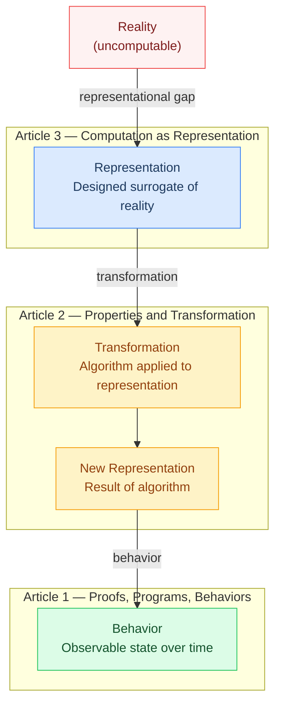

> "Why every algorithm acts on a surrogate — the representational gap, useful forgetting, and the blind-spot map your data structure draws at design time."
 

Your database does not hold customers. It never has.

It holds records: typed fields, indexed rows, foreign keys, standing in for customers. The actual customer exists outside the system. Inside is only a surrogate. This is not a flaw in your architecture. It is the mechanism that makes computation possible. Every algorithm your system runs acts on representations, not on reality. The **representational gap** between what your program holds and what actually exists is not a bug to fix. It is the ground the entire stack stands on.

You think your database holds customers. Or you know it holds representations of customers. The second framing is the one that predicts where your system will fail.

This is the ground floor of a three-part series. Article 1 showed computation as behavior: state transitions through time. Article 2 showed computation as transformation: algorithms as rules on representations. This article asks what the things being transformed actually are. The answer: representations. And understanding what they cost, and why computation requires them, changes how you read every data structure you will ever write. Call it **useful forgetting**: the intentional information loss that makes data computable.

---

## Map ≠ territory: every program holds a surrogate

Every program runs on surrogates.

Not on the things themselves. On simplified, selected, lossy stand-ins that capture some aspect of reality and discard the rest. Korzybski put it plainly: the map is not the territory. The GPS map is not the city. The resume is not the candidate. Each representation keeps something and discards everything else. That gap, the **representational gap**, is built into every data structure you write. A **representational choice** is not a storage decision. It is a decision about which questions your system can answer and which it cannot.

| Reality | Representation | Kept | Discarded |
|---|---|---|---|
| Customer | Database record | Name, email, purchase history | Mood, intent, context |
| City | Graph | Roads, distances, connections | Terrain, buildings, street life |
| Person | Resume | Work history, titles | Character, reasoning under pressure |
| Image | Pixel array | Color at each position | Depth, texture, meaning |
| Network | Adjacency matrix | Which nodes connect | Bandwidth, latency, reliability |

Every program you have ever written operates on the left column through the lens of the right. The **representational gap** in each row is where systems fail. A customer model that keeps email but discards intent will miss churn. A city model that keeps roads but discards traffic state will misroute.

The gap is always there. The question is whether you know what yours contains.

---

## Useful forgetting: why information loss is the mechanism

A GPS app forgets almost everything about a city.

Weather, buildings, smells, businesses, pedestrians. Gone. It keeps four things: roads, distances, connections, current speed estimates. That loss is not a limitation. It is what makes navigation possible. A representation that kept everything would be the city itself. You cannot run a routing algorithm on a city.

This is **useful forgetting**: the intentional information loss every representation performs, designed around computational purpose rather than accidental.

Useful forgetting is not compression. Compression preserves information in less space. Useful forgetting eliminates information because that information is irrelevant to the computation at hand. The GPS forgets smells because no routing algorithm needs smell. The bank account record forgets the customer's emotional state because no transaction validation uses it. The forgetting is load-bearing. Remove it and the representation collapses toward the reality it stood in for, useless to a machine.

The **representational gap** expands or shrinks depending on what the computation needs. A mapping system's gap is enormous: it omits almost everything about a city. A genomics system's gap is narrow: it preserves nucleotide-level detail. Neither gap is wrong. Both are designed. The loss is not incidental to the representation. It is the representation's mechanism.

Every data structure performs **useful forgetting**. An array forgets relationships. A hash table forgets insertion order. A tree forgets cross-hierarchical connections. The question is never "did we lose information?" You always did. The question is "did we lose the right information for this computation?"

---

## The representation ladder: how reality becomes computable

Reality is not computable. Not directly.

To compute on something, a machine needs a symbol: discrete, unambiguous, manipulable. Raw reality is continuous, messy, context-dependent, infinite. The path from reality to symbol requires a series of steps, each stripping away more information, each increasing computational tractability. I call this the **representation ladder**: the step-by-step ascent from raw reality to computable symbol.

Here is the **representation ladder** applied to a city at every rung.

| Rung | What it is | City example | What gets lost |
|---|---|---|---|
| Reality | The thing itself, unmediated | The actual city: buildings, people, weather, noise | Nothing yet. This is the full, uncomputable whole. |
| Observation | Selective perception | A surveyor's measurements: road widths, block lengths, intersections | Everything the surveyor did not measure |
| Representation | A recorded surrogate | A map: roads drawn to scale, distances labeled | Texture, smell, sound, everything beyond roads |
| Model | A structured simplification for reasoning | A graph: nodes (intersections), edges (roads), weights (distances) | Physical scale, terrain, non-road features |
| Symbol | A discrete token a machine manipulates | Numeric node IDs and edge weights in an array | Spatial meaning: the machine sees only integers |

Each rung up the **representation ladder** strips more away. Each rung gains computability. Reality cannot be sorted or indexed. A symbol can. Computation happens at the top, on symbols. Every symbol stands at the end of a chain of selective losses beginning with the thing itself.

Dijkstra's algorithm does not find the shortest path through a city. It finds the shortest path through a graph representing a city. The algorithm works because the **representation ladder** was climbed successfully. If the graph misses a road, the algorithm returns a correct answer to the wrong question.

This is the first truth of failing systems: the algorithm is often right. The representation is wrong.

---

## Why data structures exist: every one is a representational choice

Data structures are not containers. They are decisions.

Each one encodes an answer to the question: what aspect of this reality matters, and what can be discarded? The structure you reach for is a **representational choice**: a decision about what your program will be able to compute and what it will be permanently blind to.

| Structure | What it keeps | What it discards | Best for |
|---|---|---|---|
| Array | Sequence: element order | Relationships; identity beyond position | Ordered data where position carries meaning: pixel rows, time series |
| Tree | Hierarchy: parent/child structure | Cross-tree connections | File systems, parse trees, recursive structure |
| Graph | Relationships: connections between nodes | Sequential ordering; depth | Road networks, social graphs, dependency maps |
| Hash Table | Identity: key-to-value mapping | Insertion order; key relationships | Fast retrieval: caches, indexes, symbol tables |
| Queue | Temporal order: arrival sequence | Identity relationships; random access | Task scheduling, event processing, BFS traversal |

Each row is a **representational choice**. Storing city roads in a graph rather than an array says: relationships matter more than sequence. Storing user sessions in a hash table rather than a list says: identity lookup matters more than temporal order. These decisions shape what the system can compute, often permanently, because downstream code builds on early representations.

The **blind-spot map** each structure carries, the questions it cannot answer because it discards the required information, is fixed at the moment of this choice. A hash table's blind spot is insertion order. A tree's blind spot is cross-hierarchical connections. An array's blind spot is relational context.

You cannot query what the representation discarded.

This connects to Article 2 in the series. The transformation layer, algorithms acting on data, operates on this layer. Change the representation and every algorithm built on it changes with it. The data structure is not beneath the algorithm. It is the surface the algorithm moves across.

---

## Types and models: constraining meaning at two scales

Types are small representations. Models are large ones.

Both solve the same problem: reducing ambiguity about what a symbol means. Declaring a column `age` as integer is a **representational choice**: it eliminates interpretations and enables computations. Age as integer can be compared, sorted, averaged. Age as string cannot. The type does not describe the data. It prescribes what the data is allowed to be.

A model, a database schema, a state machine, a TLA+ spec, shares one structural property with every other model: it intentionally hides details. A schema decides which customer attributes matter. A state machine decides which transitions are legal. All of them perform **useful forgetting** at scale, collapsing a full domain into a structure a system can reason about. The **representation ladder** runs through every model: somewhere above was a reality that got observed, recorded, and abstracted into the schema you see now.

The risk is invisible drift. The representation was accurate when built. Reality changed. The representation did not. The schema still types `age` as integer, but the system now needs estimated ages with uncertainty ranges. The mismatch is not between code and schema. It is between the representation and the reality it was built to stand in for.

---

## The cost of representation: your model's blind-spot map

Every representation creates a **blind-spot map**.

Not as a metaphor. As a structural fact. The questions a representation cannot answer are determined at design time, by the information discarded. A spreadsheet loses relationships. A graph loses insertion order. A pixel array loses depth. These are not bugs. They are the expected costs of **useful forgetting**. But they must be named. Here is a four-question audit to surface any data model's **blind-spot map**.

---

**Blind-Spot Audit**

**1. What can this representation not distinguish?**
Two things different in reality may be identical in the representation. A customer table keyed on email cannot distinguish a user who changed their email from a new user. The **representational gap** swallowed the continuity.

**2. What ordering does it lose?**
A hash map loses insertion order. A set loses all ordering. A ticket system storing open tickets in a hash map cannot answer "which arrived first?" without a separate timestamp. The structure discarded sequence.

**3. What relationships does it flatten?**
A relational table loses relationships between rows unless foreign keys are explicit. A CSV of transactions cannot answer "which customers tend to buy together?" Cross-row relationships were discarded.

**4. What granularity does it discard?**
A healthcare system recorded diagnosis dates. Not times. That seemed fine until someone needed intra-day clinical sequence questions. It wasn't. The resolution was fixed at representation design, before anyone asked that question.

---

Running this audit surfaces the **representational gap** a model carries. The gap is not a reason to rebuild. It is a reason to know which questions the model will never answer, and to stop building systems that assume it can.

No perfect representation exists. Every model has a **blind-spot map**. The engineers who know theirs build systems that fail in predictable, recoverable ways.

---

## Representation creates computation: the ground floor

Without representation, there is nothing to compute on.

This is mechanical, not philosophical. An algorithm requires a well-defined input: a symbol with fixed interpretation, a data structure with known properties. Reality offers neither. It is continuous, ambiguous, and infinite. The moment an algorithm runs, someone has already climbed the **representation ladder**: observed reality, recorded it, structured it, and handed a symbol to the machine. Computation begins at the top. Everything beneath that was representation.

This article is the ground floor. The series stack:

Article 1 argued computation is behavior. Article 2 argued computation is transformation. This article explains what the things being transformed are. The **representation ladder** is climbed at design time. The **representational gap** is fixed at design time. The **blind-spot map** is drawn at design time. By the time the algorithm runs, the representational choices are locked. The **useful forgetting** has already happened. The questions the system cannot answer have already been determined.

Representation is the layer that makes algorithms and state transitions possible. Change it and everything built on it shifts. Early representational choices determine the system's failure envelope, long before any bug appears.

---

## Five tests for a representation that will hold

A well-designed representation passes five tests.

| Test | Question | Pass condition |
|---|---|---|
| Computability | Can a machine act on this without ambiguity? | Every symbol has one interpretation; no field requires human judgment to parse |
| Intentional loss | Does it lose what it should? | Discarded information is irrelevant to the computation; nothing needed is missing |
| Purpose-matched | Does the kept information serve the target computation? | The representation preserves exactly what the algorithm requires |
| Unambiguous | Does one symbol map to one meaning? | No field can be read two ways; types constrained; nulls explicitly handled |
| Model-suitable | Can you reason about reality through this representation? | Queries return answers true of the original reality, not just the model |

The **blind-spot map** is the inverse of this rubric. It names what the representation cannot do. The rubric names what it must do. Both together give you a complete picture of a representation's fitness for a specific computational purpose.

Your database does not hold customers. It holds a designed surrogate: representational choices made at design time, each performing **useful forgetting**, each fixing a **representational gap**, each drawing a **blind-spot map** around the questions the system will never answer.

Know your blind-spot map. Every failure you have not yet experienced is hiding inside it.
