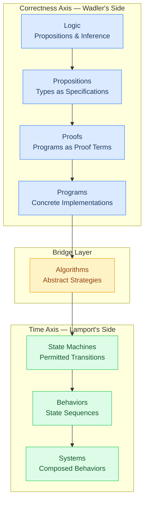

> this post is inspired by the works of [Philip Wadler](https://homepages.inf.ed.ac.uk/wadler/bio.html) and [Leslie lamport](https://en.wikipedia.org/wiki/Leslie_Lamport). 

> "Wadler and Lamport aren't studying different things. They're on opposite ends of one staircase — the computational stack that unifies logic, algorithms, state machines, and behavior."

Wadler and Lamport aren't studying different things. They're standing on opposite ends of the same staircase. The computational stack was always one object — CS specialized, it didn't fragment.

You can see computer science as independent subfields, each with its own vocabulary and its own truth. Or you can see it as one structure, computation itself, studied through different analytical lenses. That lens plurality is the correct framing. It lets you borrow from any field to solve a problem in another.

---

## The fragmentation problem is the starting point

You've felt this. Functional programmers talk about types and proofs. Distributed systems engineers talk about state machines and behaviors. Algorithm designers talk about recurrences and complexity. They don't sound like they're studying the same thing.

Move between communities and the dissonance compounds. A Haskell programmer reads a TLA+ spec and sees machinery with no clear connection to the types she reasons about daily. A distributed systems engineer reads a paper on Curry-Howard and wonders what proofs have to do with keeping servers alive. A competitive programmer looks at both and returns to LeetCode.

The problem isn't competence. It's framing.

CS education delivers these communities as adjacent disciplines — related but separate. Algorithms in one course, type theory in another, operating systems in a third. Nobody draws the vertical axis. Nobody names the staircase.

The result: engineers who can't move across abstraction layers hit walls. They can prove a function correct but can't reason about how it behaves under concurrent state changes. They can design a state machine but can't connect it to the formal property they want to guarantee. I've watched this happen. The wall is always at the same layer boundary.

Lens plurality is what names this pattern: different communities study the same computational object from different positions, not different objects. Not a surprising conclusion. The starting assumption. Once you hold lens plurality as the default, the map that makes fragmentation disappear becomes visible. That map is the computational stack, and it's been there for decades.

---

## The Lamport view shows computation as time

For Leslie Lamport, a system isn't a function mapping inputs to outputs. It's a set of behaviors — every sequence of states it can move through. A system is defined not by what it computes but by what it's allowed to do over time.

Take a bank account. Forget the code. The account starts at $500. A deposit arrives: $700. A withdrawal: $400. A concurrent transfer: $100. Each step is a state. Each arrow is a transition. The sequence is a behavior. Lamport calls this an execution: State₀ → State₁ → State₂ → ..., governed by actions. The account is never just the static record in memory. It's the history of its changes.

A system *is* the set of behaviors it permits.

This is the temporal layer of computation. It answers: what can this system *do*, across all its possible executions?

Here's where the space-time split first shows its structure. Lamport stands on the time axis, the axis that asks how state evolves. The account record in memory is space: a snapshot. The state machine governing deposits and withdrawals is time: rules for how that snapshot changes. Most programmers think about the space axis. Lamport forces the time axis into view. His insight: *the behavior is the specification* — the set of permitted state sequences is the formal meaning of what a system does.

TLA+ encodes this. A spec is a temporal formula satisfied by a set of behaviors. To model-check is to verify that every behavior produced by the system lies within what the spec allows.

The cost of stopping here: Lamport's view is complete for reasoning about systems behavior. But it doesn't connect naturally to correctness at the level of individual operations. That's Wadler's territory.

---

## The Wadler view shows computation as correctness

A program, for Wadler, is a proof. Not metaphorically. Structurally. The Curry-Howard correspondence makes this precise: every proposition in a logic corresponds to a type, and every proof of that proposition corresponds to a program of that type. Types are propositions. Programs are proofs.

Walk through it. You want to find a target in a sorted array. Formalize as a proposition: given a sorted array and a target, return an index or confirm absence. A correctly typed, terminating implementation of binary search is a constructive proof that this proposition holds. Not an assertion. A demonstration.

The proposition is the specification. The proof is the implementation.

This is where the bridge layer appears for the first time. The algorithm (binary search as abstract strategy) sits between the proposition and the program. It's not a proof: no formal language, no type system. Not a program: no memory layout, no runtime. It's the abstract computational move: divide, compare, recurse. The bridge layer is the abstract strategy that translates a formal specification into a concrete implementation.

Lens plurality in practice: Curry-Howard reveals that logic and programming are two views of the same structure. A type checker and a proof checker do the same verification. Different notation. Same act.

Wadler's view is complete for correctness of individual operations. But TLA+ doesn't care whether the code is correct. It only asks whether the behavior satisfies the spec. Those are different questions at different rungs.

---

## Algorithms are the bridge layer between two worlds

Sharpen the distinction Lamport drew that most programmers miss.

Binary Search is an algorithm. `binary_search.rs` is a program. They're not the same thing at different levels of abstraction — they're different kinds of objects.

An algorithm is an abstract computational strategy. It names no programming language. It specifies no memory layout. It has no runtime characteristics in any specific system. Binary Search says: maintain a search interval, compare the midpoint to the target, recurse on the half that contains it. Abstract. Timeless. Language-independent.

**Algorithm vs Program — 5 Tests**

| Test | Algorithm | Program |
|---|---|---|
| Names a programming language? | No | Yes |
| Specifies memory layout? | No | Yes |
| Has concrete runtime characteristics? | No | Yes |
| Depends on a type system? | No | Yes |
| Can be executed directly? | No | Yes |

Lamport's phrase is exact: algorithms are *abstract programs*. A program is a concrete realization of an algorithm in a specific language, with specific memory semantics, for a specific runtime.

Now trace the full path. Start with the proposition (Wadler's world): find the target or confirm absence. A proof constructs the search procedure. Crystallize that proof into an abstract strategy: Binary Search — the bridge layer. Realize it in Rust: `binary_search.rs`. Execute: a sequence of memory states as the array is traversed — Lamport's behavior.

The bridge layer is what makes Wadler's world and Lamport's world parts of the same staircase rather than separate buildings. Without it, you have proofs that are never executable and behaviors that are never formally specified.

---

## The space-time split is the structural key

Computation has two orthogonal dimensions. Every CS concept lives on one of them, or at their intersection.

**Space** — the dimension of information layout. Memory, data structures, representations. A linked list describes how nodes relate in memory. A hash table describes how values are addressed. A graph describes how vertices connect. These structures describe what information looks like at a moment in time, not how it changes.

**Time** — the dimension of behavioral evolution. States, transitions, behaviors. A state machine describes how a system moves through states over time. A protocol describes what sequence of actions is permitted. These structures describe how things change, not what they look like at one instant.

The **space-time split** is the recognition that these two dimensions are orthogonal. Every major CS discipline lives on one axis or on the boundary between them.

**Space-Time Split Quick Reference**

| Axis | Level | Concept | Example |
|---|---|---|---|
| Space | Memory | Raw allocation | Contiguous array of integers |
| Space | Data structure | Organized layout | Binary search tree |
| Space | Representation | Semantic encoding | City as adjacency matrix |
| Time | State | System snapshot | Account at $700 |
| Time | State machine | Transition rules | Deposit: balance += amount |
| Time | Behavior | Execution sequence | State₀ → State₁ → State₂ |

The city example sharpens this. A city in memory is a graph — space (nodes, edges, adjacency). The algorithm finding the shortest path is the bridge layer. The traffic simulation running over time is a behavior — time (state sequences of vehicle positions). One city. Three layers. Space, bridge layer, time.

This is why Lamport and Wadler appear to study different things. They stand on different axes. The computational stack connects those axes into one object. Fragmentation is positional, not structural.

```mermaid
flowchart LR
    subgraph space_ax["Space Axis — Information Layout"]
        direction TB
        Mem["Memory<br/>Raw Allocation"]
        DStruct["Data Structures<br/>Organized Layout"]
        RepS["Representations<br/>Semantic Encoding"]
        Mem --> DStruct --> RepS
    end

    subgraph bridge_b["Bridge Layer"]
        AlgoB["Algorithms<br/>Transformation Rules"]
    end

    subgraph time_ax["Time Axis — Information Change"]
        direction TB
        StB["State<br/>System Snapshot"]
        SMB["State Machines<br/>Transition Rules"]
        BehB["Behaviors<br/>Execution Sequences"]
        StB --> SMB --> BehB
    end

    RepS --> AlgoB --> StB

    classDef sp fill:#e0e7ff,stroke:#6366f1,color:#1e1b4b
    classDef br fill:#fef3c7,stroke:#f59e0b,color:#92400e
    classDef tm fill:#dcfce7,stroke:#22c55e,color:#14532d

    class Mem,DStruct,RepS sp
    class AlgoB br
    class StB,SMB,BehB tm
```

The moment this clicked: a Lamport paper and a Pierce paper, same week, both using "model" the same way. Different communities. Same computational stack.

---

## State machines are computation through time

The space-time split isn't a metaphor. It's structural.

Data structures are the space axis made concrete. A binary tree is a layout: where values live relative to each other. Fixed at a moment. Meaningful as arrangement.

State machines are different. Not a snapshot but a rulebook: what states are possible, what transitions are legal, what sequences constitute valid behavior. A finite automaton doesn't tell you where values are. It tells you what can happen next.

The connection to Lamport is direct. A TLA+ spec is a predicate over behaviors. It names the set of state sequences the system may produce. A system satisfying a safety property is a state machine whose behaviors never enter a forbidden state.

The bridge layer between data structures and state machines: the algorithm. Quicksort takes an array (space) and produces a sorted array (space) by executing comparisons and swaps (time). The algorithm makes spatial structures participate in temporal behavior.

Data structures and state machines aren't unrelated. They're the space and time axes of computation. Every program navigates both. The space-time split is the structural key that shows why they always appear together.

---

## Models are meaning assignments

Space and time are the two dimensions. What ties them into a single system?

Both Lamport and the logicians use the word "model." Not coincidence.

In logic, a model satisfies a set of sentences. It assigns meaning to formal symbols. This constant refers to that object. This predicate holds of these elements. A **meaning model** is a meaning assignment: it tells you what a formal statement *refers to* in any execution.

In Lamport's framework, a meaning model is a set of behaviors satisfying a specification. A TLA+ spec is a temporal formula. The meaning model for that spec is the state sequences that make the formula true. Model-checking asks: do all behaviors my system produces lie within that set?

A Java programmer who has never touched formal methods is building meaning models every time they write a method signature. Just without the name.

Both definitions do the same thing from different vantage points. A meaning model connects formal language to semantic domain. Logicians apply it to propositions. Lamport applies it to temporal specifications.

The synthesis: Wadler's world has propositions and proofs. Lamport's world has specifications and behaviors. The meaning model is the shared concept. Both ask: in what structure does this formal statement become true? A Haskell runtime is a meaning model for types. A TLA+ state space is a meaning model for temporal specs. One structure. Two entry points. The bridge layer connects them.

---

## The unified stack

Every piece is in place.

Lens plurality makes different communities look like they study different objects. They don't. Each community stands at a different rung. The stack is one object.

**The Computational Stack — 8 Rungs**

| Rung | Layer | What it studies | Who works here |
|---|---|---|---|
| 1 | **Logic** | Propositions, inference rules, truth | Logicians, formal methods |
| 2 | **Propositions** | Types as specifications, type systems | Type theorists, PL researchers |
| 3 | **Proofs** | Programs as proof terms | Functional programmers, theorem provers |
| 4 | **Programs** | Concrete implementations | All programmers |
| 5 | **Algorithms** | Abstract strategies, complexity | Algorithm designers |
| 6 | **State Machines** | Permitted transitions, temporal specs | Distributed systems engineers |
| 7 | **Behaviors** | Sets of permitted state sequences | Systems engineers, Lamport's framework |
| 8 | **Systems** | Composed behaviors, emergent properties | Architects, distributed researchers |

**Where Does Your Concept Live? — Diagnostic Framework**

**Is it primarily about correctness?** That's rungs 1–3: type systems, Curry-Howard, formal proofs.

Rungs 4–5 are about abstract procedure — algorithms and programs, complexity and realization. Binary Search lives here. So does every data structure operation you've ever analyzed for Big-O.

**Is it primarily about patterns over time?** That's rungs 6–8: TLA+ specs, distributed protocols, concurrency.

When a concept bridges two of those questions, it spans adjacent rungs. Every concept has a position on the stack.

Rungs 1–5 are on the correctness axis. Rungs 6–8 are on the time axis. The bridge layer is where they cross. The meaning model makes it coherent: each rung is a level of semantic interpretation, and formal objects at one rung get their meaning from the rung above.

CS didn't fragment. It specialized. The fragmentation was a curriculum problem, not a structural one.

---

## You now have the coordinates

CS specialized, depth-first, one layer at a time. Nobody drew the connecting axis.

Locate your current work on the stack. Writing a sort function: rung 4, instantiating a strategy from rung 5, manipulating structures on the space axis. Designing a distributed protocol: rung 6, specifying permitted behaviors at rung 7. Writing dependent types: rung 2, where your type-correct program is a proof at rung 3.

That placement tells you what's adjacent and what tools those neighbors use. A programmer at rung 4 who needs temporal correctness reasoning can step to rung 6. Same stack, different position. A systems engineer at rung 7 who needs formal verification can step to rung 1. The proposition was there all along.

The stack doesn't solve hard problems. It shows you which hard problem you're actually working on.

We've seen the stack. The next question is what occupies each rung. What do machines actually manipulate when they move between levels? The next article goes one layer deeper — into what representations are and why the space axis deserves its own framework.

The staircase goes both directions.
