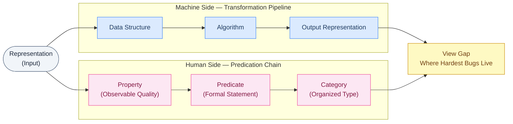

> "Why computation has two descriptions — machine-side transformation and human-side predication — and how the gap between them is where the hardest bugs live."

Two things happen simultaneously in every computation. The machine transforms a representation: state in, state out. You observe the result and apply a property, then a predicate, then a category. The machine never sees your property. You never see the machine's transformation. That gap, the **view gap**, is not philosophical. It is where the hardest bugs live.

You debug what the machine did, or you debug what properties the result should have. Most programmers can only hold one view at a time. That's why some bugs are impossible to find from either side alone. The **transformation pipeline**, the complete machine-side chain of a computation, and the predication chain, the complete human-side chain of observation, are both tools a working programmer needs. This article names both, shows them on the same example, and gives you the vocabulary to use them.

---

## Machines never touch reality

Your database does not contain a customer.

It contains a record: bytes, organized by schema, retrieved by id. When your algorithm runs, it does not touch the customer's bank account. It touches the account's representation: a row with a balance field, a timestamp, a foreign key. When the bank credits £100 to account 4482, no money changes in the machine. Two integers change. The meaning of those integers, that this equals money, that this account belongs to a person, lives entirely outside the machine.

A machine manipulates representations of things. Not the things. You can't put a city in a database. You can put a city's road network in: nodes, edges, distances. The city stays outside. The representation is what computation acts on. Always.

Article 1 showed how computation unfolds as behavior through time. Behavior of what? Representations. The **transformation pipeline**, representation in, algorithm applied, new representation out, is the machine's complete description of what happened. That pipeline is mechanical and fully independent of what you think the result means.

The bug this creates: programmers write code against the record and think they're writing code against the customer. When they're wrong about that mapping, no amount of machine-side debugging will find the error. The error doesn't live in the transformation. It lives in what the transformation was supposed to mean.

---

## What data structures really are

Take a single person. Call her Alice.

Alice can be a JSON object, a hash table, a database row, a graph node. Alice is none of these. She's a person. Each representation captures different aspects and makes different operations efficient. The hash table makes field lookup fast. The graph makes relationship traversal fast. Same underlying facts; different organized representations.

This is what data structures really are. Not storage containers. Organized representations: structures that shape what transformations are possible and which ones are cheap.

The city example makes this concrete. You want the shortest path from A to B. That requires the city as a graph: nodes are intersections, edges are roads, weights are travel times. Dijkstra runs on that representation. Change it to a grid and different algorithms apply. The city hasn't changed. The computation changes entirely based on how it's represented.

The **transformation pipeline** deepens: an algorithm transforms one specific representation into another. Input list → sorting algorithm → sorted list. The transformation is defined over the representation, not the underlying reality. The algorithm runs on the representation, never on the thing.

---

## Algorithms as transformation rules

The clearest way to see an algorithm: a function from one representation to another.

Sort takes an unordered list, returns an ordered list. Dijkstra takes a weighted graph and a source node, returns a distance map. Representation in, rule applied, new representation out.

London's road network: 500,000 nodes, 2.3 million edges, weights proportional to travel time. Dijkstra explores outward from the source, expanding cheapest-so-far paths, and returns a parent pointer array, another representation, from which you reconstruct the route. The city did not participate. Two representations did.

Every transformation rule has a signature. Dijkstra requires non-negative edge weights. Violate that and the algorithm doesn't return the wrong answer. It returns whatever it produces when its contract is broken, which can be anything at all.

The **transformation pipeline** as a debugging lens: when output is wrong, the first machine-side question is whether the input representation satisfied the algorithm's preconditions. The algorithm might be correct and the representation wrong. These are separate questions. The gap between them is where bugs hide.

---

## Computation as controlled transformation

State in. Action applied. State out.

Article 1 framed this through Lamport: Current State + Action → Next State. One level lower: Current Representation + Algorithm → New Representation.

The bank account. State: `{balance: 1000, currency: "GBP", id: 4482}`. Action: deposit £100. Rule: new balance = old + amount. Next state: `{balance: 1100}`. The full **transformation pipeline** is visible: initial representation → transaction → credit algorithm → new representation. Each link mechanical. Deterministic.

What the machine does not do: know that £1,100 is enough to pay rent. Know whether the credit was authorized. Those observations require someone to look at the output and apply a description to it. The machine produced a new representation. The meaning of that representation is a separate matter. That's what the human side of computation is about.

---

## Where properties come from

You look at the number 4. Before you name anything, you observe: 4 can be divided into two equal groups. No remainder. That observation, that quality of 4, is a property.

Properties are what you can say about a representation without knowing how it was produced. You don't need the algorithm that computed 4. You see 4 and observe: even. Positive. A perfect square. Each is something that can be said about 4, an observable quality of the representation itself.

The **property layer** is the threshold where machine-level computation becomes human-interpretable. Below it: bytes, transformations, state transitions. Above it: descriptions with meaning. Even, sorted, connected, null, authorized. When a programmer writes `NonNegative`, they're naming a property. When a test asserts `result > 0`, it's asserting a property. The type checker verifies predicates against representations. It doesn't know what values mean, only whether stated properties hold.

Look at the account record: `{balance: 1100}`. Balance is positive. Above the rent threshold. Consistent with the expected credit. Each is a **property layer** observation, meaningful to the person looking and invisible to the machine that produced it.

Properties don't come from the algorithm. They come from an observer looking at the output and saying: this is what can be said about what I see.

---

## Predicates

There's something unsettling about a property that stays in your head.

You observe that 4 is even. But "even" sitting in your mind isn't testable, shareable, or checkable in code. To move from observation to formal statement, you need a predicate.

`is_even(4)`. This is a predicate. It takes the number 4, applies the property "even," and returns a truth value. `is_even(4)` is true. `is_even(7)` is false. The difference from a property is minimal but decisive: a property is something that can be said.

`is_yellow(lemon)`. `is_sorted(list)`. `is_null(value)`. `balance > 0`. Each takes a representation, evaluates a property, returns a boolean. Each makes the **property layer** programmable. Every test assertion you've written is a predicate. `assert result > 0` is `is_positive(result)` with different syntax.

This is the first rung of the **predication chain**, the human-side chain running representation → property → predicate → category. Properties are what you see. Predicates are how you say it formally. Type systems are predicate systems: `NonEmptyList` means `length(list) > 0` must hold. The type checker verifies that predicate at the boundary. It doesn't know what the list contains, only whether the stated property holds.

---

## Categories

Kant noticed that observation alone doesn't organize experience. You need categories. One sentence: categories are the organizing structures of thought: frameworks into which observations get sorted.

You observe yellow on a lemon. You say `is_yellow(lemon)`. Yellow is a color. You've placed the observation in Category: Color. The predicate didn't stay isolated. It joined a system of predicates organized around a shared property type. Do it with 4. You observe even. You say `is_even(4)`. Category: Parity. Members: even, odd.

**Category formation** is the process by which predicates on properties organize representations into types and systems. Going from "this value is sorted" to "this is an OrderedSequence": that's **category formation**. From "this value is null" to "this is an Optional": **category formation**. Each category collects predicates about the same property type and names the collection.

The **predication chain** completes here: representation → property → predicate → category. The lemon becomes a Color instance. The number becomes a Parity instance. The balance becomes a Sign instance.

A type is a category. `Integer`: representations satisfying the integer predicates. `NonNegative`: representations satisfying `value >= 0`. When a programmer designs a type, they're doing **category formation**: collecting predicates about a property type and naming the collection. The machine never does this. **Category formation** is entirely on the human side of the view gap.

---

## Categories and data structures

Data structures organize information for computation. Categories organize predicates for thought. The parallel is not accidental. Both are organizational systems: one for the machine, one for the person.

The **view gap** sharpens here. Data structures are visible to the algorithm. It traverses the tree, hashes the key. Categories are invisible to it. The algorithm has no access to "Color." Category membership is a **property layer** fact. It lives in the observer's description, not the transformation.

Schema design makes this concrete. When you design a schema, you're doing two things at once: choosing a data structure (tables, columns, keys) to make transformations efficient; and encoding a category system (types, constraints, foreign keys) to make the **property layer** correct. The **predication chain** tells you what properties the schema should enforce. The **transformation pipeline** tells you what operations it enables. A good schema satisfies both.

---

## The two views

The same representation, described twice.

London's road network: weighted graph, 500,000 nodes, 2.3 million edges. Dijkstra runs. Output: distance map and parent pointer array, encoding the shortest path from Paddington to Canary Wharf.

**Machine View vs Human View: the same computation**

| Step | Machine View (Transformation Pipeline) | Human View (Predication Chain) |
|---|---|---|
| Input | Weighted graph representation | Weighted graph representation |
| Data structure | Adjacency list + priority queue | Property: connected, non-negative weights |
| Algorithm | Dijkstra's shortest path | Predicate: `is_connected(g) && all_weights_positive(g)` |
| State transition | Frontier expansion, relaxation | Category: ValidDijkstraInput |
| Output | Distance map + parent array | Meaning: shortest route found |

Two complete descriptions. Same computation. Neither is the whole story.

The **transformation pipeline** tells you what the machine did. What properties the result must carry: that's the **predication chain**. The **view gap**, the systematic mismatch, is not a failure. It is the structure of computation itself.

Here is where misunderstanding lives. A bug invisible from the machine side is often visible from the human side: transformation completed, distance map returned, but `is_valid_route(output)` fails because the graph had a disconnected component and nobody checked the precondition predicate. The machine did its job. The **property layer** failed.

The reverse holds too. A bug invisible from the human side (types correct, predicates all pass) can be fully visible from the machine side: wrong algorithm for the representation, state corrupted by an unchecked transformation.

Both views run simultaneously. The **category formation** on the human side and the algorithmic execution on the machine side are parallel acts on the same representation. You need both.

**Evaluation rubric: when to use which lens**

| Scenario | Primary lens | When to switch |
|---|---|---|
| Algorithmic correctness | Machine (transformation pipeline) | Output type is right but semantics wrong → add human lens |
| Type design | Human (predication chain) | Types correct but operations slow → add machine lens |
| Debugging wrong output | Both simultaneously | Identify violated predicate first, then find broken transformation |
| Schema design | Human (predication chain) | Queries slow → add machine lens for indexing |
| Performance optimization | Machine (transformation pipeline) | Optimization breaks semantics → restore property guarantees |

**Property → Predicate → Category: Quick Reference**

| Property | Predicate | Category |
|---|---|---|
| even | `is_even(n)` | Parity |
| yellow | `is_yellow(x)` | Color |
| sorted | `is_sorted(list)` | OrderedSequence |
| null | `is_null(value)` | Optionality |
| positive | `is_positive(n)` | Sign |
| connected | `is_connected(graph)` | Topology |

---

## Closing

The state machines from Article 1 act on representations. Now you know how both sides describe them.

The **view gap** is not a gap to close. It's the structure of computation: two valid descriptions of the same act. The **transformation pipeline** tells you what the machine did. The **predication chain** tells you what properties the result must have. **Category formation** organizes those properties into types. The **property layer** is the interface: where bytes become meaning, where the balance integer becomes "sufficient," where the sorted array becomes "an ordered sequence ready for binary search."

Below the **property layer**: transformation. Above it: predication. At the seam: every non-trivial bug.

Next time a bug resists both, apply the **two-lens debug checklist**:

**Machine Lens:**
1. What was the input representation?
2. What transformation applied?
3. What was the output representation?
4. What state changed, and what didn't?

**Human Lens:**
1. What property should the output have?
2. What predicate should hold?
3. What category does the output belong to?
4. Which property is violated?

The bug is at the seam between them.

Article 3 goes one level deeper: if representations are what computation acts on, why do representations exist at all? Why not act on things directly?

That question has a structural answer. And it changes how you design systems.
