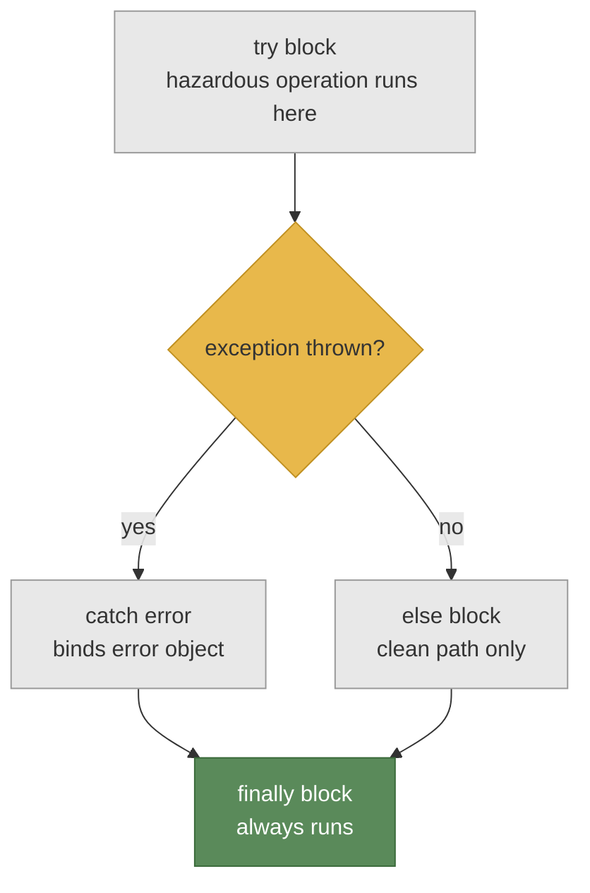
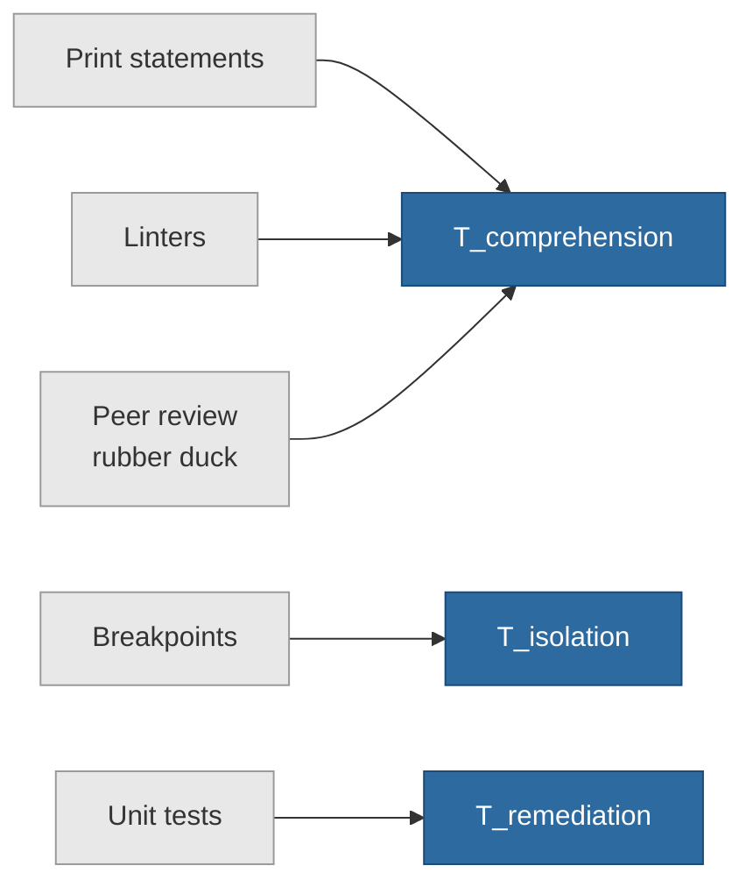

> How error architecture differs across C, LabVIEW, and JavaScript, and why the reading skill stays the same.


You hit a TypeError in a C codebase. Except C has no type system.

The error message tells you something failed. It does not tell you the vocabulary you need to read it. You Google the exact string, find a Stack Overflow answer for a different runtime, copy the fix. It works. Until next time.

That is debug by recognition. It accumulates fixes. It fails the moment you cross a paradigm boundary.

Debug by reading is different. You understand the error architecture behind the message. You extract the diagnostic signal from the structure: the class, the origin, the mechanism. Do it before you touch a search engine. That is diagnostic literacy. It does not accumulate. It transfers.

Your total debugging time is T_debug = T_isolation + T_comprehension + T_remediation. Most developers shorten T_remediation by collecting fixes. Debug by reading shortens T_isolation and T_comprehension. That is where the time actually lives.

## The T_debug model

In 2022, computer science educators, language designers, and systems researchers convened at Dagstuhl Seminar 22052 to analyze a specific problem: how diagnostic design affects developer cohorts from children to experienced engineers. Not debugging tools. Not IDE features. The design of the error message itself.

That is the moment error architecture became a recognized subdiscipline. Not a trend. A documented research program.

T_debug = T_isolation + T_comprehension + T_remediation. Three components. One formula.

T_isolation is finding what broke: which function, which line, which state assumption failed. In production codebases, this is where most debugging time disappears.

T_comprehension is understanding what the error message says about that failure: its class, mechanism, and blast radius. That is the diagnostic signal the error carries.

T_remediation is applying the fix and verifying it holds.

Well-designed error architecture compresses T_comprehension to near zero. Diagnostic literacy compresses T_isolation. A developer who has built diagnostic literacy through debug by reading cuts T_debug not by accumulating fixes faster, but by extracting signal from the error itself.

> "God only knows." That is what Anna McDougall's `/* gok */` comment says on a bitmask operation. A developer documenting the point where they stopped understanding their own code. Error messages are the upstream answer to that comment. The honest documentation developers never wrote.

The paradigm boundary is where this matters most. In C, an error returns -1 or NULL. In LabVIEW, it breaks a wire. In JavaScript, it throws a typed exception. The vocabulary changes. The reading skill does not.

## C/Unix error architecture

C makes no promises about how errors look. When an operation fails, the function returns -1 or NULL. The developer checks the return value explicitly or the error is silent. There is no exception class, no stack unwind, no typed error object. That design decision is the first fact of C's error architecture.

The errno global variable is the diagnostic channel. Thread-local, set on failure. strerror() translates the integer code to a readable string. perror() writes to stderr with a user-provided context prefix: the developer labels what was attempted. The __FILE__ and __LINE__ macros inject origin data: exact file, exact line, without a stack trace.

Here is what debug by reading looks like in C. You do not wait for a backtrace. You read errno, call strerror(), check __FILE__ and __LINE__. The error architecture tells you what the runtime knows, and you read that directly.

Cleanup is manual. C has no finally block. The goto cleanup pattern handles this: every function that acquires resources jumps to a single cleanup label on failure. One exit path. All deallocation in one place. The pattern reduces T_remediation: one exit path means one place to verify resource release.

```c
#include <stdio.h>
#include <errno.h>
#include <string.h>
#include <unistd.h>

int change_directory(const char *path) {
    errno = 0; /* reset: prevent diagnostic pollution from prior calls */
    if (chdir(path) != 0) {
        /* perror("chdir") outputs "chdir: <strerror(errno)>" to stderr — one-liner when file/line origin is not needed */
        fprintf(stderr, "[%s:%d] chdir failed: %s\n",
                __FILE__, __LINE__, strerror(errno));
        return -1;
    }
    return 0;
}
```

The errno = 0 reset is not ceremonial. A prior system call may have set errno without failing. Reading errno after chdir() without resetting first gives you the diagnostic signal from the wrong operation. That is a paradigm boundary that trips developers from exception-based languages: in C, error state is global and mutable. You maintain it.

## Visual paradigms: LabVIEW and GameMaker

When the error architecture is visual rather than textual, the diagnostic signal changes form. The reading skill stays the same.

**LabVIEW**

When you disconnect two wires with mismatched data types or a broken path, the wire goes grey and hatched. A broken arrow appears on the Run button. The program will not run. The syntax error is visible before execution starts.

This is error architecture at the compilation layer. The paradigm boundary here is the medium: errors are spatial, not textual. There is no stack trace. There is a wire.

Execution highlighting takes this further. Activate it and data-flow bubbles animate between nodes in real time. Slow, but precise. You watch values move. If a bubble stops, that is your T_isolation point.

Probes go further. Right-click any wire during design, insert a probe. Live values output to the Probe Watch Window during execution without stopping the program. No print statement equivalent needed. The probe is attached to the data path itself.

**GameMaker**

GameMaker's event-loop paradigm means code runs in response to events: Create, Step, Draw. The Step Event runs every frame. A variable initialized in Create but referenced in Step will crash if a child object defines its own Create Event without calling event_inherited(). The parent's Create never runs. The variable is never set. The first frame access throws a runtime error.

Read the error: it tells you a variable was undefined. Debug by reading means asking which event ran, which did not, and which parent variables were never initialized. That is the diagnostic signal: not the symptom (undefined variable) but the mechanism (event_inherited() missing).

When you move from JavaScript into GameMaker, you cross a paradigm boundary: errors are not thrown but triggered by event lifecycle failures. Virtual Machine (VM) vs YoYo Compiler (YYC) is a direct trade-off in diagnostic quality. VM produces detailed runtime stack traces. YYC compiles to native machine code and runs faster, but produces less descriptive output. Choosing YYC is a diagnostic quality decision. Not just a performance choice.

**Paradigm Error Architecture Matrix**

| Paradigm | Error mechanism | Primary interface | Recovery strategy | T_debug component targeted | Runtime overhead |
|---|---|---|---|---|---|
| C/Unix | Integer return code + errno global | stderr output | Explicit return check + goto cleanup | T_isolation (file, line, errno code) | None: error codes are integer comparisons |
| LabVIEW | Broken wire + broken run arrow | Visual compiler feedback | Fix wire type mismatch or data path | T_comprehension (spatial, pre-execution) | Continuous type-check at compile time |
| GameMaker | Runtime exception + stack trace (VM) | Output panel | Fix event_inherited() or variable init order | T_isolation (event chain, object hierarchy) | VM: full trace overhead. YYC: minimal |
| JavaScript | Typed exception object | Console + browser DevTools | try/catch + error class inspection | T_comprehension (class name + message text) | Negligible: catch executes on error path only |

## Dynamic runtime: JavaScript

JavaScript has the richest error architecture in this series, measured by the diagnostic signal it makes available by default.

The try/catch/else/finally lifecycle:



Four blocks, four distinct conditions.

The try block isolates the hazardous operation. The catch block intercepts exceptions and binds the error object: error.name carries the class name, error.message carries the mechanism. Those two fields are the highest-density diagnostic signal the JS runtime produces. The else block executes only if try completes without throwing. Not when catch runs. Only when try succeeds completely. Finally runs unconditionally. Resource release belongs in finally, not in catch.

The else block is the one most developers skip. It matters. If you put post-try logic in catch, it runs when an exception is thrown. That is likely wrong. Else is unambiguous: it fires only on a clean pass.

Python uses the same reading protocol with different syntax. The 'as' keyword binds the exception object by name:

```python
try:
    result = 10 / 0
except ZeroDivisionError as error:
    print(f"{type(error).__name__}: {error}")
    # Outputs: ZeroDivisionError: division by zero
    # type(error).__name__ gives the class name
    # str(error) gives the diagnostic message
```

The diagnostic signal extraction is the same across Python and JavaScript: identify the class, read the message, map to the failure mechanism. The syntax differs. The reading protocol does not.

**JavaScript error classes**

| Error class | Causal mechanism | What it tells you |
|---|---|---|
| TypeError | Method on incompatible type, or null/undefined property access | Wrong type assumption or missing null guard |
| ReferenceError | Undeclared or out-of-scope variable access | Scope violation or misspelling |
| SyntaxError | Grammar violation or malformed JSON | Invalid code structure |
| RangeError | Numeric out of bounds or infinite recursion | Off-by-one or missing base case |
| URIError | Invalid characters in URI encoding | Malformed URL string |
| EvalError | Legacy eval misuse | Rarely encountered in modern JavaScript |

```javascript
try {
    const rawJson = '{"status": "ok"'; // intentionally malformed: missing closing brace
    const parsed = JSON.parse(rawJson);
} catch (error) {
    console.error(`${error.name}: ${error.message}`);
    // Outputs: SyntaxError: Unexpected end of JSON input
    // error.name maps to the class table above
    // error.message carries the diagnostic signal: what specifically failed
}
```

error.name is the entry point into the class table. error.message is the mechanism. Together they collapse T_comprehension to a single console.error call. That is what the error architecture was designed to give you.

## Debugging methodologies

Map techniques to T_debug components. Theory without the mechanism underneath is noise.



Print statements show state only at the points you instrumented. Miss the location and they show you nothing useful. Place them right and they collapse T_comprehension fast: value, type, shape, all visible. T_isolation is still your problem.

Breakpoints pause execution at the exact failure point. They reduce T_isolation directly: you are in the frame where the failure happened. Combined with watch expressions, breakpoints compress T_comprehension to near zero. Every variable, every scope, every call stack frame is visible.

Linters catch class mismatches and undeclared variables before execution. They read the error architecture of your code before it can produce a runtime error. T_comprehension reduced pre-run.

Unit tests reduce T_remediation by preventing regression. They do not help with the current bug. They stop the fixed bug from returning.

Peer review and rubber duck debugging reduce T_comprehension through verbalization. Say what each line is supposed to do. The gap between that expectation and what the code actually does is where bugs live. Harder to maintain the wrong model when you have to say it out loud.

> **Anti-patterns that inflate T_debug**
>
> Three practices that increase T_debug, named by the component they inflate:
>
> - Bare except/catch blocks swallow the error class entirely. You know something failed. You do not know what class of failure it was. T_comprehension inflated: no diagnostic signal survives the catch.
> - Empty catch blocks discard error.message. The failure origin is gone. T_isolation inflated: you are starting over with no starting point.
> - var versus let/const scope leakage: state origin becomes ambiguous across frames. T_isolation inflated: the variable exists in the wrong scope and you cannot determine which call set it.

The debug by reading 5-step protocol applies diagnostic literacy across all paradigms:

1. Identify the error class. TypeError? ReferenceError? C errno -1? LabVIEW broken wire?
2. Locate the stack frame origin: which function, which line, which file.
3. Determine which paradigm boundary was crossed: C error codes, JavaScript typed exceptions, LabVIEW spatial diagnostics, GameMaker event lifecycle?
4. Extract the diagnostic signal: what specific information does the error carry: subject, mechanism, scope, blast radius?
5. Verify program state before applying the fix: what state assumption failed?

---

Error messages are the most honest documentation a system ever produces. They do not soften the failure or generalize it. They report what broke, in the error architecture of the paradigm that produced it.

Diagnostic literacy is the skill of reading that vocabulary. Not accumulating fixes. Reading.

Next time you hit an error from a paradigm you do not recognize: before you Google the exact string, identify the error class and the T_debug component it speaks to. Name the paradigm boundary you crossed. Then extract the diagnostic signal.

That is the difference between debug by recognition and debug by reading. Recognition fails on novel ground. Reading never does.
