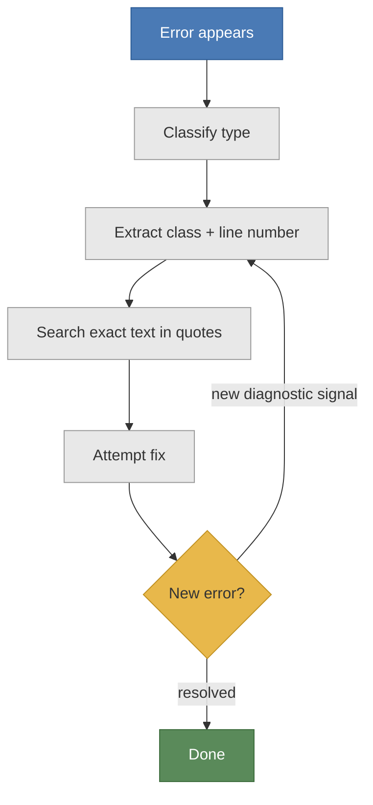

> A 4-step method for reading error messages by structure, not by recognition — works on every error in every language.

You see "Uncaught TypeError: undefined is not a function" and paste it into a search bar. The first result is for a different framework. The second is from 2018. The third is a GitHub issue from three years ago, closed without an answer. You try the second fix anyway.

That is debug by recognition. It accumulates fixes you can recognize. It fails the moment the error is one you have never encountered.

Debug by reading is the other path. Look at those eight words: Uncaught, TypeError, undefined, is not a function. Four specific claims. The runtime is telling you exactly what broke and how. You do not need the right search result to decode them. You need to understand the error architecture: the vocabulary the runtime uses to report failures.

Every error message has structure. That structure is learnable. Not by accumulating fixes. By understanding the design of the message itself. That is diagnostic literacy. It transfers to every error you will ever encounter.

Your total debugging time is T_debug = T_isolation + T_comprehension + T_remediation. Debug by reading shortens T_isolation and T_comprehension before you apply a single fix. That is where most debugging time lives.

## Three types of error

Before applying any method, classify the error. There are three types. Each has different error architecture. Wrong classification sends you to the wrong approach.

**Syntax errors** fire before execution. The parser reads your code and stops at a grammar violation: a missing bracket, an unclosed string, a misplaced semicolon. The message points to a specific line, sometimes the exact character. Fix is always at or near that location. No execution ever starts.

**Runtime errors** fire during execution. The code starts running, reaches a point of failure, and stops. The message carries an error class, a description of what failed, and a line number or stack trace. The stack trace is a chain of function calls: bottom is where execution started, top is where it stopped. Read bottom to top. That is the failure point.

**Logic errors** are the hardest category. The code runs to completion. No error fires. You call a function that should return five filtered results. It returns three. No error class. No line number. No diagnostic signal. The only clue is the gap between expected output and actual output. Debug by reading does not apply here: there is nothing to read. This is the one failure type you diagnose by comparison, not by message.

Diagnostic literacy begins with this classification. Name the error type before you do anything else. It determines which T_debug component you are working on and what the runtime has given you to work with.

| Error type | When it fires | What the message gives you | Where to look first |
|---|---|---|---|
| Syntax | Before execution | Line or character where grammar fails | That exact line in source |
| Runtime | During execution | Error class + line number + stack trace | Stack trace top: failure point |
| Logic | After execution (wrong output) | Nothing: no message fires | Expected vs actual output |

Identifying the error architecture of a failure (which type, which mechanism) is the first act of diagnostic literacy.

## How to read any error message

Debug by reading follows four steps. Apply them in order.

**Step 1: Read the full message literally.**

Every word. Not a skim. A parse.

"Uncaught TypeError: undefined is not a function" is eight words containing four facts:

```
Uncaught          -> not caught by any try/catch block: error propagated to the top
TypeError         -> error class: a type system violation occurred
undefined         -> the value: it carries no value at this point
is not a function -> diagnostic signal: something was called with () but is not callable
```

Those four components are what debug by reading extracts before searching. The error architecture of the message was designed to contain exactly this information. Read it first.

**Step 2: Use the context.**

If the message includes a file name and line number, go there before searching. The message tells you the what. The line number tells you the where. A hypothesis needs both. Going to the failure line reduces T_debug directly: instead of scanning a 2,000-line file, you start at the point the runtime marked.

**Step 3: Search the exact text.**

Copy the error message. Paste it into a search engine with double quotes around it. The error class combined with the diagnostic signal is often specific enough to surface relevant results on the first page. Swyx has argued this is a design requirement: error messages should contain unique, searchable phrases. When the error gives you a numeric code ("Error #5"), search that code directly. Jeff Atwood has noted that even cryptic codes often lead back to official documentation when searched verbatim.

**Step 4: Ask.**

When searching yields nothing actionable, ask someone. Include: the full error message exactly as it appeared (do not paraphrase; the exact phrasing matters), the file name and line number, what you already tried, and the smallest code reproduction. Missing any one of these extends the conversation before useful help arrives.

**Debug-by-reading checklist:**

1. Read in full. Extract: error class, diagnostic signal, value at failure.
2. File name + line number. Go there before searching.
3. Search: copy exact error text in double quotes.
4. Ask: full message + file/line + what you tried + minimal code reproduction.



The loop-back is not a failure. A new error after a fix is a new diagnostic signal. The fix removed one layer and exposed the next issue. Iterate. These four steps, practiced deliberately, build diagnostic literacy faster than accumulating fixes.

## Three patterns decoded

Here is debug by reading applied to three common error types. Same method. Different error architecture each time.

**TypeError: "Uncaught TypeError: undefined is not a function"**

Error class: TypeError. Type system violation.

Diagnostic signal: "undefined is not a function." Something that should be callable is undefined.

Go to the line number. Look at what is being called with parentheses. One of three things is true: the method name is misspelled, the property you are calling it on is null or undefined before you access it, or the variable was assigned a non-function value.

Three common causes:
- `user.getName()` where `user` is null: TypeError fires on property access before the call
- `data.filter()` where `data` is undefined instead of an array
- Calling a variable before assigning it a function value

**ReferenceError: "Uncaught ReferenceError: x is not defined"**

Three questions first. Is the name spelled correctly? Is it declared with let/const/var in the scope where you are using it? Was it assigned a value before this line executed?

Those are the only three causes. ReferenceError means the runtime resolved a name and found nothing. The diagnostic signal "x is not defined" gives you the exact name it could not locate. That name is already in the message. The line number gives you the scope. Check spelling, declaration, assignment: in that order. ReferenceErrors are the most honest error in the error architecture. They tell you exactly what failed and where.

**Python ZeroDivisionError with 'as' binding:**

```python
try:
    result = 10 / 0
except ZeroDivisionError as error:
    print(f"{type(error).__name__}: {error}")
    # Output: ZeroDivisionError: division by zero
    # type(error).__name__ gives the error class
    # str(error) gives the diagnostic signal: the exact statement of failure
```

The 'as' keyword binds the exception object to a name you choose. Now both components are inspectable: `type(error).__name__` for the class, `str(error)` for the diagnostic signal. "division by zero" is the runtime's exact statement of what failed. Not a guess. Not a category. The mechanism.

**Logic errors: a different approach**

Logic errors have no error class. No line number. The only diagnostic signal available is the difference between expected output and actual output. Reproduce the exact behavior with a minimal test case: strip it down to the smallest input that shows the wrong output. Debug by reading cannot help here. Comparison is the tool.

## What a good error gives you

Not all error messages are equal. The difference determines what diagnostic signal you start with when you begin reading.

Scott Nesbitt defined what a well-designed error should do: alert, inform, and guide. Alert: tell the user something went wrong. Inform: say what failed and why. Guide: say how to fix it. An error that only alerts and never informs or guides forces you to reconstruct the missing information yourself.

> "Alert, inform, and guide. An effective error message should do all three. Alert the user that something went wrong. Inform them of exactly what failed. Guide them toward the resolution."
> Scott Nesbitt

Here is the same failure designed two ways:

Bad: "File I/O Error #5"

Good: "Unable to open data.txt: check that it exists and you have read permission"

The error architecture of the first message withholds everything: a category and a code. T_debug is fully open. T_isolation = you do not know which file. T_comprehension = you do not know why. Search "File I/O Error #5" and you find ten different systems using the same code for different failures.

The good message gives you a diagnostic signal specific enough to act on: the file name, and two likely causes stated directly. T_isolation is gone (you know which file). T_comprehension is reduced to two checks. That is the difference between 30 seconds and 30 minutes.

Swyx's searchability argument applies: "Unable to open data.txt" is unique enough that a verbatim search surfaces relevant results. "File I/O Error #5" is not.

Jeff Atwood's warning: legacy systems often produce cryptic codes only. Search them anyway. Paste "0x80070005 access denied" verbatim and the Microsoft KB article is usually the second result. The code that looks opaque on screen is a first-class search key.

| Criterion | Poor error design | Good error design |
|---|---|---|
| Syntactic clarity | Generic category label only | Names the failure mechanism |
| Contextual payload | No runtime variables included | Names the file, value, or object |
| Searchability | Code number or generic phrase | Unique description, searchable verbatim |
| T_debug impact | T_isolation and T_comprehension both fully open | Eliminates T_isolation, reduces T_comprehension |

Apply this table as a diagnostic literacy checklist. Any error message you encounter: how much of the good column does it provide?

## Fix one. Iterate.

Fix one error. Re-run. Observe the next error.

This is not encouragement. It is the mechanical structure of debugging. Errors cascade: a missing parenthesis reveals a misnamed variable, which reveals a scope assumption that was wrong from the start. Each error exposes the next layer.

The first error that fires is not always the root cause. It is the first point the runtime detected something wrong enough to stop. The root cause may be one or two steps upstream.

Each iteration reduces T_debug. When you fix one error and re-run, T_isolation shrinks: one possible source eliminated. T_comprehension shrinks too, because the new error's diagnostic signal gives you new information about the actual system state. You are not resetting. You are narrowing.

> **Three ways to inflate T_debug**
>
> - Bare except/catch blocks swallow the error class. You know something failed. You do not know the class of failure. T_comprehension inflated: no diagnostic signal survives the catch.
> - Empty catch blocks discard error.message. The failure origin is gone. T_isolation inflated: you start over with no starting point.
> - var scope leakage: state origin becomes ambiguous across frames. T_isolation inflated: the variable exists in the wrong scope.

Debug by reading cannot work when the error architecture is destroyed at the catch boundary. These three patterns do exactly that.

---

Error messages are the most complete documentation a system ever produces about its own failures. A well-designed error tells you what broke, why, and where. A poorly-designed one still tells you the error class. Both are readable.

Diagnostic literacy is the skill of reading that structure. Not recognizing fixes. Reading structure. It works on every error you will ever see, in every language you will ever use, including the ones you have not learned yet.

Next time you see an unfamiliar error: name the error class before you type anything into a search bar. Identify which T_debug component it is telling you about. Extract the diagnostic signal. That one step is the difference between debug by recognition and debug by reading.
