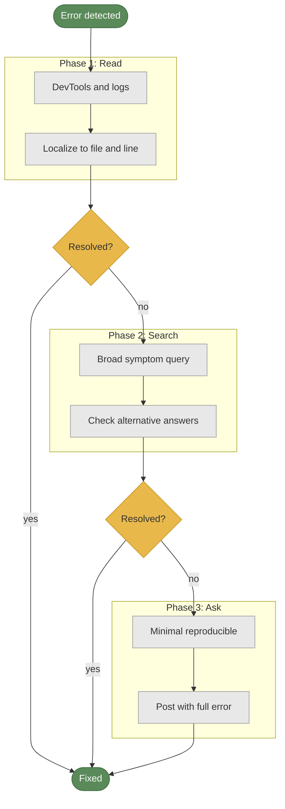

> Cooper's triad, dual-binning, and subject-target-action — three frameworks for reading error messages as design artifacts.

You receive an error from a system you did not build. It reads: "Error #5: operation failed." Eight characters. No subject. No target. No mechanism.

Most developers paste it into a search engine. That is debug by recognition. It fails the moment the system is unfamiliar.

Debug by reading is the other mode. It treats every error message as a design artifact: something built against a standard you can learn. Alan Cooper codified that standard in the 1990s. Most developers have never encountered it.

Error messages carry designed structure. That structure is their error architecture. A well-designed message reduces T_debug, the total debugging time, before you write a single fix. A poorly-designed one still contains a diagnostic signal when you know where to look. Extracting that signal is diagnostic literacy. Debug by reading requires it. It transfers to every system you will ever touch.

Three frameworks: Cooper's triad, the criteria every well-designed error must meet. Dual-binning, the method for classifying any piece of error information. Subject-target-action, the grammar of a precise error message.

## Cooper's triad

The standard exists. Most errors violate it.

Alan Cooper's criteria for a well-designed error message are three. Polite: the message confesses software failure. It does not imply user error. "Invalid input" fails this criterion. It blames the user without naming what the system expected or received. "Unable to process the file: expected CSV format, received JSON" passes. The software confesses. The scope is named. The gap between expected and actual is stated. Illuminating: the message describes scope, system state, alternatives, and data loss status. Most errors fail here. They report what broke. They do not report the blast radius, the state left behind, or what alternatives remain. Helpful: the message actively suggests the next action within the interface. Not "contact your administrator." A specific, executable suggestion.

Dual-binning maps Cooper's three criteria to a classification method. Issue bin: everything that tells you what failed and why. Cooper's polite and illuminating criteria live here: the error class, the failure mechanism, the system state, the scope. Resolution bin: everything that tells you what to do next. Cooper's helpful criterion lives here: the specific next action, the expected vs actual comparison. Prune: everything that tells you nothing actionable. Internal function call names without logical operation descriptions. Stack frames with no failure context. The bin an element belongs to determines its diagnostic signal value.

Mozilla applied dual-binning to Firefox's network error pages in 2014. Before: "The connection was reset." After: pages named possible causes and provided specific next actions. Session abandonment dropped from 29% to 60% lower. Not a design philosophy. A measured outcome with a before number, an after number, and a specific design change between them.

Intel's application developer guidelines define the distinction differently. Errors are red, halting states that prevent data corruption. Warnings are yellow, non-halting anomalies the system can continue through. The distinction determines reading urgency. A red state demands T_isolation first: you cannot comprehend or remediate what you have not isolated. A yellow state permits T_comprehension first. Error architecture encodes this T_debug priority before you read a word. Diagnostic literacy includes recognizing which state class you are in before you parse a single line of message text.

> **Cooper's three reading tests**
>
> Apply to any error message you encounter:
>
> 1. Is it polite? Does it confess software failure without implying user error?
> 2. Is it illuminating? Does it describe scope, state, alternatives, and data loss status?
> 3. Is it helpful? Does it suggest a specific, executable next step?
>
> When all three fail, you are reading a pre-Cooper error. Use dual-binning: classify what you have into Issue and Resolution. If the Resolution bin is empty, advance to Phase 2 (search) or Phase 3 (ask). Debug by reading tells you what the error architecture gave you. Dual-binning tells you what it withheld.

## Subject, target, action

One sentence contains the grammar of a readable error.

"Printing failed." Two words. No subject: which document. No target: which printer. No mechanism: what type of failure. T_isolation is fully open. You start with zero constraints.

"Paper jam: document1 stopped printing to printer2." Six words of context. Three components. Document1 is the subject: the actor in the failure. Printer2 is the target: the object the operation failed on. Paper jam is the action: the failure mechanism. Each component addresses a different T_debug phase. Subject and target close two paths in T_isolation. Action moves you from T_isolation to T_comprehension. Error architecture with all three components collapses the isolation phase before you open a file.

Static error strings are the most common source of diagnostic signal loss in application code.

```javascript
// Anti-pattern: discards runtime state
function display(result, document1, printer2) {
    if (result.status !== 'ok') {
        throw new Error('Printing failed');
        // No subject, target, or mechanism in the diagnostic signal
    }
}

// Recommended: preserves error architecture in the message
function display(result, document1, printer2) {
    if (result.status !== 'ok') {
        throw new Error(
            `${result.status}: ${document1.name} stopped printing to ${printer2.name}`
        );
        // subject: document1.name + action: result.status + target: printer2.name
    }
}
```

The anti-pattern throws a static string. The function received three runtime arguments. None survive into the error message. The developer reading it has the same information as someone who was not in the room.

The recommended pattern embeds runtime state in the diagnostic signal. Subject, action, target arrive in the message automatically. Dual-binning applied: document1.name and result.status land in the Issue bin. Printer2.name lands in the Resolution bin anchor: that is where to investigate first. Debug by reading requires this information to exist. This is how you build it in from the first line of a function.

## Config diagnostics

Two systems that removed T_isolation as a phase.

Configuru is a C++ configuration library. Its errors read: "config.json:42: Bad indentation: expected 3 tabs, got 2." Every piece of T_isolation information is in that line: the file name, the exact line number, the expected value, the actual value. T_debug collapses. T_debug = T_comprehension + T_remediation. The isolation phase does not exist because the error architecture contains it. You have the file and the line before you open anything.

The design choices that produce this: exact line reference (config.json:42, not "format error in configuration"), expected-vs-actual framing (expected 3 tabs, got 2), structural context (indentation level, not just "bad format"). Each choice closes one path of investigation. The error message does what T_isolation does. Diagnostic signal density is maximum. The T_debug formula loses one term before you begin.

Temporal, the durable workflow platform, publishes a formal error message style guide with four rules. One: lowercase, no punctuation. Punctuation introduces ambiguity in log scanning. Lowercase reduces visual noise. Two: consistent verbs. "Unable to" instead of "failed to" or "can't." Predictable verb patterns make errors greppable across codebases. Three: logical action descriptions instead of raw function call names. "Unable to schedule workflow" not "ExecuteWorkflowTaskHandler failed." Function call names are internal error architecture. The reader needs the logical operation. Four: expected vs actual in structural context. Show the gap, not just the symptom.

| Criterion | Traditional error design | Human-centric error design |
|---|---|---|
| Syntactic clarity | Generic category label ("Error #5") | Names the failure mechanism in plain terms |
| Contextual payload | Discards runtime variables in static string | Embeds subject, target, and logical action |
| Traceability and searchability | Code number or internal function name | Unique natural-language phrase, verbatim-searchable |
| System visibility | No scope or blast radius | States data loss, state changes, and alternatives |
| Interactive flow | Dead end: "contact support" | Active next step with named constraint |

The left column is the pre-Cooper error architecture. It forces T_isolation and T_comprehension fully open before you begin. The right column implements all three Cooper criteria. Apply this table as a diagnostic literacy checklist. Any error you encounter belongs in one column. That column tells you what debug by reading will cost before you start.

## JS error classes and dual-binning

JavaScript's error class system is a diagnostic taxonomy built into the language.

Each class names a category of failure. The class tells you the type of violation before you parse the message body. That is the first act of diagnostic literacy: classify by error class before you read the description. The class routes you to the right T_debug component before anything else.

| Error class | Causal mechanism | T_debug component |
|---|---|---|
| TypeError | Incompatible type or null/undefined property access | T_comprehension: type violation named; T_isolation: line number locates |
| ReferenceError | Undeclared or out-of-scope variable | T_isolation: variable name in message; scope from line number |
| SyntaxError | Grammar violation or malformed JSON | T_isolation: parser stops at exact location; T_remediation: fix is at or near that point |
| RangeError | Out-of-bounds numeric or infinite recursion | T_comprehension: constraint exceeded; T_isolation: call stack shows recursion depth |
| URIError | Malformed URI in encoding or decoding call | T_isolation: URI named in message; T_comprehension: encoding context |
| EvalError | Legacy eval() misuse | T_isolation: rare in modern JS; flag for audit |

Reading the error class is not optional. It determines which T_debug component the diagnostic signal speaks to first. A TypeError routes you to type checks and null guards. A ReferenceError routes you to declarations and scope. Skip the class and you skip the routing information that arrives before any search.

Dual-binning applied to any piece of error information follows three decisions: Issue bin (what failed and why), Resolution bin (what to do next), Prune (nothing actionable). Apply Cooper's helpfulness test to each piece. If the Resolution bin is empty after binning, advance to Phase 2 or Phase 3 of the diagnostic workflow. That decision is part of debug by reading: the empty Resolution bin is itself a diagnostic signal.

> "Error states are red, halting states that prevent data corruption. Warning states are yellow, non-halting anomalies. The distinction is not cosmetic. It determines which errors the developer must resolve before continuing."
>
> Intel application developer guidelines

The Intel distinction maps directly to T_debug priority. Red forces T_isolation before T_comprehension. Yellow permits T_comprehension first. The error architecture of the error class encodes that priority. Read it before you read the message body.

## Read, search, ask

Three phases. Apply in order.

**Phase 1: Read.**

Use DevTools and logs to localize the failure. console.table for tabular state. console.trace for the call stack. Breakpoints over print statements: breakpoints expose live state, print statements capture a fixed snapshot at one point in execution. The goal: narrow the failure to a specific file, function, or line. When Phase 1 succeeds, T_isolation is complete. T_debug = T_comprehension + T_remediation before you open a browser tab.

**Phase 2: Search.**

Search with a broad symptom query, not a feature-specific one. Scott Nesbitt's distinction: "return random item from array in javascript" finds the mechanism. "How to create rock paper scissors" finds your specific feature but not the underlying error class. Copy the exact error text. Wrap it in double quotes. The diagnostic signal is often specific enough to surface relevant results on the first page. Check alternative answers on Stack Overflow: the accepted answer solves the original poster's exact scenario. Your error class may match a different one.

**Phase 3: Ask.**

Construct a minimal complete reproducible example. The act of constructing it often surfaces the bug before you post: the reduction forces you to isolate the error architecture to its minimum viable expression. When you do post: include the full error message verbatim, the T_debug component you have identified, and what you have already tried. Missing any of these extends the conversation before useful help arrives.



Four SEO anti-patterns that break Phase 2. Negative integers: leading minus signs are parsed by search engines as exclusion operators, stripping the term from the query. Raw hex values like 0x00071153: search engines parse these inconsistently and cannot index them as complete tokens. IBM's taxonomy (module prefix plus message number plus severity code) solves internal indexing but stays opaque to external search. Modern API gateways address this with correlation IDs: unique trace-specific transaction identifiers injected into error response headers. Present the static error code alongside the correlation ID. Operations teams locate the exact microservice interaction in logging tools without searching at all. Diagnostic signal becomes directly addressable.

## Error messages are designed

Error messages are not a byproduct of implementation. They are a designed communication channel. Cooper's standard tells you what they owe you. Dual-binning tells you how to classify what they gave you. Subject-target-action tells you how to build better ones.

When you read error messages as design artifacts, against Cooper's criteria, through the Issue and Resolution bins, with subject-target-action as a parsing grammar, you extract diagnostic signal from every system you encounter. The error architecture tells you what it knows. Diagnostic literacy tells you what to ask for next.

When the Resolution bin is empty: that is not a dead end. It is a Phase 3 signal. That is debug by reading.
