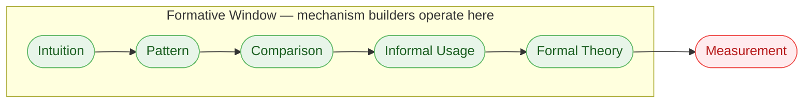
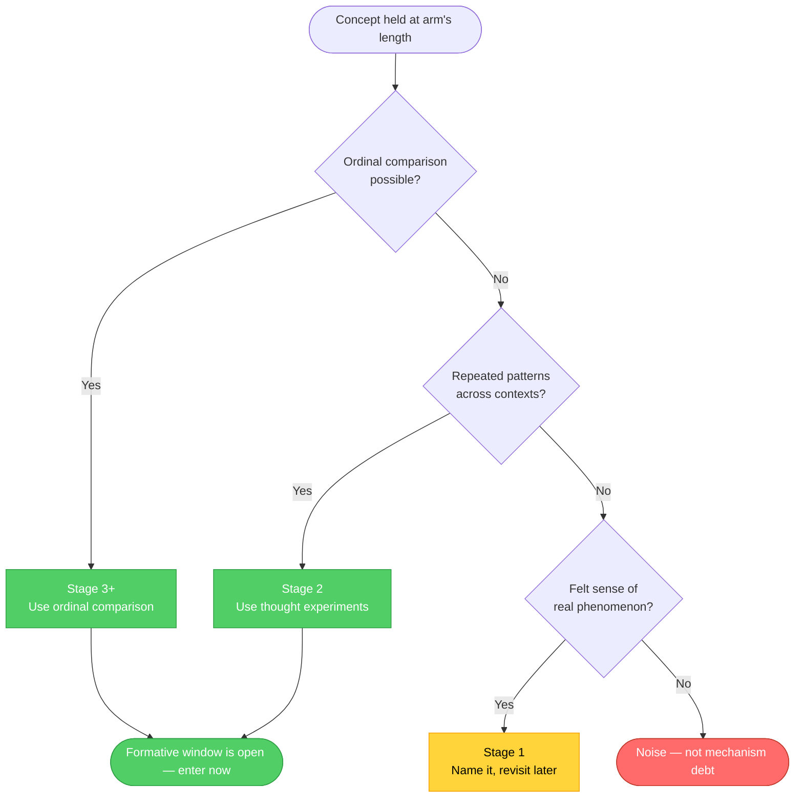

> How analytically trained thinkers mistake the limits of their measurement instruments for the limits of reality, and a method for reasoning forward anyway.

There are two types of analytically trained thinkers.

The first is a mechanism waiter. They encounter an interesting idea, something that feels real, something with predictive power, something colleagues are already acting on. They hold it at arm's length. No measurement, no permission to engage. No metric, no movement. The mechanism waiter calls this rigor. It looks like rigor. There is a specific failure mode hidden inside it.

The second is a mechanism builder. Same idea, same conditions. They don't pretend measurement exists when it doesn't. Instead, they locate where the idea sits in the formalization sequence and start using the provisional scaffolding available at that stage. They reason forward while the machinery catches up. They act in the formative window: the period before an idea's measurement infrastructure is complete, when moving first is still possible.

Most analytically trained people are mechanism waiters. They were taught to be. The skill that made them rigorous is the same one that makes them late.

---

## The error is in the instrument, not the idea

Every analytically trained person learns some version of the same rule: if you cannot measure it, be skeptical. Require reproducibility. Demand operational definitions before taking anything seriously. This rule is mostly correct. It is also responsible for a specific, recurring error.

When an idea resists measurement, the trained response is to treat it as suspect, potentially premature, possibly pseudoscientific. The idea gets quarantined until the measurement machinery exists. This feels like intellectual discipline. What it actually is: observer-tool conflation.

Observer-tool conflation is the mistake of treating the limits of your current instruments as the limits of underlying reality. The measurement gap becomes a verdict on existence. "I cannot measure this" slides quietly into "this probably does not exist." The observer's toolkit becomes the boundary of the possible.

Quarter after quarter, good ideas get shelved not because they're wrong, but because the instrument isn't ready. This is mechanism debt: the gap between when a phenomenon becomes real and when the language and methodology to describe it catch up. Mechanism debt is evidence of where a concept sits in the formalization sequence. It is not evidence against the concept.

The mechanism is not absent because the idea is wrong. It is absent because the idea arrived first.

---

## Where every concept lives

Every concept travels the same path: intuition, pattern recognition, comparison, informal usage, formal theory, measurement. Stage six is where the measurement infrastructure lives. Stage one is where real phenomena begin.

Most analytically trained people demand Stage 6 before they permit Stage 1. History moves in the opposite direction. Always.

Paul Erdős understood this intuitively. He placed bounties on mathematical problems he could see but couldn't prove, $25 for problems just out of current reach, up to $10,000 for structurally significant ones. When asked about the Collatz Conjecture, he said "mathematics is not ready for such problems." Not: this doesn't exist. Not: this is noise. He knew where it sat in the sequence and the right move was to mark it, set a price on it, and reason around it.

The concepts for safety, threat, order, and chaos existed as experienced realities long before stable vocabulary arrived. People made accurate predictions from them, modified behavior, survived or didn't, based on whether they got threat recognition right. Roughly three decades before formal psychology provided vocabulary to describe this. The vocabulary trailed the phenomenon by decades. The phenomenon was real the whole time.

The observer-tool conflation of demanding formal vocabulary before acknowledging the phenomenon would have been a categorical error in both cases.

**Mechanism Debt Stage Map**

| Stage | What Exists | What's Missing | Valid Reasoning Moves |
|-------|-------------|----------------|----------------------|
| 1: Intuition | A felt sense that something real is happening | Language, comparison, verification | Name the intuition; find analogies; note adjacent feelings |
| 2: Pattern recognition | Repeated observation across contexts | Formal structure, vocabulary | Map the pattern; use similarity matching; compare instances |
| 3: Comparison | Multiple competing interpretations | Consensus, measurement | Ordinal comparison; thought experiments; A/B test concepts |
| 4: Informal usage | Working language, rough definitions | Precision, reproducibility | Qualitative observation; longitudinal tracking; domain transfer |
| 5: Formal theory | Structural explanation | Quantification, population-level data | Theory stress-testing; predictive reasoning; edge case analysis |
| 6: Measurement | Full verification infrastructure | — | All standard analytical methods |

The observer-tool conflation treats Stages 1 through 5 as problems to resolve before engagement. They are not problems. They are the formative window.

---

## The mechanism builder's method

The mechanism builder doesn't ignore the formalization sequence. They know which stage a concept is at, which reasoning moves are valid there, and which bridges constitute provisional scaffolding versus wishful thinking.

Five steps for reasoning inside mechanism debt:

**Step 1: Name the intuition.** Without requiring a precise definition. "This concept feels related to X." Specificity matters more than correctness here. A vague feeling cannot be tested. A specific one can be compared.

**Step 2: Map neighboring concepts.** Collect adjacent ideas. If the concept feels related to safety, gather: stability, predictability, order, protection. These are reference points, not synonyms. They let you triangulate shape before a formal definition exists.

**Step 3: Compare similarities and differences.** Which neighbor feels closest? Where do they diverge? What does your concept produce that none of the neighbors do? You are building an ordinal map. Ordinal maps are usable even before a ruler exists.

**Step 4: Apply to a real decision.** Abstract ideas reveal themselves under load. Does this concept change the decision? Reduce friction? Produce meaningfully different results? Concepts with no operational effect in Step 4 are still at Stage 1. Worth marking, not building on yet.

**Step 5: Observe outcomes ordinally.** Without precise measurement, compare trajectories. Is this direction ordinally better than the alternative it replaced? You are not proving a claim. You are calibrating a model.

Stage determines which step is load-bearing. At Stage 1, Step 1 is everything. By Stage 3, Step 3 is the primary tool. The method doesn't change. How hard you can push each step does.

Each cycle refines the conceptual map. Each ordinal comparison sharpens the model. By the time Stage 6 arrives, the mechanism builder has years of structured thinking behind their measurement. The mechanism waiter engages correctly. Late.

---

## The audit

Pick one concept you are holding at arm's length. Something that feels real, has predictive power, and you refuse to reason about rigorously because Stage 6 machinery does not yet exist.

Ask one question: is this mechanism debt, or is this noise?

If you can run Step 3, if you can place this concept in ordinal comparison against alternatives and get a meaningful result, you are not at Stage 1. Stage-appropriate scaffolding exists. The formative window is open.

The mechanism is not absent because the idea is wrong.

The mechanism is not ready yet.

That is not the same thing.
