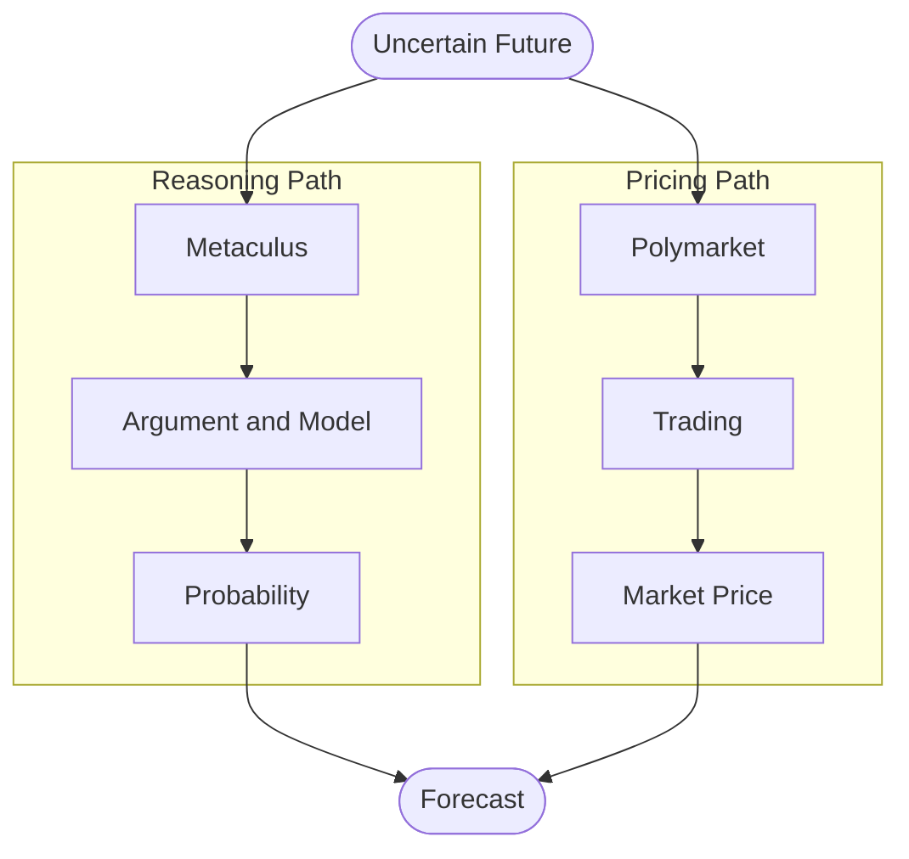
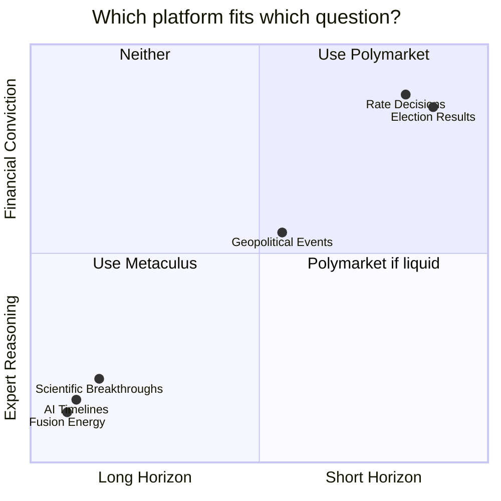

> "Metaculus and Polymarket aren't rivals. They are two different compression machines — and they preserve completely different information."


## You're either a reasoner or a pricer

Pick one.

Reasoners trust the best argument. They read evidence, build models, write their reasoning publicly, and update when new information arrives. The future is a hypothesis. Hypotheses get tested.

Pricers trust the most expensive conviction. They stake money. The market clears at a price. That price is the forecast.

> "Metaculus asks for your model. Polymarket asks for your money."

Both crowds are smart, about different things.

Metaculus and Polymarket aren't rivals. One argues its way to truth; the other buys its way to a price. "Which platform is better" is the wrong frame: they answer different questions. The real divide is **reasoning vs pricing**, and it runs deeper than two websites.

## Both platforms solve the same problem. The mechanism couldn't be more different.

The future is uncertain. Forecasters turn that uncertainty into a number.

Both platforms output a probability between 0 and 1: a single actionable claim that compresses everything the system knows. Election outcome? AI capabilities by 2030? Rate cut next quarter? Scientific breakthrough in fusion energy? Both will give you a number.

The reasoning vs pricing divide is where the symmetry ends. Metaculus reaches its number through argument: evidence gathered, reasoning written, model updated. Polymarket reaches its number through markets: money staked, position taken, price cleared.

Same destination. Entirely different machinery.

## Metaculus is a prediction laboratory

Metaculus is a prediction laboratory.

Not a metaphor. A structural description.

Every question on the platform functions like a scientific hypothesis: a claim about the future that can be tested, scored, and accumulated into a track record. Forecasters read evidence, build models, and write their reasoning in public. They update beliefs as new information arrives. The Brier scoring system punishes overconfidence and underconfidence equally. Be wrong at 95% certainty and you lose more than if you'd forecast 60%.

What drives participation? Not money. Reputation. Status within a **prediction laboratory** community that rewards being right over sounding right.

This creates a specific kind of selection pressure. On Metaculus, it favors epistemic accuracy. Forecasters who reason carefully, update correctly, and maintain good calibration accumulate high scores. Forecasters who cling to wrong models pay a reputational price. The best ones read like detectives, not pundits.

Here's the reasoning vs pricing split made visible: on Metaculus, the reasoning is preserved. The path from source material to forecast is traceable. Three months later, you can read exactly why a forecaster said 40%, and whether the argument held. The prediction laboratory doesn't just produce forecasts. It archives the thinking behind them.

## Polymarket is a stock market for future events

Polymarket is a stock market for future events.

A question resolves YES or NO. YES shares pay $1 if the event occurs, $0 if it doesn't. The market price becomes the implied probability:

```
YES share = $0.73  →  73% implied probability
YES share = $0.31  →  31% implied probability
```

Simple arithmetic. Profound consequence.

On Polymarket, reasoning is private. You don't write your model. You don't explain your update. You trade. The price is the only signal that survives.

This creates a completely different **selection pressure**, one the prediction laboratory never sees: financial gain.

| Dimension | Metaculus | Polymarket |
|-----------|-----------|------------|
| Currency | Reputation | Money |
| Feedback loop | Brier score | Profit / Loss |
| Core motivation | Accuracy | Profit |
| What survives | The reasoning | The price |
| Selection pressure | Epistemic accuracy | Financial gain |
| Failure mode | Groupthink | Manipulation |

The **wisdom of incentives** is the aggregate signal a market surfaces when participants have real money at stake. It is not the same as the wisdom of crowds, which assumes participants are trying to be accurate. Polymarket participants are trying to be profitable. Those goals overlap often. Not always.

## Which crowd is smarter? The one with the right incentives for your question.

Here's what wisdom of incentives buys you: speed, private information, and financial conviction.

Polymarket prices update within minutes of breaking news. During the 2024 US election, Polymarket markets were pricing Trump's victory well above what cable news was projecting: traders had repositioned on early county-level returns before networks synthesized them into a call. A political insider, financial professional, or domain expert embeds knowledge directly into a price, without writing a word of public reasoning. The market clears. The prediction laboratory cannot access knowledge that never surfaces as text.

That's the real edge of markets: fast, private, and financially grounded.

But wisdom of incentives creates distortions markets alone cannot self-correct, and has failure modes the prediction laboratory avoids:

| Failure Mode | Metaculus | Polymarket |
|---|---|---|
| Intellectual monoculture | High (forecaster community is homogeneous) | Low (anyone can trade) |
| Shared assumptions | High (explicit reasoning spreads consensus) | Low (trades are private) |
| Liquidity manipulation | N/A | High (thin markets are gameable) |
| Contract resolution disputes | N/A | High (resolution criteria invite gaming) |
| Long-horizon accuracy | Strong | Weak (few traders hold multi-year positions) |
| Speed on breaking news | Slow | Fast |

Long-horizon questions — AI timelines, scientific breakthroughs, structural geopolitical shifts — need the forecasting as compression mechanic that the prediction laboratory provides: public reasoning, traceable models, slow accumulation of calibrated signal.

Short-horizon questions — elections, rate decisions, near-term political events — need what wisdom of incentives provides: speed, private information, and conviction that acts in minutes, not days.

Neither selection pressure is universally superior. Both are optimized for different inputs. The question isn't "which crowd is smarter?" It's "which selection pressure do you need?"

## Forecasting as compression: what both systems are actually doing

A forecast is not a number.

It takes everything you know and compresses it into one. Models, evidence, uncertainty, calibration. All of it collapsed into a single probability others can act on. **Forecasting as compression** is what both platforms do. They just compress differently.

Metaculus compresses through reasoning. The argument becomes the probability. What gets preserved: the structure of the thinking, traceable and revisable. What gets lost: nuance that didn't survive the written forecast.

Polymarket compresses through pricing. The trade becomes the probability. Direction and magnitude of conviction survive. The reasoning disappears entirely.

Here's the architecture:



Same uncertain future. Two completely different information-processing paths. The forecasting as compression lens reveals what the "which platform is better" debate misses: both platforms compress the future, but they preserve different information and destroy different information.

Route your question to the right compression mechanism:



Long horizon, niche domain, explicit reasoning matters → Metaculus. Short horizon, liquid market, speed matters → Polymarket.

The deeper pattern runs past prediction platforms entirely. Two distinct traditions for forecasting the future, using different currencies. Epistemic systems, science, research, expert communities, filter for the best argument. Market systems, prices, prediction markets, financial incentives, filter for the most expensive conviction.

Reasoning vs pricing has coexisted as long as markets and universities have. Both are right about different parts of reality. The question is always which part you need right now.

---

## The real error isn't choosing the wrong platform

> **When to trust which:**
>
> Long horizon · explicit reasoning · niche domain → **Use Metaculus**
>
> Short horizon · liquid market · private information matters → **Use Polymarket**
>
> Both exist because no single compression mechanism captures everything.

Wisdom of incentives and prediction laboratory aren't competing. Forecasting as compression makes this visible: they solve different problems. One preserves the reasoning. The other preserves the price. Treat them as substitutes and you lose both signals.

The real error isn't choosing the wrong platform. It's thinking you only need one.

Metaculus asks for your model. Polymarket asks for your money. Reasoning vs pricing — both worth giving, but only to the right question.
