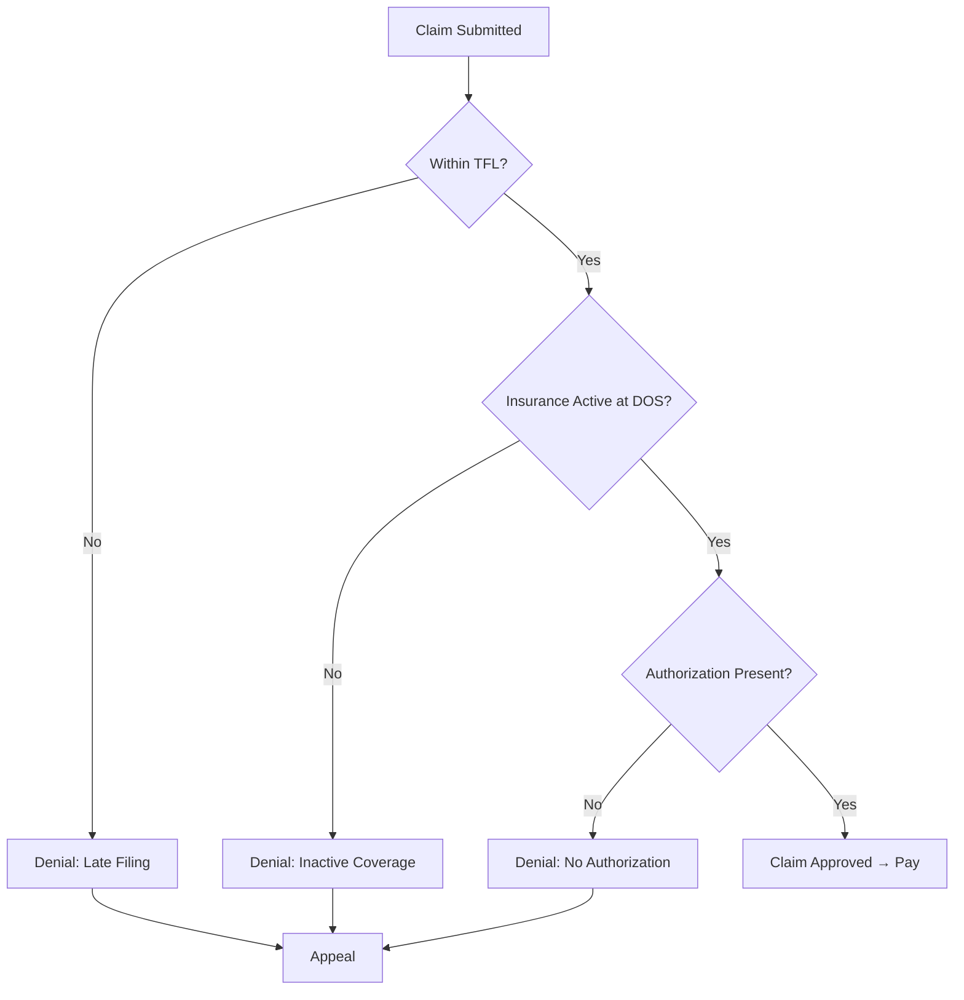
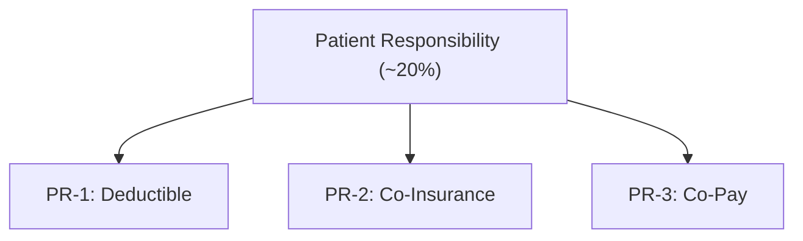

[← Series Overview]({{ '/notes/rcm/rcm-overview' | relative_url }})

---

## 📋 Billing & Claims Concepts

A claim is a clock. Two timers govern its life: **how long you have to file**, and **how long the payer takes to decide.**

> [!info] TFL — Timely Filing Limit
> The **time frame within which a provider must submit a claim** to the health plan. **Set by the insurance itself.** Miss it and the claim dies on arrival — this is one of the top denial reasons.

> [!info] TAT — Turn Around Time
> The **time interval the adjudication team takes to decide** whether to pay or deny a claim. TAT also applies to Authorization requests.

### Provider / Claim Identifiers

| ID | Full form | Format | Shared? |
|----|-----------|--------|---------|
| **NPI** | National Provider Identifier | **10-digit** unique | One per **individual provider** |
| **TIN** | Tax Identification Number | **9-digit** | **Shared** by multiple providers |

> [!note] NPI vs TIN
> NPI identifies the *person* who rendered care. TIN identifies the *practice or group* billing. A solo physician has both; a hospital group has one TIN, many NPIs.

---

## ⛔ 3 Classic Denial Reasons

These three cover the vast majority of denials seen in daily RCM operations:

1. **Untimely filing limit** — claim filed after TFL
2. **No active insurance** for the Date of Service (DOS)
3. **Provider never generated an Authorization**

> [!important] Appeal
> When a claim is wrongly denied, the provider files an **Appeal** to challenge the decision. Appeals go back to the payer's adjudication team with additional documentation.

---

## Claim Adjudication Decision Tree

---

## 🗂️ Common Terminology

> [!info] COB — Coordination of Benefits
> The **process of determining which payer** is the member's **primary, secondary, or tertiary** — who takes financial responsibility, and in what order.

> [!info] EOB — Explanation of Benefits
> A **detailed summary of a processed claim**, shared by the insurance with **both the provider and the member.** It explains what was billed, what was allowed, what was paid, and what the patient owes.

> [!info] Dual Members
> Members eligible for **both** government plans simultaneously: **Medicare + Medicaid.** Medicare pays first (primary); Medicaid pays last (secondary, as payer of last resort).

---

## 🧾 Patient Responsibility (PR)

After the insurer pays its share, **~20% typically lands on the patient.** It comes in three distinct flavors plus a spending ceiling.

| Code | Term | What it is | When paid |
|------|------|------------|-----------|
| **PR-1** | **Deductible** | A **fixed dollar amount** the member must exhaust first within a **calendar year**, after which insurance takes over. | First, annually |
| **PR-2** | **Co-Insurance** | The **cost share** between member and insurer, shown as a **percentage**. Actual $ amount known **only after the claim is processed.** | After processing |
| **PR-3** | **Co-Pay** | A **fixed dollar amount** the member pays the provider **up-front**, at time of service. | Up-front |

> [!important] OOP — Out of Pocket Maximum
> The total ceiling on member spending in a plan year:
>
> `OOP = PR-1 (Deductible) + PR-2 (Co-Insurance) + PR-3 (Co-Pay) + non-covered charges`
>
> Once the OOP maximum is hit, the insurance covers **100% of remaining covered expenses** for the rest of the year.

---

## 📚 RCM Series

[← Overview & Cheat Sheet]({{ '/notes/rcm/rcm-overview' | relative_url }}) ·
[Participants & HIPAA]({{ '/notes/rcm/rcm-participants-hipaa' | relative_url }}) ·
[Plans & Medicare]({{ '/notes/rcm/rcm-plans-medicare' | relative_url }}) ·
[Managed Care]({{ '/notes/rcm/rcm-managed-care' | relative_url }}) ·
[Providers & Auth]({{ '/notes/rcm/rcm-providers-auth' | relative_url }}) ·
[Medical Coding]({{ '/notes/rcm/rcm-coding' | relative_url }}) ·
[All Diagrams →]({{ '/notes/rcm/rcm-diagrams' | relative_url }})
