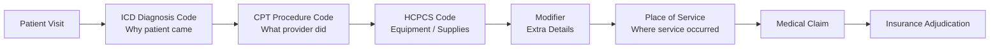

[← Series Overview]({{ '/notes/rcm/rcm-overview' | relative_url }})

---

## 🔢 Medical Coding — The Logic

Coding turns a messy clinical visit into **structured numbers a payer can adjudicate.** Three questions drive the whole system:

> [!abstract] The coding logic
> - **What disease?** → pointing the disease → **ICD**
> - **What treatment?** → what the provider did → **CPT**
> - **What/where/extra info?** → **HCPCS · Modifiers · POS**

---

## The 5 Code Sets

| Code | Full form | What it denotes | Format | Example |
|------|-----------|-----------------|--------|---------|
| **CPT** | Current Procedural Terminology | Medical **procedures / services / treatments** | **5-digit numeric** | `10040` Acne surgery · `66984` Cataract surgery |
| **ICD** | International Classification of Disease | Medical **condition / disease / symptoms** | **Alphanumeric** | `R51` Headache · `E11.22` Diabetes mellitus w/ chronic kidney disease |
| **HCPCS** | Healthcare Common Procedure Coding System | **Misc products & equipment** (e.g. DME) | **5 alphanumeric** | `E0265` Hospital bed · `A0021` Ambulance · `A5500` Diabetic shoes |
| **Modifiers** | — | Extra **clarity** on a CPT (lvl 1) or HCPCS (lvl 2) code | **2 alphanumeric** | `RT` right · `LT` left · `50` bilateral |
| **POS** | Place of Service | **Where** the service was rendered | **2 numeric** | `24` = ASC · `12` = Home · `11` = Office |

---

## CPT vs ICD — Don't Confuse Them

This distinction appears constantly in RCM conversations and on assessments:

| **CPT** | **ICD** |
|---------|---------|
| What the **provider did** — procedures, services, treatments | What the **patient has** — conditions, diseases, symptoms |
| 5-digit **numeric** (`99213`) | **Alphanumeric** (`M54.5`) |
| Published by AMA | Published by WHO (adapted for US use) |

> [!tip] Memory hook
> **CPT = "Current Procedures" = what you DID.**
> **ICD = "International Classification of Disease" = what they HAVE.**

---

## 🔍 CPT E/M Codes — Office Visits

E/M = **Evaluation and Management**. The most frequently used CPT category — these are the "regular doctor visit" codes.

| Code range | Patient type | Note |
|-----------|--------------|------|
| `99202` → `99205` | **New patient** (first-time visit) | Higher code = more complex |
| `99212` → `99215` | **Established patient** (follow-up) | Higher code = more time/complexity |

> [!note] Why this matters for support calls
> When a provider calls about a denied claim, these E/M codes are often the center of the dispute. Wrong code for new vs established patient = denial.

---

## 🏥 Place of Service (POS) Codes — Key Values

| POS Code | Setting |
|----------|---------|
| `11` | Office |
| `12` | Home |
| `21` | Inpatient Hospital |
| `22` | Outpatient Hospital |
| `23` | Emergency Room |
| `24` | Ambulatory Surgical Center (ASC) |
| `31` | Skilled Nursing Facility (SNF) |

---

## 📚 RCM Series

[← Overview & Cheat Sheet]({{ '/notes/rcm/rcm-overview' | relative_url }}) ·
[Participants & HIPAA]({{ '/notes/rcm/rcm-participants-hipaa' | relative_url }}) ·
[Plans & Medicare]({{ '/notes/rcm/rcm-plans-medicare' | relative_url }}) ·
[Managed Care]({{ '/notes/rcm/rcm-managed-care' | relative_url }}) ·
[Providers & Auth]({{ '/notes/rcm/rcm-providers-auth' | relative_url }}) ·
[Claims & PR →]({{ '/notes/rcm/rcm-claims-patient-resp' | relative_url }}) ·
[All Diagrams]({{ '/notes/rcm/rcm-diagrams' | relative_url }})
