[← Series Overview]({{ '/notes/rcm/rcm-overview' | relative_url }})

> [!tip] How to use this page
> These 10 diagrams give you an 80/20 picture of the entire RCM domain. Study the most important 6 first: 1, 5, 6, 8, 9, 10. Return here any time you need a visual anchor.

---

## 1. The Entire Revenue Cycle

The master chain — every other concept lives somewhere on this flow.

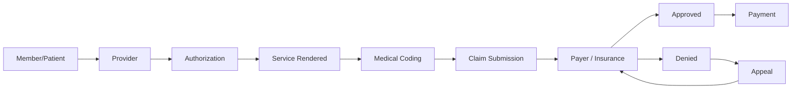

---

## 2. The Healthcare Ecosystem

The 5 participants and how they connect.

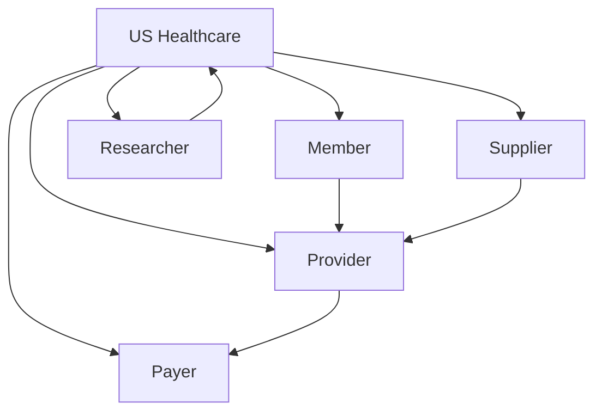

---

## 3. HIPAA & PHI

Who must follow HIPAA, and what PHI protects.

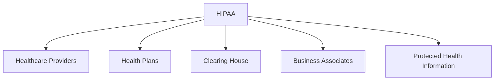

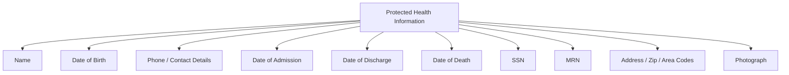

---

## 4. Health Plan Universe

Which plan applies to which patient situation.

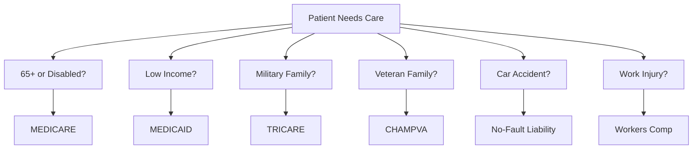

---

## 5. Medicare Parts ★

The four-part structure of Medicare.

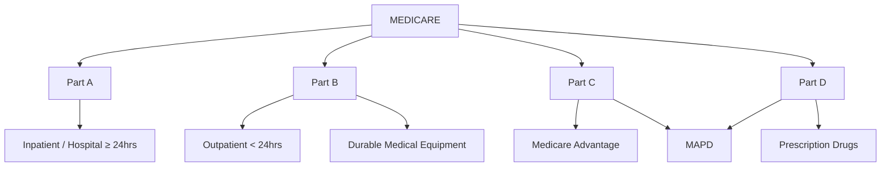

---

## 6. HMO vs PPO ★

The managed care plan types comparison.

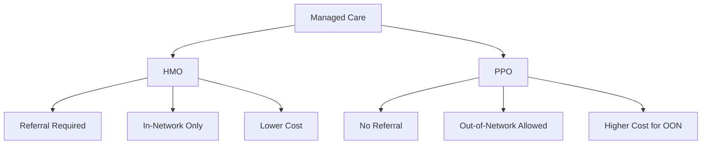

---

## 7. Provider Hierarchy

Individual vs Facility providers, and the facility types.

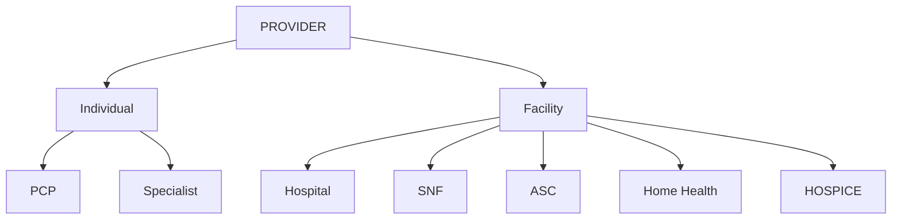

---

## 8. Authorization Workflow ★

How a member gets from office visit to specialist procedure, with insurance approval at each gate.

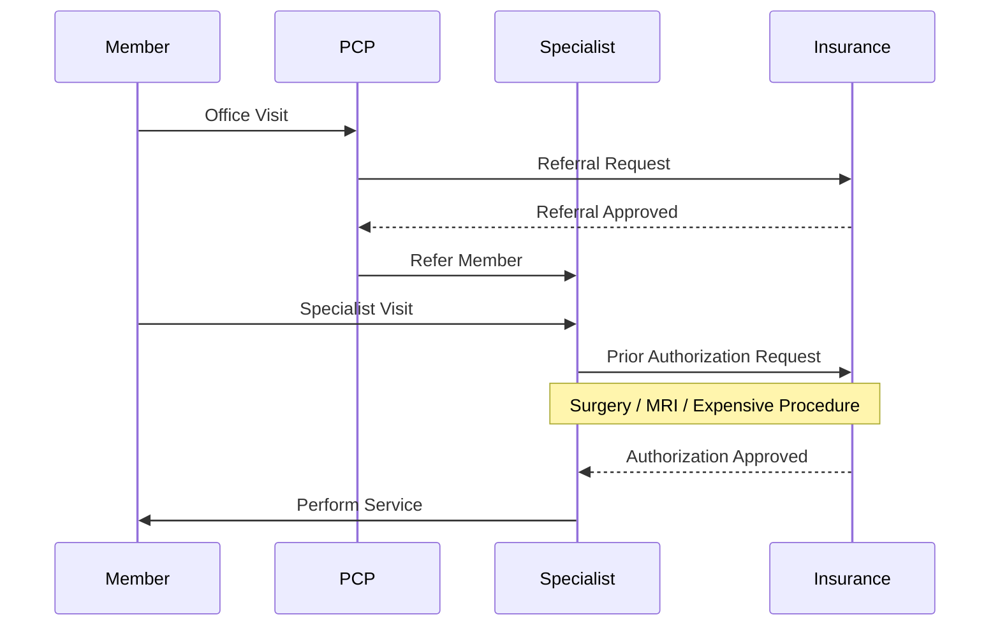

---

## 9. Medical Coding Stack ★

How a visit turns into a claim — the 5 code sets in sequence.

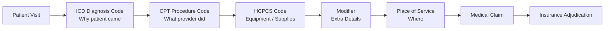

---

## 10. Claim Adjudication & Denials ★

The three gates a claim must pass before payment.

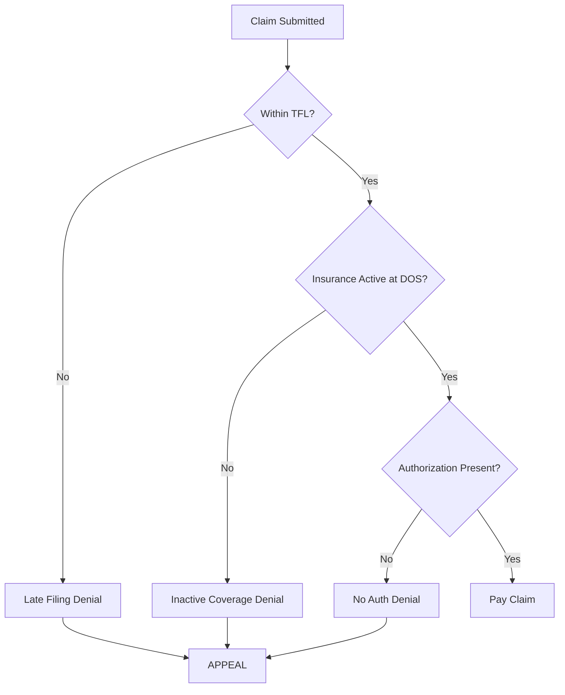

---

> [!success] If you can narrate all 10 diagrams aloud
> You understand the entire Week 1 SunKnowledge training. The ★ ones are the 6 highest-priority.

---

## 📚 RCM Series

[← Overview & Cheat Sheet]({{ '/notes/rcm/rcm-overview' | relative_url }}) ·
[Participants & HIPAA]({{ '/notes/rcm/rcm-participants-hipaa' | relative_url }}) ·
[Plans & Medicare]({{ '/notes/rcm/rcm-plans-medicare' | relative_url }}) ·
[Managed Care]({{ '/notes/rcm/rcm-managed-care' | relative_url }}) ·
[Providers & Auth]({{ '/notes/rcm/rcm-providers-auth' | relative_url }}) ·
[Medical Coding]({{ '/notes/rcm/rcm-coding' | relative_url }}) ·
[Claims & PR]({{ '/notes/rcm/rcm-claims-patient-resp' | relative_url }})
