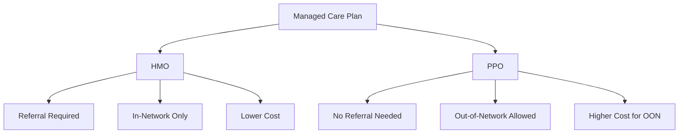

[← Series Overview]({{ '/notes/rcm/rcm-overview' | relative_url }})

---

## 🏗️ Managed Care — What It Is

When a member picks **Medicare Part C (Medicare Advantage)**, they enter managed care. Managed care is essentially a system where the insurance plan controls costs by controlling *how* and *where* members receive care.

> [!warning] The 2 rules of Managed Care
> 1. An **Authorization / Referral is always required.**
> 2. The member should **always visit in-network providers.**

---

## 📋 The 4 Plan Types

| Type | Full form |
|------|-----------|
| **HMO** | Health Maintenance Organization |
| **PPO** | Preferred Provider Organization |
| **EPO** | Exclusive Provider Organization |
| **POS** | Point of Service |

---

## HMO vs PPO — The Comparison That Gets Tested

| | **PCP / Referral needed?** | **Can visit OON providers?** | **Cost share** |
|---|---|---|---|
| 🔵 **HMO** | ✅ YES — need a referral | ❌ NO — in-network **only** | **Lower** |
| 🟠 **PPO** | ❌ NO — go direct | ✅ YES — flexible | **Higher** for OON; lower for INN |

> [!tip] One-liner
> **HMO = cheap but locked in. PPO = flexible but you pay for the freedom.**

---

## 🔑 Key Concept: PCP as Gatekeeper

In an HMO, the **PCP (Primary Care Physician)** is the entry point to all care. You can't see a specialist without a referral from your PCP. In a PPO, you skip this step entirely.

This is why authorization workflows (covered in [note 5]({{ '/notes/rcm/rcm-providers-auth' | relative_url }})) are standard in HMO and Medicare Advantage plans — someone has to approve the spend before it happens.

---

## 💡 EPO and POS (Quick Notes)

**EPO (Exclusive Provider Organization):** Like an HMO but without the need for a PCP referral. Members must stay in-network (exclusive) but can self-refer to specialists within the network.

**POS (Point of Service):** A hybrid. PCP referral required, but members *can* go out-of-network and pay more. Think: HMO with an OON escape valve.

---

## 📚 RCM Series

[← Overview & Cheat Sheet]({{ '/notes/rcm/rcm-overview' | relative_url }}) ·
[Participants & HIPAA]({{ '/notes/rcm/rcm-participants-hipaa' | relative_url }}) ·
[Plans & Medicare]({{ '/notes/rcm/rcm-plans-medicare' | relative_url }}) ·
[Providers & Auth →]({{ '/notes/rcm/rcm-providers-auth' | relative_url }}) ·
[Medical Coding]({{ '/notes/rcm/rcm-coding' | relative_url }}) ·
[Claims & PR]({{ '/notes/rcm/rcm-claims-patient-resp' | relative_url }}) ·
[All Diagrams]({{ '/notes/rcm/rcm-diagrams' | relative_url }})
