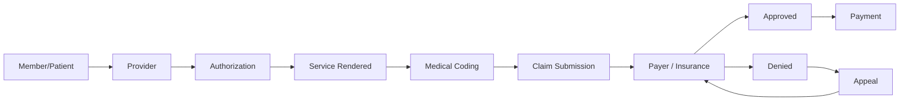

> [!abstract] What this covers
> Money moves through US healthcare along one chain: **a member gets sick → a provider treats them → a payer foots the bill → coders translate the visit into numbers → billers fight to get paid.** This is the entry point for the full RCM series.

---

## The Revenue Cycle — End to End

Every concept in RCM lives somewhere on this chain. Master the chain first; then the details click into place.

---

## Series Map

| Note | Topic | Key concepts |
|------|-------|-------------|
| **1/8** — you are here | Overview | Revenue cycle, cheat sheet |
| [2/8 Participants & HIPAA]({{ '/notes/rcm/rcm-participants-hipaa' | relative_url }}) | The 5 players + privacy law | Member, Provider, Payer, Supplier, Researcher · PHI · HIPAA 4 entities |
| [3/8 Plans & Medicare]({{ '/notes/rcm/rcm-plans-medicare' | relative_url }}) | Insurance plans | Medicare (Parts A–D) vs Medicaid · TRICARE · CHAMPVA · DME |
| [4/8 Managed Care]({{ '/notes/rcm/rcm-managed-care' | relative_url }}) | HMO, PPO, EPO, POS | Managed care rules · HMO cheap/locked vs PPO flexible/pricey |
| [5/8 Providers & Auth]({{ '/notes/rcm/rcm-providers-auth' | relative_url }}) | Who provides, how they get paid | INN/OON · Referral vs Auth · Capitation vs FFS |
| [6/8 Medical Coding]({{ '/notes/rcm/rcm-coding' | relative_url }}) | 5 code sets | CPT (what you did) · ICD (what they have) · HCPCS · Modifiers · POS |
| [7/8 Claims & Patient Responsibility]({{ '/notes/rcm/rcm-claims-patient-resp' | relative_url }}) | Billing lifecycle | TFL · TAT · NPI/TIN · 3 denial reasons · PR1/2/3 · OOP |
| [8/8 All Diagrams]({{ '/notes/rcm/rcm-diagrams' | relative_url }}) | Visual study map | 10 mermaid diagrams covering the entire series |

> [!tip] Study tools
> **Read:** 1 → 8. **Drill:** [Flashcard + MCQ]({{ '/notes/rcm/drill' | relative_url }}) — mark weak cards, copy prompt. **Cheat-Sheet:** [📋 Interactive]({{ '/notes/rcm/cheatsheet.html' | relative_url }}) — blur/reveal, mastery tracking, keyboard nav. **Search:** [🔍 All content]({{ '/notes/rcm/search.html' | relative_url }}) — full-text across 73 facts, 37 terms, 8 notes. **Track:** [📊 Dashboard]({{ '/notes/rcm/dashboard.html' | relative_url }}) — progress across all notes + weak area map. **One-pager:** [📖 All-in-One]({{ '/notes/rcm/all-in-one.html' | relative_url }}) — whole series + all diagrams, single printable page.

---

## 🧠 Quick Recall Cheat Sheet

Use this for active recall. Cover the right column, read the left, test yourself.

### The Spine

| Prompt | Answer |
|--------|--------|
| 5 healthcare participants | Member · Provider · Payer · Supplier · Researcher |
| The spine of every encounter | Member ➜ Provider ➜ Payer |
| Federal privacy law (year, agency) | HIPAA, 1996, DHHS |
| PHI = ? (6 examples) | Address/zip · SSN · MRN · Photo · Admission/Discharge/Death dates |

### Medicare vs Medicaid

| Prompt | Medicare | Medicaid |
|--------|----------|----------|
| Run by | Federal | State + Federal (joint) |
| Covers | **80%** (member pays rest) | **100%** |
| Mnemonic | "Rich" / older | "Poor" |
| Age | 65+ **or** disabled (24 months SS checks) **or** 40 quarters tax | No age limit |
| Special rule | — | Last payer to pay · covers ESRD |

### Medicare Parts

| Part | Nickname | Covers |
|------|----------|--------|
| A | Original / Traditional | **Hospital / Inpatient** (≥ 24 hrs) |
| B | — | **Outpatient** (< 24 hrs) + **DME** |
| C | Medicare Advantage | A + B + Dental/Hearing/Vision/Rx |
| D | PDP (optional) | **Drugs**, vaccines |
| MAPD | — | Part C + Part D combined |

### HMO vs PPO

| | HMO | PPO |
|---|-----|-----|
| PCP / Referral needed? | ✅ YES | ❌ NO |
| Out-of-network allowed? | ❌ NO | ✅ YES |
| Cost | **Lower** | **Higher** for OON |
| One-liner | Cheap but locked in | Flexible but you pay for freedom |

### The 5 Code Sets

| Code | Full form | What | Format |
|------|-----------|------|--------|
| CPT | Current Procedural Terminology | **Procedures / services** | 5 numeric |
| ICD | International Classification of Disease | **Conditions / diseases** | Alphanumeric |
| HCPCS | Healthcare Common Procedure Coding System | **Equipment / misc** | 5 alphanumeric |
| Modifiers | — | Extra clarity on CPT or HCPCS | 2 alphanumeric |
| POS | Place of Service | **Where** service occurred | 2 numeric |

### Billing Fast-Facts

| Concept | Definition |
|---------|------------|
| TFL | Timely Filing Limit — deadline to submit a claim (set by payer) |
| TAT | Turn Around Time — how long payer takes to decide |
| NPI | National Provider Identifier — **10-digit**, one per individual provider |
| TIN | Tax Identification Number — **9-digit**, shared by multiple providers |
| COB | Coordination of Benefits — who pays primary/secondary/tertiary |
| EOB | Explanation of Benefits — detailed claim summary from insurer |

### 3 Classic Denial Reasons

1. **Untimely filing limit** — claim filed after TFL
2. **No active insurance** on the Date of Service (DOS)
3. **No authorization** — provider never got one

### Patient Responsibility

| Code | Term | What | When |
|------|------|------|------|
| PR-1 | Deductible | Fixed $ to "finish off" first, annually | First, each year |
| PR-2 | Co-Insurance | % split with insurer (known after claim) | After processing |
| PR-3 | Co-Pay | Fixed $ paid up-front at visit | At time of service |
| OOP | Out of Pocket | Ceiling: PR-1 + PR-2 + PR-3 + non-covered | Once hit, insurer pays 100% |

---

*Add new topics to this series: create `notes/rcm-[topic].md` with `topic: RCM` and it appears in the notes page automatically.*
