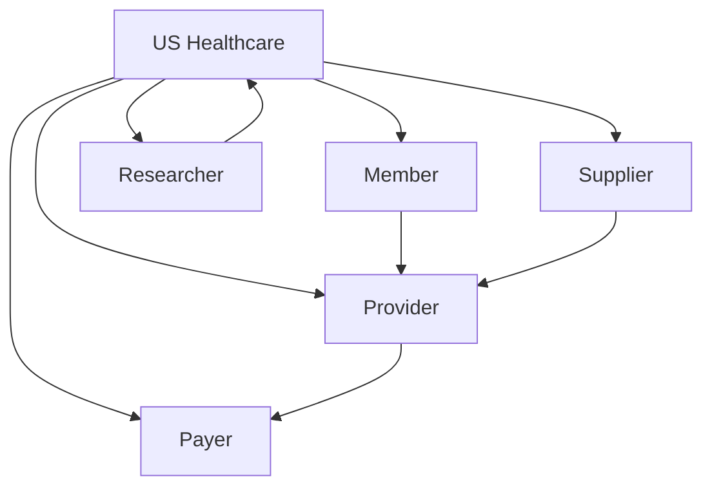
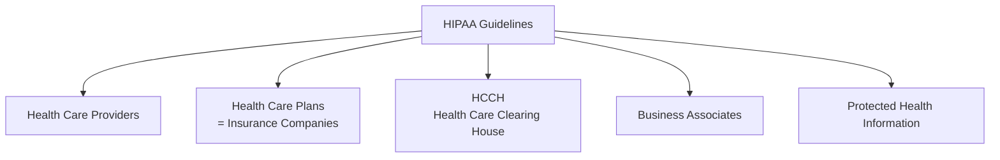
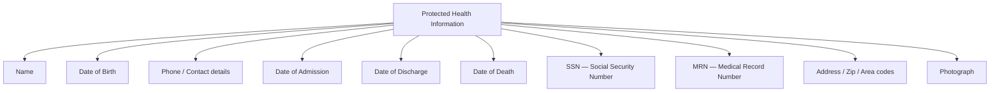

[← Series Overview]({{ '/notes/rcm/rcm-overview' | relative_url }})

---

## 👥 The 5 Participants

Healthcare isn't a two-party deal — **five distinct actors touch every dollar.** Every later concept hangs off one of these roles.

| # | Participant | Who they are |
|---|-------------|--------------|
| 1 | **Member** | The US policy holder — the patient. |
| 2 | **Provider** | Individuals/organizations delivering care (doctors, hospitals). |
| 3 | **Payer** | The insurance company. *Payer = the entity that pays the claim.* |
| 4 | **Supplier** | Supplies medical equipment/supplies used to treat or prevent illness. |
| 5 | **Researcher** | Runs experiments and studies for human health. |

> [!tip] Mental model
> Member ➜ Provider ➜ **Payer** is the spine. Suppliers and Researchers sit on the edges.

---

## 🔒 HIPAA

> [!info] HIPAA — Health Insurance Portability and Accountability Act
> A **federal privacy law** that forces all members' personally identifiable health information to stay **confidential and private**.
>
> Enacted **1996** · By **DHHS** (Department of Health and Human Services)

> [!warning] Spelling check
> The acronym is **HIPAA** (two A's). "HIPPA" is a very common misspelling — it's a tell in interviews.

### 4 entities required to follow HIPAA

| Entity | One-line role |
|--------|---------------|
| **Health Care Providers** | Individuals/orgs giving medical services — keep member details confidential. |
| **Health Care Plans** | The insurance policies covering members' medical expenses. |
| **HCCH** (Health Care Clearing House) | Orgs that process the data used for billing. |
| **Business Associates** | Third parties working *on behalf of* plans, providers, and HCCH. |

---

## 🧾 PHI — Protected Health Information

> [!important] PHI = the data HIPAA exists to protect
> Member information that **must stay confidential** to secure the member's privacy.

**PHI categories to memorize:**

- **Biographic** — Address (including Zip code), Photograph, SSN
- **US People Identity Card**
- **MRN** — Medical Record Number
- **Dates** — Date of Admission, Date of Discharge, Date of Death (all in-hospital)

> [!note] Why dates matter
> The specific in-hospital dates (admission, discharge, death) are PHI because they reveal that someone received care at all — that alone can affect employment, insurance, and more.

---

## 📚 RCM Series

[← Overview & Cheat Sheet]({{ '/notes/rcm/rcm-overview' | relative_url }}) ·
[Plans & Medicare →]({{ '/notes/rcm/rcm-plans-medicare' | relative_url }}) ·
[Managed Care]({{ '/notes/rcm/rcm-managed-care' | relative_url }}) ·
[Providers & Auth]({{ '/notes/rcm/rcm-providers-auth' | relative_url }}) ·
[Medical Coding]({{ '/notes/rcm/rcm-coding' | relative_url }}) ·
[Claims & PR]({{ '/notes/rcm/rcm-claims-patient-resp' | relative_url }}) ·
[All Diagrams]({{ '/notes/rcm/rcm-diagrams' | relative_url }})
