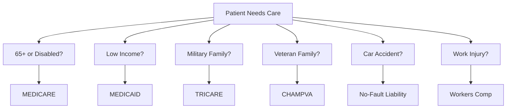
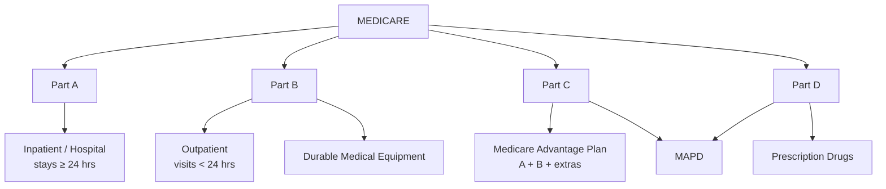

[← Series Overview]({{ '/notes/rcm/rcm-overview' | relative_url }})

---

## 💳 Health Care Plans — Big Picture

Plans split two ways: **government-run** (Medicare, Medicaid) and **government programs** for specific populations. Get the Medicare-vs-Medicaid split right and half the payer domain falls into place.

---

## 🟦🟩 Medicare vs Medicaid

The fastest way to keep them straight: **Medicare = age/disability (federal), Medicaid = poverty (state + federal).**

| | 🟦 **MEDICARE** | 🟩 **MEDICAID** |
|---|---|---|
| **Run by** | Federal government | **Joint** — funded by state, monitored by federal |
| **Covers** | **80%** (rest = patient responsibility) | **100%** |
| **Mnemonic** | "Rich" / older | "Poor" |
| **Age criteria** | 65+ **or** disabled (receiving **24 months** of Social Security checks) **or** paid **40 quarters** of federal tax (= 10 yrs US residency) | **No age limit** |
| **Who qualifies** | See above | Poor, disabled, pregnant women, children, anyone below the federal poverty line |

> [!note] Two critical Medicaid facts
> - Medicaid is the **last payer to pay** when a member has multiple coverages (the "payer of last resort").
> - Also covers **ESRD** patients — End Stage Renal Disease.

---

## 🏛️ Government Programs

Beyond Medicare/Medicaid, four programs cover specific populations:

> [!example] TRICARE (formerly CHAMPUS)
> Civilian Health And Medical Program of the Uniformed Services. Health insurance for **military personnel** — active, deceased, disabled, retirees, **and their dependents.**

> [!example] CHAMPVA
> Civilian Health And Medical Program of the **Department of Veterans Affairs**. Covers care costs for **war veterans** — active, deceased, disabled, or partially disabled during war — **and their dependents.**

> [!example] No-Fault Liability (Third-Party Insurance)
> Pays for care resulting from injury to a person **or** damage to property in an accident — **regardless of who caused it.**

> [!example] Workers' Compensation
> Covers injuries employees sustain **on work premises (or elsewhere during active work hours).**

---

## 🩺 Components of Medicare — Parts A, B, C, D

Medicare isn't one thing — it's **four parts**, each covering something different.

| Part | Nickname | Covers | Hook |
|------|----------|--------|------|
| **Part A** | Original / Traditional Medicare | **Hospital / Inpatient** (stays ≥ 24 hrs) | Major surgery |
| **Part B** | — | **Medical / Outpatient** (< 24 hrs) + **DME** | Minor surgery + equipment |
| **Part C** | **Medicare Advantage Plan** | Part A + Part B + Dental, Hearing, Vision, Rx | Private plan bundle |
| **Part D** | PDP — Prescription Drug Plan (optional) | Medicines, vaccines | Drugs |

> [!success] MAPD = Part C + Part D
> **Medicare Advantage Prescription Drug** plan — bundles Part C and Part D together.

---

## 🛠️ DME — Durable Medical Equipment

> [!info] DME
> Medical equipment that can be **rented or purchased** for repeated home use. Billed under **Part B**.
>
> Examples: walkers, wheelchairs, hospital beds, prosthetic/orthotic supplies, diabetic shoes.

---

## 🏢 Major Medicare Payers

The big carriers that handle Medicare claims (carry the "MCR" tag internally):

**Humana · Cigna · United Health Care (UHC) · BCBS · Aetna**

---

## 📚 RCM Series

[← Overview & Cheat Sheet]({{ '/notes/rcm/rcm-overview' | relative_url }}) ·
[Participants & HIPAA]({{ '/notes/rcm/rcm-participants-hipaa' | relative_url }}) ·
[Managed Care →]({{ '/notes/rcm/rcm-managed-care' | relative_url }}) ·
[Providers & Auth]({{ '/notes/rcm/rcm-providers-auth' | relative_url }}) ·
[Medical Coding]({{ '/notes/rcm/rcm-coding' | relative_url }}) ·
[Claims & PR]({{ '/notes/rcm/rcm-claims-patient-resp' | relative_url }}) ·
[All Diagrams]({{ '/notes/rcm/rcm-diagrams' | relative_url }})
