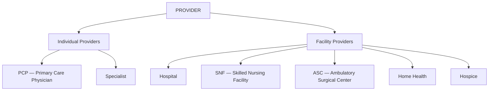
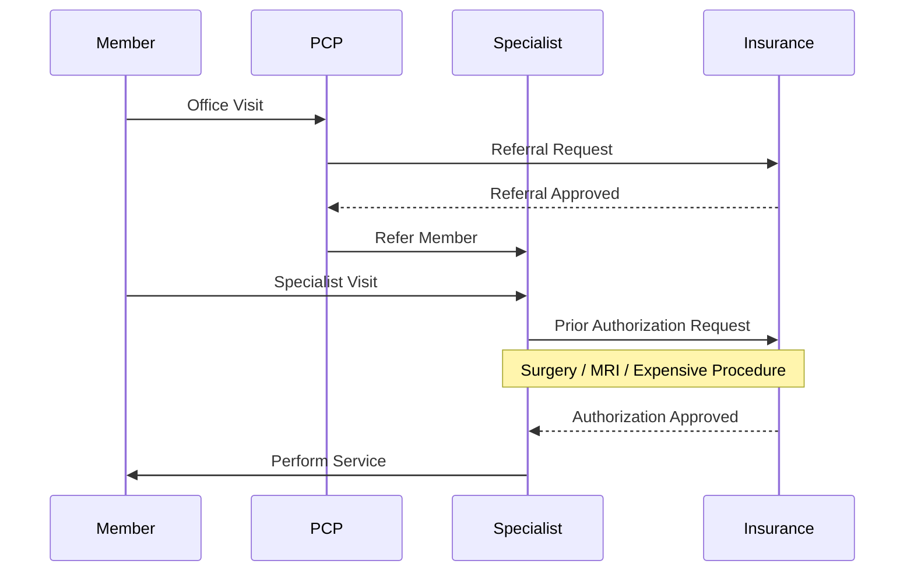

[← Series Overview]({{ '/notes/rcm/rcm-overview' | relative_url }})

---

## 🧑‍⚕️ Health Care Providers — 2 Types

Providers split into **people** and **places.** Both bill, but they bill differently.

### Individual Providers

> [!important] PCP = Primary Care Physician
> The **primary gatekeeper** — first point of contact. Member goes to PCP first; PCP refers out to specialists.

### Facility Providers

| Facility | What it is |
|----------|------------|
| **Hospital** | Inpatient care |
| **SNF** — Skilled Nursing Facility | Recovery center providing post-surgical care **plus ADL** (Activities of Daily Living): bathing, cooking, occupational therapy. |
| **ASC** — Ambulatory Surgical Center | **Same-day** ("day-in, day-out") surgery center. *e.g. cataract surgery.* POS code `24`. |
| **Home Health** | Agencies delivering medical services to patients/families **at home** per written care plans. |
| **Hospice** | Lets **terminally ill** people spend their final stages at home or home-like settings. |

---

## 🔗 Networks & Contracts

Contracts sit **between Payers and Providers** — and network status decides what the member pays.

| | **In-Network (INN)** | **Out-of-Network (OON)** |
|---|---|---|
| Provider type | **Participating** providers | **Non-Participating** providers |
| Member cost | **Lower** | **Higher** |

> [!note] The bank analogy (from training)
> Participating (INN) ≈ INDUS, ICICI · Non-participating (OON) ≈ SBI. *Whatever makes it stick.*

---

## 📝 Authorization & Referral

Before expensive care happens, the provider usually has to **ask permission.** That permission is Authorization.

> [!important] Authorization
> A **designated permission** a provider requests **from the health care plan** to get a medical service approved for a member.
>
> The **first-time** authorization is called a **Referral.**

### The Call Flow

**PCP → Insurance** = Referral call  
**Specialist → Insurance** (for procedure) = Authorization call

### 4 Ways to Initiate Authorization

1. ☎️ **Call**
2. 💻 **Portals**
3. 📄 **P.A. Form** (Prior Authorization form)
4. 📠 **E-Fax** (Electronic Fax)

> [!info] Provider naming in context
> The same provider gets different labels by function: **Requesting · Referring · Ordering · Servicing · Rendering** provider. They often overlap — context tells you which hat they're wearing.

---

## 💰 Payment Modules — 2 Types

How does a provider actually get paid? **Two opposing philosophies.**

| Module | Income type | How it works |
|--------|-------------|--------------|
| **Capitation** | Fixed income | **PHPM** (Per Head Per Month). Provider gets a set amount **regardless of how many visits** the member makes. |
| **Fee for Service (FFS)** | Incentive type | Every service billed **separately** (un-bundled). More services = more money. |

> [!tip] Why the incentive structure matters
> **Capitation** rewards *keeping people healthy* — fewer visits, same pay. **FFS** rewards *volume* — more procedures, more money. The incentive shapes the provider's behavior; payers prefer capitation to control costs.

---

## 📚 RCM Series

[← Overview & Cheat Sheet]({{ '/notes/rcm/rcm-overview' | relative_url }}) ·
[Participants & HIPAA]({{ '/notes/rcm/rcm-participants-hipaa' | relative_url }}) ·
[Plans & Medicare]({{ '/notes/rcm/rcm-plans-medicare' | relative_url }}) ·
[Managed Care]({{ '/notes/rcm/rcm-managed-care' | relative_url }}) ·
[Medical Coding →]({{ '/notes/rcm/rcm-coding' | relative_url }}) ·
[Claims & PR]({{ '/notes/rcm/rcm-claims-patient-resp' | relative_url }}) ·
[All Diagrams]({{ '/notes/rcm/rcm-diagrams' | relative_url }})
